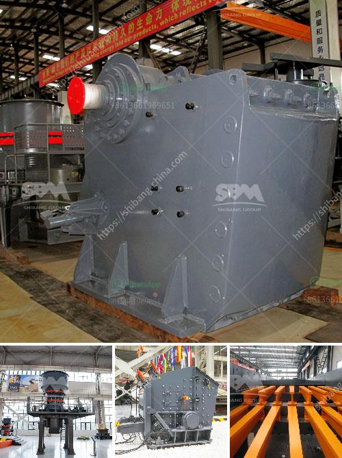

<h3>سيور ناقلة في جنوب أفريقيا</h3>
تعتبر السيور الناقلة من أهم وسائل نقل المواد في الصناعة، وتستخدم بشكل واسع في عدة قطاعات مختلفة مثل التعدين والبناء والزراعة والمواد الغذائية والكيماويات والمياه والنفايات.

في جنوب أفريقيا، تشتهر صناعة السيور الناقلة بتطورها وتنوع استخداماتها. تعتبر هذه السيور من الأدوات الحديثة التي قد غيرت طريقة عمل الصناعة في البلاد وساهمت في تسهيل وتسريع عمليات الإنتاج والنقل.

تستخدم السيور الناقلة في جنوب أفريقيا بشكل خاص في قطاع التعدين، حيث يوجد العديد من المناجم الكبيرة لاستخراج الذهب والبلاتين والفحم والماس والزنك والألمنيوم. هذه السيور تستخدم لنقل المواد الخام من المناجم إلى المصانع والمراكز الاستخلاصية بطريقة آمنة وفعالة.

بالإضافة إلى ذلك، تستخدم السيور الناقلة في قطاع البناء والتشييد في جنوب أفريقيا، حيث تسهل نقل المواد الأولية مثل الحصى والرمل والأسمنت والصخور إلى موقع البناء. تعد هذه السيور من الأدوات الضرورية لمشاريع البنية التحتية الكبيرة مثل الجسور والطرق والأبنية العالية.

وتستخدم السيور الناقلة أيضًا في القطاع الزراعي في جنوب أفريقيا، حيث تستخدم لنقل الحبوب والبذور من المزارع إلى مستودعات التخزين والأسواق. كما تستخدم لنقل المواد الغذائية الحساسة مثل اللبن واللحوم والخضروات بطريقة تحافظ على جودتها ونضارتها.

ويجب أن نشير إلى أن استخدام السيور الناقلة في جنوب أفريقيا ليس مقتصرًا على الصناعات التقليدية، بل تمتد إلى قطاعات حديثة مثل الطاقة المتجددة. تستخدم السيور الناقلة أيضًا في نقل الطاقة الشمسية والرياح من المناطق النائية إلى محطات التوزيع الرئيسية.

باختصار، يمكن القول أن تطور صناعة السيور الناقلة في جنوب أفريقيا قد أحدث تغييرًا إيجابيًا في عمليات الإنتاج والنقل في العديد من القطاعات الصناعية. وتعتبر هذه السيور من الوسائل الحديثة والفعالة لتحقيق التنمية المستدامة وتلبية احتياجات السوق المحلية والعالمية.
<h3>Contact us</h3><ul><li><strong>Whatsapp:&nbsp;<a href="https://wa.me/8613661969651">+8613661969651</a></strong></li><li><a href="https://swt.shibang-china.com/?git&amp;zhl&amp;سيور ناقلة في جنوب أفريقيا"><strong>Online Service(chat now)</strong></a></li></ul><h3>Related</h3><ul><li><a href='استخدام مصانع التكسير للبيع في الإمارات.md'>استخدام مصانع التكسير للبيع في الإمارات</a></li><li><a href='مطحنة MTW.md'>مطحنة MTW</a></li><li><a href='آلات طحن المطاحن للبيع.md'>آلات طحن المطاحن للبيع</a></li><li><a href='مطحنة الأسطوانة للسائل.md'>مطحنة الأسطوانة للسائل</a></li><li><a href='معدات الطحن بالكرات ووسائط الطحن.md'>معدات الطحن بالكرات ووسائط الطحن</a></li></ul>