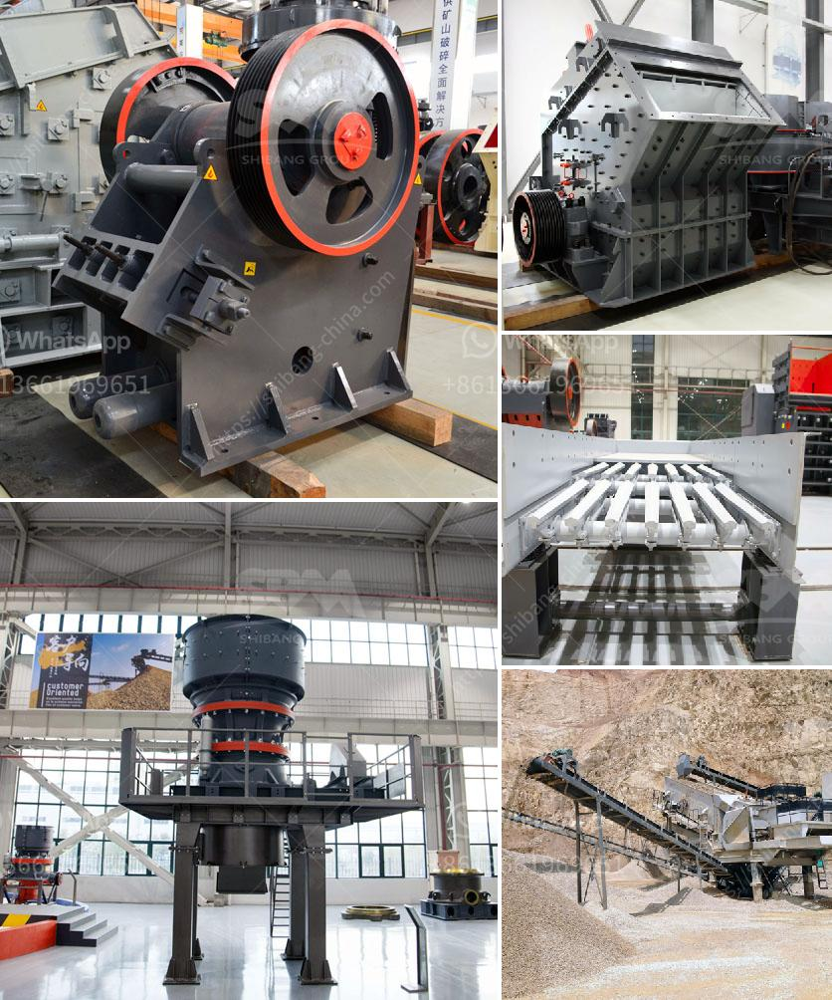

<h3>سيور ناقلة في فرنسا</h3>
تعتبر سيور النقل من التكنولوجيات الحديثة التي تستخدم في العديد من المجالات الصناعية والتجارية حول العالم، وفرنسا ليست استثناء من ذلك. فهي تضم العديد من الشركات التي تستخدم سيور النقل في عملياتها اليومية بفعالية وكفاءة عالية.

تستخدم سيور النقل في الصناعات التحويلية مثل الصناعات الغذائية، الكيميائية، والمعدنية، بالإضافة إلى الصناعات الخفيفة والثقيلة، وذلك لنقل المواد الخام والمنتجات النهائية في العمليات الإنتاجية. كما تستخدم في قطاع اللوجستيات والنقل لنقل البضائع والحاويات داخل المستودعات ومراكز التوزيع والموانئ.

واحدة من الشركات المعروفة في فرنسا التي تقدم حلول سيور النقل هي "ايه بيز الميسيرابل". تأسست الشركة في عام 1947 وهي تعتبر واحدة من الشركات الرائدة عالميًا في صناعة سيور النقل وأنظمة التداول المتكاملة. تقدم الشركة حلولاً مخصصة ومبتكرة للعملاء في جميع أنحاء العالم، بما في ذلك فرنسا، وتعمل في مجالات متنوعة مثل الأتمتة الصناعية واللوجستية والتصنيع والتعبئة والتغليف.

تعتبر سيور النقل في فرنسا مهمة جداً في تحسين كفاءة الإنتاج وتقليل تكاليف العمل. حيث تتميز بسهولة التركيب والصيانة والتشغيل، وتقدم أداءً عاليًا في نقل المواد الثقيلة وتحمل الأحمال العالية. كما انها تتمتع بمرونة تصميمية تسمح بتكيفها مع البيئات المختلفة والمساحات المحدودة، مما يسهل توزيع المواد والبضائع في الأماكن التجارية الضيقة.

بالإضافة إلى ذلك ، تهتم فرنسا أيضًا بالاستدامة البيئية وتعمل على تطوير سيور النقل ذات الأداء العالي والقابلة لإعادة التدوير والتوجه نحو البيئة النظيفة. فبفضل تلك التحسينات، يمكن لسيور النقل أن تلعب دورًا حاسمًا في تقليل التأثير البيئي وتحسين الاستدامة في عمليات الإنتاج والنقل.

باختصار، يمكن القول أن سيور النقل تلعب دورًا هامًا في الصناعة الفرنسية، حيث تساهم في تحسين إنتاجية الشركات وتقليل التكاليف ودعم الاستدامة البيئية. وبفضل الشركات المتخصصة في هذا المجال مثل "ايه بيز الميسيرابل"، يمكن توفير حلول مبتكرة وفعالة لعمليات النقل في جميع أنحاء البلاد.
<h3>Contact us</h3><ul><li><strong>Whatsapp:&nbsp;<a href="https://wa.me/8613661969651">+8613661969651</a></strong></li><li><a href="https://swt.shibang-china.com/?git&amp;zhl&amp;سيور ناقلة في فرنسا"><strong>Online Service(chat now)</strong></a></li></ul><h3>Related</h3><ul><li><a href='آلات معالجة الجير.md'>آلات معالجة الجير</a></li><li><a href='كسارة أولية للبيع.md'>كسارة أولية للبيع</a></li><li><a href='شركة تصنيع لطحن الكلنكر.md'>شركة تصنيع لطحن الكلنكر</a></li><li><a href='مطحنة الكرة لطحن الفلبين.md'>مطحنة الكرة لطحن الفلبين</a></li><li><a href='تكلفة تركيب السيور الناقلة.md'>تكلفة تركيب السيور الناقلة</a></li></ul>