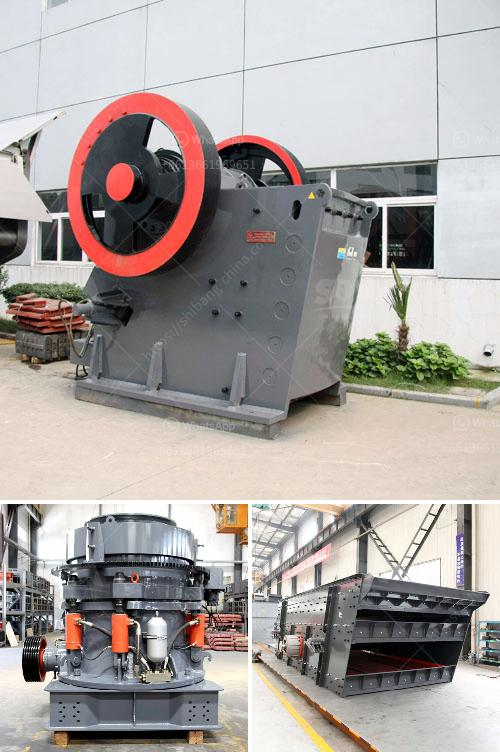

<h3>سيور ناقلة في ماليزيا</h3>
تعتبر السيور الناقلة واحدة من أهم وأكثر وسائل النقل استخدامًا في العالم، وتستخدم في العديد من الصناعات المختلفة لنقل المواد والبضائع بكفاءة وسرعة. تتباين استخدامات السيور الناقلة من نقل المواد الثقيلة في مناجم المعادن إلى نقل الحقائب والصناديق في مطارات العالم. تتميز ماليزيا كوجهة رئيسية للصناعة وهي تمتلك عددًا كبيرًا من السيور الناقلة الحديثة لتلبية احتياجاتها الصناعية.

تستخدم السيور الناقلة في العديد من الصناعات في ماليزيا، مثل صناعة التعدين والزراعة وقطاع النفط والغاز وغيرها. في قطاع التعدين على سبيل المثال، تستخدم السيور الناقلة في نقل المواد الخام مثل الفحم والحديد والذهب وغيرها من المعادن من المناجم إلى مصانع التكرير. هذا يساعد في تحسين كفاءة الإنتاج وتقليل التكاليف وتوفير الوقت.

في صناعة الزراعة، تستخدم السيور الناقلة لنقل المحاصيل مثل الأرز والقمح والنخيل من المزارع إلى مواقع التصنيع. هذا يساعد في تحسين تدفق الإنتاج وتجنب فقدان المواد الغذائية خلال عملية النقل.

أيضًا، تستخدم السيور الناقلة في صناعة النفط والغاز لنقل منتجات النفط والغاز الخام من حقول النفط إلى مصافي التكرير. هذا يسهم في زيادة إنتاج النفط والغاز وتحسين الأمان وجودة العمليات.

وتظهر ماليزيا سباقة في تبني تكنولوجيا السيور الناقلة الحديثة لتلبية احتياجات الصناعة المتنوعة. تتوفر السيور الناقلة في ماليزيا بمختلف الأحجام والأشكال والمواصفات لتناسب الاحتياجات المحددة لكل صناعة. كما أن الابتكارات الحديثة تمكن السيور الناقلة من التحرك بطريقة آلية ودقيقة وفقًا للبرامج المحددة.

بالتالي، يمكن القول إن السيور الناقلة تلعب دورًا حاسمًا في دفع قطاع الصناعة في ماليزيا. فهي تزيد من الإنتاجية والكفاءة وتقلل من التكاليف وتوفر الوقت وتحسن الأمان في العديد من الصناعات المختلفة. إن استيراد وتبني تكنولوجيا السيور الناقلة الحديثة يعزز مكانة ماليزيا كواحدة من دول العالم الناشئة الرائدة في الصناعة، وتعزز نمو اقتصادها المستدام.
<h3>Contact us</h3><ul><li><strong>Whatsapp:&nbsp;<a href="https://wa.me/8613661969651">+8613661969651</a></strong></li><li><a href="https://swt.shibang-china.com/?git&amp;zhl&amp;سيور ناقلة في ماليزيا"><strong>Online Service(chat now)</strong></a></li></ul><h3>Related</h3><ul><li><a href='آلة غسيل الرمل للبيع في سريلانكا.md'>آلة غسيل الرمل للبيع في سريلانكا</a></li><li><a href='قائمة مصنعي آلات سحق اليابان.md'>قائمة مصنعي آلات سحق اليابان</a></li><li><a href='آلة سحق مكعب الخرسانة.md'>آلة سحق مكعب الخرسانة</a></li><li><a href='تصميم مصنع الإسمنت بتنسيق PDF.md'>تصميم مصنع الإسمنت بتنسيق PDF</a></li><li><a href='مطحنة ريموند في تشيناي.md'>مطحنة ريموند في تشيناي</a></li></ul>