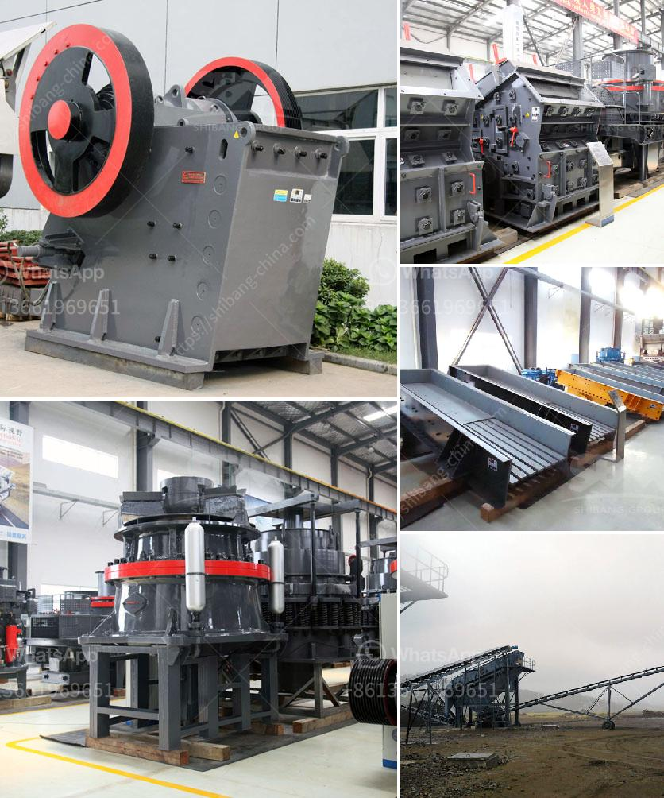

<h3>سيور ناقلة للبيع في الصين</h3>
صناعة السيور الناقلة هي صناعة نشطة في الصين حيث توجد العديد من الشركات المتخصصة في تصنيع وبيع السيور الناقلة. تلك السيور هي أحد الأدوات الهندسية الحديثة التي تستخدم لنقل المواد من مكان لآخر بسهولة وكفاءة.

تعتبر الصين واحدة من أكبر الدول المنتجة للسيور الناقلة في العالم. تتميز السيور الناقلة الصينية بجودتها العالية وتكنولوجيتها المتقدمة. كما أن السوق الصيني يوفر مجموعة واسعة من السيور الناقلة مثل السيور الناقلة الثقيلة والسيور الناقلة المطاطية والسيور الناقلة البلاستيكية والسيور الناقلة الصناعية العامة.

تستخدم السيور الناقلة في العديد من الصناعات مثل صناعة المعادن والتعدين والنقل والبتروكيماويات والزراعة والمواد الغذائية والكيماويات والسيارات والإلكترونيات والطاقة البديلة وغيرها. بصفة عامة، يتم استخدام السيور الناقلة لنقل المواد السائلة أو الجامدة أو المشتتة في أماكن العمل المختلفة.

يتم استخدام السيور الناقلة الثقيلة في المصانع الكبيرة التي تحتاج إلى نقل كميات ضخمة من المواد بشكل مستمر. تتوفر السيور الناقلة الثقيلة عادةً بأحجام كبيرة وبقدرة تحميل عالية لتلبية احتياجات الإنتاج المكثفة.

بالنسبة للسيور الناقلة المطاطية والبلاستيكية، فهي تستخدم عادةً في الصناعات المتوسطة والصغيرة. تتميز السيور الناقلة المطاطية بمرونتها ومقاومتها للتآكل والحرارة، بينما توفر السيور الناقلة البلاستيكية دقة عالية في النقل ومرونة في التصميم.

تتميز السيور الناقلة الصناعية العامة بسهولة تركيبها وصيانتها وتشغيلها. تصمم السيور الناقلة الصناعية العامة عادةً لتلبية احتياجات عمليات النقل العامة في العديد من الصناعات المختلفة.

تتوفر السيور الناقلة الصينية بأسعار تنافسية ومناسبة للعملاء في جميع أنحاء العالم. يمكن للعملاء طلب السيور الناقلة عبر الإنترنت أو من خلال التعامل مع الموزعين المعتمدين في بلدانهم.

لذلك، إذا كنت تبحث عن شراء سيور ناقلة عالية الجودة وتقنية متطورة بأسعار معقولة، فإن السيور الناقلة الصينية قد تكون الخيار المثالي لك. تجدر الإشارة إلى أنه لضمان الحصول على منتج ذو جودة عالية يجب البحث عن شركات موثوقة وذات سمعة جيدة، وإجراء مقارنة بين العروض المختلفة قبل اتخاذ القرار النهائي.
<h3>Contact us</h3><ul><li><strong>Whatsapp:&nbsp;<a href="https://wa.me/8613661969651">+8613661969651</a></strong></li><li><a href="https://swt.shibang-china.com/?git&amp;zhl&amp;سيور ناقلة للبيع في الصين"><strong>Online Service(chat now)</strong></a></li></ul><h3>Related</h3><ul><li><a href='أسعار معدات المحجر.md'>أسعار معدات المحجر</a></li><li><a href='مورد آلة كسارة الأسطوانة.md'>مورد آلة كسارة الأسطوانة</a></li><li><a href='آلة غربلة الرمل للبيع في الفلبين.md'>آلة غربلة الرمل للبيع في الفلبين</a></li><li><a href='مصنع معالجة الذهب المحمول مع السعر.md'>مصنع معالجة الذهب المحمول مع السعر</a></li><li><a href='سعة الكسارة المحمولة ٢٠٠ طن في الساعة.md'>سعة الكسارة المحمولة ٢٠٠ طن في الساعة</a></li></ul>