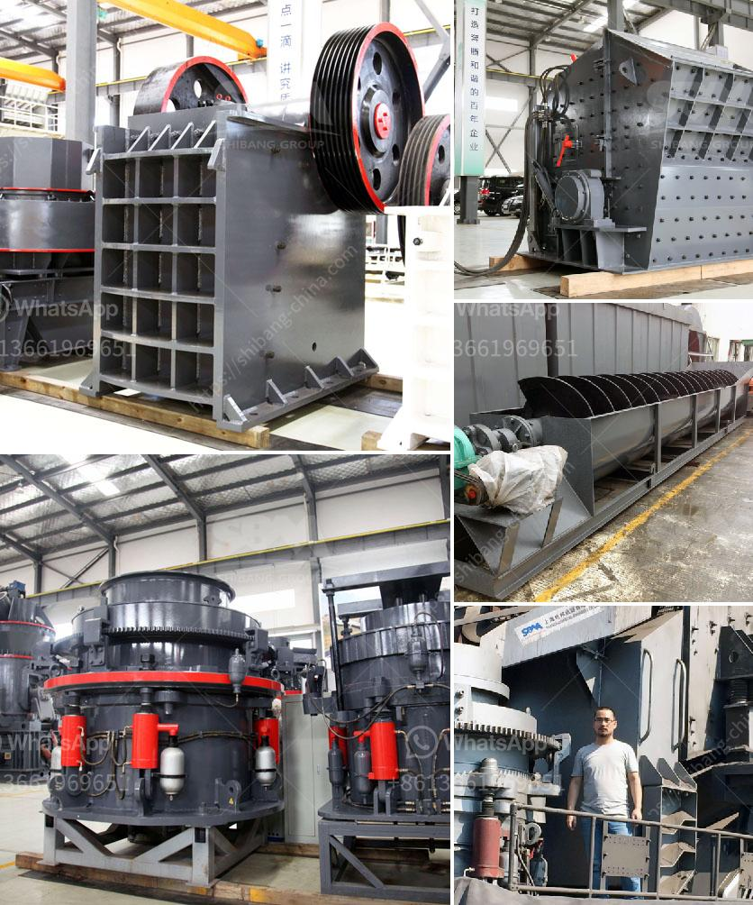

<h3>سيور ناقلة معدنية في الألواح</h3>
تُعَد السيور الناقلة المعدنية في الألواح أحد التقنيات الحديثة التي يستخدمها العديد من الصناعيين والمهندسين في العديد من الصناعات المختلفة. تتكون هذه السيور من ألواح معدنية متصلة معًا بواسطة سلسلة من الزَرَافات المعدنّية، وتقوم بتحريك المواد من موقع إلى آخر بشكل سلس ومؤمن.

تستخدم السيور الناقلة المعدنية في الألواح في العديد من الصناعات، بما في ذلك الصناعات الأتمتة والتعدين والمعادن وصناعة الأغذية والتعبئة والتغليف وغيرها الكثير. فالسيور الناقلة المعدنية في الألواح تتميز بتحملها للأحمال الثقيلة ومقاومتها للتآكل، مما يجعلها مثالية لنقل المواد الثقيلة والحبيبية والمسحوقة.

تتميز السيور الناقلة المعدنية في الألواح بمرونتها ومتانتها، مما يسمح لها بالتكيف مع العديد من الظروف والمواقف المختلفة في بيئة العمل. فهي تستطيع التحرك في اتجاهات مختلفة، مما يتيح للمصانع والمنشآت المختلفة توجيه المواد إلى الأماكن المناسبة. كما تتميز أيضًا بقدرتها على تحمل درجات الحرارة العالية والباردة، مما يجعلها مناسبة للاستخدام في البيئات القاسية.

بفضل تصميمها الدقيق والاحترافي، تعمل السيور الناقلة المعدنية في الألواح بطريقة فعالة وفعالة من حيث التكلفة. ضمن أجزاء قليلة من الصيانة والعناية، تستطيع هذه السيور العمل لفترات طويلة دون أي تلف أو خلل. وبفضل طبيعتها المعدنية، يصعب تآكل السيور، مما يزيد من متانتها ويطيل عمرها الافتراضي.

باختصار، السيور الناقلة المعدنية في الألواح تمثل تقنية حديثة وفعالة لنقل المواد في العديد من الصناعات المختلفة. تتميز بمتانتها ومرونتها ومقاومتها للتآكل، مما يجعلها خيارًا ممتازًا لتلبية احتياجات الصناعة الحديثة. بفضل تصميمها العالي الجودة، تعد السيور الناقلة المعدنية في الألواح حلاً مثاليًا لتحسين عمليات الإنتاج وتحقيق التحسين المستدام والاقتصادي.
<h3>Contact us</h3><ul><li><strong>Whatsapp:&nbsp;<a href="https://wa.me/8613661969651">+8613661969651</a></strong></li><li><a href="https://swt.shibang-china.com/?git&amp;zhl&amp;سيور ناقلة معدنية في الألواح"><strong>Online Service(chat now)</strong></a></li></ul><h3>Related</h3><ul><li><a href='خطة عمل كاملة لمصنع تكسير الحجارة.md'>خطة عمل كاملة لمصنع تكسير الحجارة</a></li><li><a href='كل مصانع التكسير المحاجر.md'>كل مصانع التكسير المحاجر</a></li><li><a href='كسارة متنقلة بسعة 100 طن في الساعة.md'>كسارة متنقلة بسعة 100 طن في الساعة</a></li><li><a href='سعر كسارة الحجر في نيجيريا.md'>سعر كسارة الحجر في نيجيريا</a></li><li><a href='كم تكلف كسارات الصخور.md'>كم تكلف كسارات الصخور</a></li></ul>