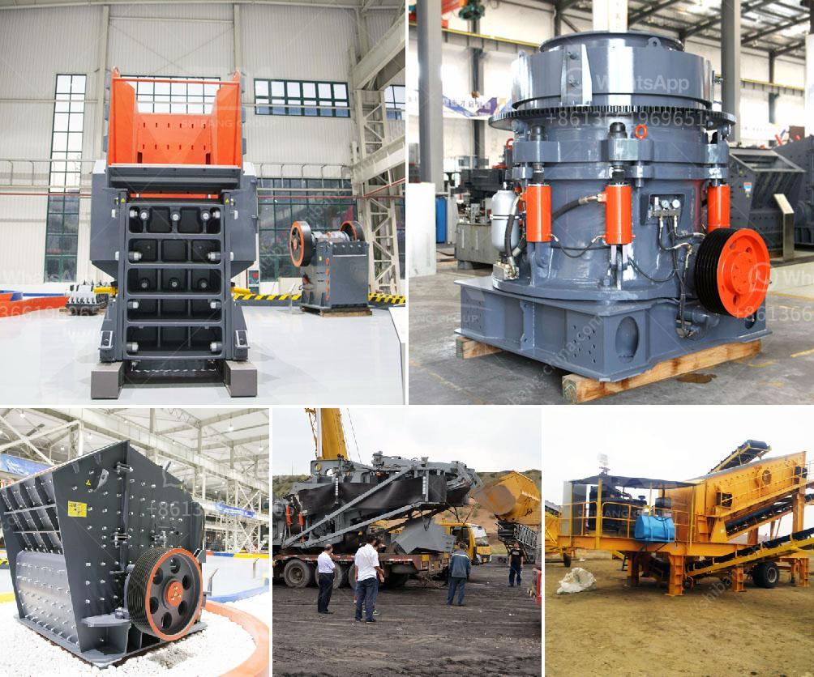

<h3>شاشات الفحم الاهتزازية</h3>
شاشات الفحم الاهتزازية: تقنية حديثة لتحسين عمليات الفحص والفصل

تُعد شاشات الفحم الاهتزازية تقنية حديثة تستخدم في عمليات فصل وتصنيف الفحم. تم تحسين هذه التقنية على مر السنين لتوفير فحص دقيق وفعال للفحم واستخلاصه من الشوائب. تُعد تلك الشاشات جزءًا أساسيًا من العمليات الميكانيكية في صناعة الفحم وهي ضرورية للتحسين العام لعمليات التعدين واستخلاص الفحم.

تعتمد شاشات الفحم الاهتزازية على حركة الاهتزاز لفصل شوائب الفحم وفقًا لحجمها ومكوناتها. تعمل الشاشات عن طريق تعريض الجسيمات المختلفة من الفحم لاهتزازات فائقة الدقة. تقوم الشاشة بتصنيف الفحم وتقسيمه حسب حجم الجسيمات، مما يسمح بتحسين جودة الفحم واستخلاص المكونات القيمة باستخدام هذه التقنية.

تتمتع شاشات الفحم الاهتزازية بالعديد من المزايا التي تجعلها تكنولوجيا مناسبة وفعالة لصناعة الفحم. ففاعليتها العالية ودقتها في الفصل بين الجسيمات يساهم في زيادة كفاءة العمليات وتقليل الاهدار في عمليات الفصل. تساعد هذه الخاصية في تحسين تركيز الفحم وزيادة قيمتها التجارية.

بالإضافة إلى ذلك، فإن شاشات الفحم الاهتزازية قابلة للتكيّف مع مختلف أحجام ومواصفات الفحم، مما يجعلها تقنية مرنة وقابلة للتطوير. تم تصميم الشاشات للعمل بشكل مستدام وقابلية عالية للصيانة. وبفضل هيكلها المتين ومواد التصنيع العالية الجودة، يمكن أن تدوم الشاشات لفترة طويلة مع الحد الأدنى من التوقف للصيانة.

من المؤكد أن شاشات الفحم الاهتزازية تعد تقنية مهمة لتعزيز عمليات تصنيع الفحم. تحظى بشعبية كبيرة في صناعة التعدين واستخلاص الفحم بسبب فعاليتها ودقتها في الفصل. تساعد في تحسين جودة الفحم وتقليل تكاليف الإنتاج، مما يعود بالفائدة على الشركات والصناعات المعنية.

في الختام، يمكن القول إن شاشات الفحم الاهتزازية هي تقنية حديثة وفعالة تستخدم في تصنيع الفحم. تعزز هذه التقنية جودة الفحم وتساهم في تحسين عمليات الفصل واستخلاص الفحم. تستفيد من مزاياها التقنية والاقتصادية، وتلعب دورًا مهمًا في تعزيز صناعة الفحم.
<h3>Contact us</h3><ul><li><strong>Whatsapp:&nbsp;<a href="https://wa.me/8613661969651">+8613661969651</a></strong></li><li><a href="https://swt.shibang-china.com/?git&amp;zhl&amp;شاشات الفحم الاهتزازية"><strong>Online Service(chat now)</strong></a></li></ul><h3>Related</h3><ul><li><a href='شركة تصنيع الكسارات في الصين.md'>شركة تصنيع الكسارات في الصين</a></li><li><a href='كسارة الفك المحمولة في ماليزيا.md'>كسارة الفك المحمولة في ماليزيا</a></li><li><a href='طحن الكرة الرطبة مقابل الطحن الجاف.md'>طحن الكرة الرطبة مقابل الطحن الجاف</a></li><li><a href='شراء كسارة الحجر sbm في الفلبين.md'>شراء كسارة الحجر sbm في الفلبين</a></li><li><a href='كسارات الطوب للبيع في أستراليا.md'>كسارات الطوب للبيع في أستراليا</a></li></ul>