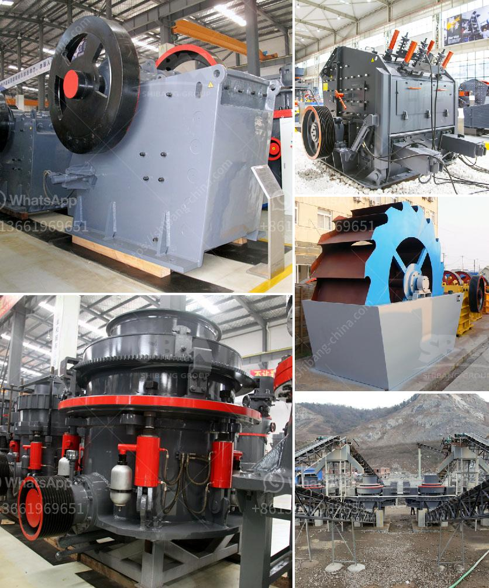

<h3>شاشات غسيل الركام في جنوب أفريقيا</h3>
تعتبر شاشات غسيل الركام من المعدات الأساسية في صناعة البناء والتشييد في جنوب أفريقيا وفي العديد من البلدان الأخرى. تعمل هذه الشاشات على غربلة وفصل الصخور والركام بناءً على حجمها وشكلها، وتقسيمها إلى فئات مختلفة لتلبية متطلبات المشاريع المختلفة.

يتم تصميم شاشات غسيل الركام بشكل مهني لتناسب الأحمال الثقيلة وتحمل ظروف العمل الصعبة. كما أنها تتميز بأنها قابلة للتكيف مع مجموعة متنوعة من المواد والأحجام المختلفة. تتكون هذه الشاشات من عدة طبقات تحمل في العادة مراحل فصل متعددة، مثل الفصل الأولي والفصل الثانوي وغيرها، وهذا يسهم في الحصول على نوعية عالية وموحدة للمنتج النهائي.

تساعد شاشات غسيل الركام في زيادة كفاءة عملية إعادة التدوير للركام واستخدامه في تجديد المشاريع الإنشائية. وتعزز أيضًا استدامة البناء وتقليل التأثير البيئي بالحد من تجمع النفايات واستخدام المواد الأولية بشكل فعال.

في جنوب أفريقيا، يتم استخدام شاشات غسيل الركام بشكل واسع في عمليات البناء، سواء في المشاريع الكبيرة أو الصغيرة. يتم استخدامها في غسيل الحصى والركام قبل استخدامها في إعادة التدوير، وهذا يسهم في تحسين جودة المنتج وزيادة عمره الافتراضي.

علاوة على ذلك، تساهم شاشات غسيل الركام في زيادة الإنتاجية وتوفير الوقت والجهد لأصحاب المشاريع، حيث تقوم بعملية فصل الركام بطريقة سريعة وفعالة. كما أنها تعمل على تقليل تكاليف الإنتاج وتحسين كفاءة العمليات.

وفي الختام، فإن شاشات غسيل الركام تلعب دورًا حاسمًا في صناعة البناء والتشييد في جنوب أفريقيا، وتعزز استدامة البناء وزيادة كفاءة عملية إعادة التدوير للركام. كما أنها تسهم في تقليل التكاليف وتحسين جودة المنتج النهائي. بفضل التطور التكنولوجي المستمر، يتم تحسين أداء هذه الشاشات باستمرار وتطويرها لتلبية متطلبات الصناعة المتنامية.
<h3>Contact us</h3><ul><li><strong>Whatsapp:&nbsp;<a href="https://wa.me/8613661969651">+8613661969651</a></strong></li><li><a href="https://swt.shibang-china.com/?git&amp;zhl&amp;شاشات غسيل الركام في جنوب أفريقيا"><strong>Online Service(chat now)</strong></a></li></ul><h3>Related</h3><ul><li><a href='كسارة مطرقية متعددة.md'>كسارة مطرقية متعددة</a></li><li><a href='تقرير المشروع حول استخدام رمل السحق.md'>تقرير المشروع حول استخدام رمل السحق</a></li><li><a href='مصانع الإسمنت للبيع في باكستان.md'>مصانع الإسمنت للبيع في باكستان</a></li><li><a href='إجراءات مكتبية لمصنع كسارة الحجر في مدى.md'>إجراءات مكتبية لمصنع كسارة الحجر في مدى</a></li><li><a href='كسارة هيدروليكية.md'>كسارة هيدروليكية</a></li></ul>