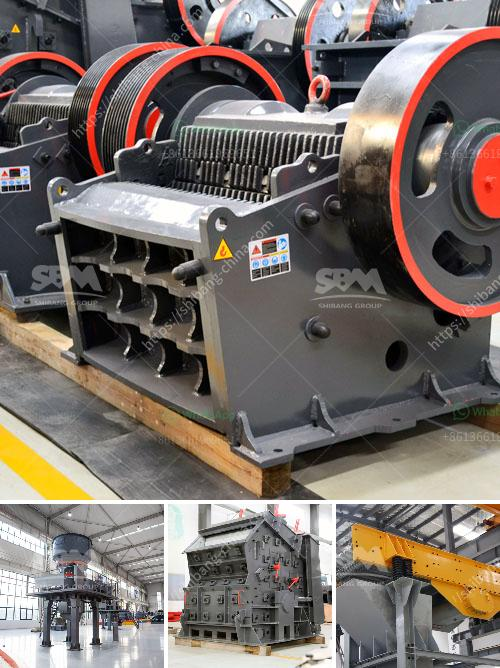

<h3>شاشات هزازة متنقلة</h3>
تعتبر الشاشات الهزازة المتنقلة من الابتكارات التكنولوجية الرائعة التي تحظى بشعبية متزايدة في السنوات الأخيرة. إنها شاشات تعمل بتقنية الاهتزاز الذي يمكن تحميلها ونقلها بسهولة بين المكاتب أو الغرف المختلفة. في هذه المقالة، سنتناول بعض الجوانب الهامة لهذه الشاشات وفوائدها المحتملة.

أحد الاستخدامات الرئيسية للشاشات الهزازة المتنقلة هو في مجال الترفيه والألعاب. يمكن للشاشات أن تعزز تجربة الألعاب عبر توفير تفاعل كبير مع اللاعبين. عندما تهتز الشاشات بناءً على أحداث اللعبة مثل الانفجارات أو الصدمات، يمكن للأشخاص أن يشعروا بالتأثير الحقيقي للعبة، مما يزيد من المتعة والتشويق.

بالإضافة إلى ذلك، يمكن استخدام الشاشات الهزازة المتنقلة في المجالات الأخرى مثل الافتتاحيات التجارية والعروض التقديمية. عند عرض مواد مرئية تحتوي على مؤثرات صوتية أو بصرية، يمكن للشاشات الهزازة نقل الأحداث والاهتزازات إلى المشاهدين بطريقة قوية وواقعية. يكمن الجمال في تلك الشاشات في قدرتها على محاكاة تفاعل الحواس وخلق تأثيرات بصرية و صوتية غريبة.

لا يقتصر استخدام الشاشات الهزازة المتنقلة على المجالات الترفيهية فقط، بل يمكن أن تكون لها فوائد عديدة في المجالات العلمية والتعليمية أيضًا. يمكن استخدام هذه التقنية لتحسين تجارب التفاعل المختلفة مثل الرحلات الافتراضية والدروس التعليمية خاصة في التخصصات العلمية مثل الطب والهندسة. يعتبر توفير مستوى متقدم من التفاعل والتشبيه للطلاب أمرًا مفيدًا لفهم المفاهيم والعمليات بدقة.

في النهاية، يمكن القول بأن الشاشات الهزازة المتنقلة هي تقنية ممتعة ومفيدة. تمنح المستخدمين تجربة لا تنسى في المجالات الترفيهية، وتعزز تفاعل المشاهدين في مجالات العروض والعروض التقديمية وتحسين تجربة التعلم في المجالات التعليمية. على الرغم من أنها قد تكون مكلفة في بعض الأحيان، إلا أن الفوائد المحتملة التي يمكن أن توفرها تجعلها تستحق الاستثمار.
<h3>Contact us</h3><ul><li><strong>Whatsapp:&nbsp;<a href="https://wa.me/8613661969651">+8613661969651</a></strong></li><li><a href="https://swt.shibang-china.com/?git&amp;zhl&amp;شاشات هزازة متنقلة"><strong>Online Service(chat now)</strong></a></li></ul><h3>Related</h3><ul><li><a href='مصنعي آلات سحق النحاس في الصين.md'>مصنعي آلات سحق النحاس في الصين</a></li><li><a href='مصنع معالجة الباريت.md'>مصنع معالجة الباريت</a></li><li><a href='آلات كسارة الحجر الكوارتز.md'>آلات كسارة الحجر الكوارتز</a></li><li><a href='سعر آلة غسيل الرمل الكوارتز.md'>سعر آلة غسيل الرمل الكوارتز</a></li><li><a href='معدات طحن الباريت.md'>معدات طحن الباريت</a></li></ul>