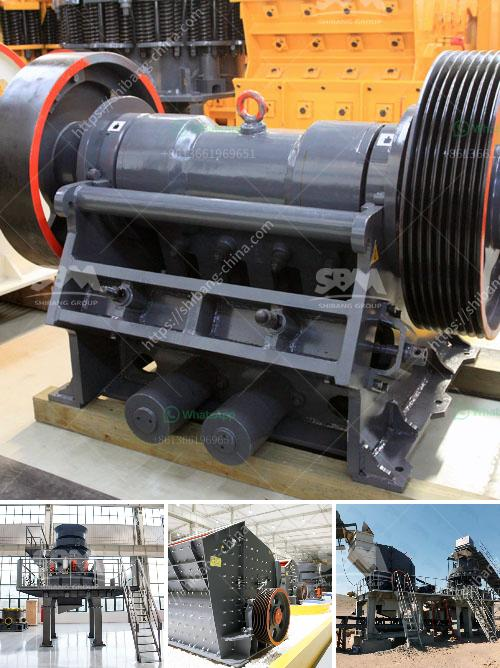

<h3>شاشات وكسارات الركام</h3>
شاشات وكسارات الركام: تقنية حديثة لتحقيق الكفاءة العالية في صناعة البناء

تعد شاشات وكسارات الركام من التقنيات الحديثة التي تم استخدامها بشكل واسع في صناعة البناء. فهذه التقنية تساهم في تحقيق الكفاءة العالية وتقليل التكاليف وزيادة الإنتاجية في عمليات تكسير وفرز الركام.

تتميز شاشات الركام بقدرتها على غربلة المواد الخام وفصلها حسب الحجم المطلوب. فهي تستخدم لفصل الحصى والرمل والحجارة غير المرغوب فيها، مما يؤدي إلى الحصول على ركام نقي ومنتجات نهائية ذات جودة عالية.

تعمل شاشات الركام عن طريق تثبيتها بشكل مائل، وتحتوي على طبقات متعددة من شبكات الشاشة المختلفة المسامية. يتم تكسير المادة الخام عندما تمر عبر الشبكات، حيث يتم تصفية الركام المرغوب فيه من المواد الأخرى.

أما كسارات الركام، فهي تستخدم لتحطيم وطحن الصخور والحصى الكبيرة إلى أحجام أصغر. تتألف الكسارات عادةً من قدرة محرك قوية وفكين ووحدة تغذية للمواد الخام. تعمل الكسارات عن طريق وضع المواد الخام في جزء الفك العلوي الذي يحركه المحرك، وهو ما يتيح الفرصة للصخرة أن تتحطم وتنخفض لأسفل لتخرج من جزء الفك السفلي في صورة ركام أصغر الحجم.

تعد شاشات وكسارات الركام من التقنيات المهمة في صناعة البناء، حيث توفر الكفاءة العالية والإنتاجية المحسنة. فمن خلال استخدام هذه التقنيات، يمكن للشركات المصنعة للبناء تقليل تكاليف العمالة والزمن، وتحسين جودة المنتج والمرونة في التشكيل.

وفي الختام، تعتبر شاشات وكسارات الركام من الابتكارات التقنية التي ساهمت في تطوير صناعة البناء وتحسين عمليات التكسير والفرز. فهي توفر كفاءة عالية وجودة منتج نهائية ممتازة. وبالتالي، ينصح باستخدام هذه التقنيات الحديثة في صناعة البناء لتحقيق النتائج المرجوة بكفاءة واقتصادية.
<h3>Contact us</h3><ul><li><strong>Whatsapp:&nbsp;<a href="https://wa.me/8613661969651">+8613661969651</a></strong></li><li><a href="https://swt.shibang-china.com/?git&amp;zhl&amp;شاشات وكسارات الركام"><strong>Online Service(chat now)</strong></a></li></ul><h3>Related</h3><ul><li><a href='مخروط سحق 700 1000.md'>مخروط سحق 700 1000</a></li><li><a href='مصنع غسل الحجارة الكوارتز.md'>مصنع غسل الحجارة الكوارتز</a></li><li><a href='خط إنتاج رمل السيليكا في ألمانيا.md'>خط إنتاج رمل السيليكا في ألمانيا</a></li><li><a href='كسارة الفك في تايلاند.md'>كسارة الفك في تايلاند</a></li><li><a href='كتلة الآلات وكسارة في AutoCAD.md'>كتلة الآلات وكسارة في AutoCAD</a></li></ul>