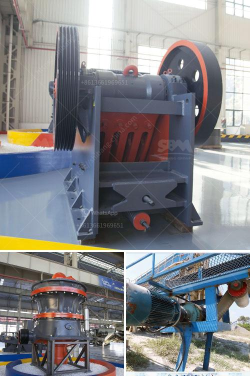

<h3>شاشة اهتزاز الحصى</h3>
تُعد شاشة اهتزاز الحصى أداة هامة في صناعات استخراج المعادن ومعالجة الحجارة. تستخدم هذه الشاشة لفصل وتصنيف الحصى والرمال حسب حجمها وخصائصها. يعتبر الاهتزاز الذي تنتجه الشاشة أمرًا حاسمًا في عملية التصفية، حيث يساهم في تفكيك وفصل المواد بشكل مطلوب.

تتألف الشاشة من عدة أجزاء رئيسية، بما في ذلك الإطار الذي يدعم الشبكة المعدنية أو النسيج المثقب المثبت عليها وحامل الشبكة، وآلية الاهتزاز. يعمل آلية الاهتزاز عن طريق محرك يعطي اهتزازات ذات تردد وقوة محددة. يتم ترتيب طبقات الشبكة بحيث تتناسب مع احتياجات المواد المراد فصلها.

عندما يتم تشغيل المحرك وتبدأ عملية الاهتزاز، يتحرك الحصى والرمال الموجودة على الوجه العلوي للشاشة. تمتزج المواد ببعضها البعض وتتفاعل مع الاهتزاز. تنقلب وتتداخل الحصى والرمال ذات الحجم الأكبر وتتركز في الطبقة العلوية. في الوقت نفسه، تمتطي المواد الأصغر حجمًا وتمر خلال فتحات الشبكة الموجودة في الطبقة السفلية من الشاشة.

تعتمد فعالية الشاشة على حجم الفتحات الموجودة في الشبكة وتردد الاهتزاز. فعلى سبيل المثال، إذا كانت الفتحات في الشبكة صغيرة، فإنها ستقوم بتصفية المواد الأكبر حجمًا فقط، في حين يمكن للمواد الصغيرة أن تمر عبرها، والعكس بالعكس. على الجانب الآخر، إذا كانت الفتحات أكبر حجمًا، فستسمح بمرور المواد الأكبر أيضًا.

تعد شاشة اهتزاز الحصى أداة مهمة جدًا في صناعات البناء والتعدين، حيث تساهم في إزالة المواد الغريبة وترشيح الحصى والرمال. بالإضافة إلى ذلك، تعتبر فحص المواد المعدنية في عمليات التعدين والاستخراج أمرًا حاسمًا، حيث تتيح للشركات إنتاج منتجات عالية الجودة والمطابقة للمواصفات المطلوبة.

في الختام، تُعد شاشة اهتزاز الحصى أداة أساسية في صناعات البناء والتعدين، حيث تساهم في تصنيف المواد وفصلها وتسهم في إنتاج منتجات عالية الجودة. إن استخدامها السليم وتوجيهها بشكل سليم يمكن أن يعزز الكفاءة ويحسن من جودة العمليات الصناعية.
<h3>Contact us</h3><ul><li><strong>Whatsapp:&nbsp;<a href="https://wa.me/8613661969651">+8613661969651</a></strong></li><li><a href="https://swt.shibang-china.com/?git&amp;zhl&amp;شاشة اهتزاز الحصى"><strong>Online Service(chat now)</strong></a></li></ul><h3>Related</h3><ul><li><a href='آلة مطحنة الطحن المستخدمة.md'>آلة مطحنة الطحن المستخدمة</a></li><li><a href='سعر مصنع كسارة محمولة في الهند.md'>سعر مصنع كسارة محمولة في الهند</a></li><li><a href='جزء من مطحنة الكرة ومبدأ عمله.md'>جزء من مطحنة الكرة ومبدأ عمله</a></li><li><a href='كسارات Canica 1200 VSI المستعملة.md'>كسارات Canica 1200 VSI المستعملة</a></li><li><a href='كسارة الحجر الهامر.md'>كسارة الحجر الهامر</a></li></ul>