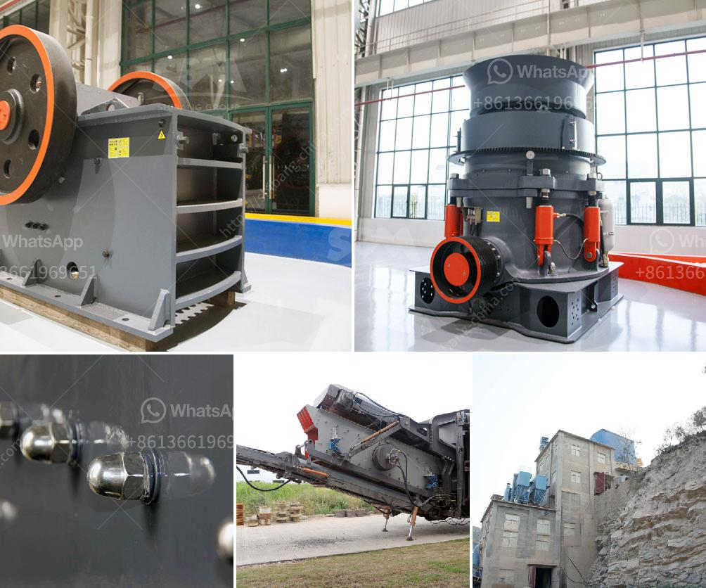

<h3>شاشة اهتزاز صناعية</h3>
تُعد شاشة الاهتزاز الصناعية من التقنيات المستخدمة في العديد من الصناعات المختلفة. فهي تُستخدم لفصل المواد الصلبة والسوائل المختلفة وتصنيفها بناءً على حجمها وشكلها. تعمل الشاشة عن طريق الاهتزازات العمودية والأفقية، وتتكون عادةً من مجموعة من المسامير الربيعية أو الرغوة المطاطية والتي تخلق الحركة الاهتزازية.

تتكون شاشة الاهتزاز الصناعية من عدة أجزاء أساسية. أولًا، تتكون من البنية التحملية، وهي الجزء الذي يدعم شاشة الاهتزاز ويحميها من الاهتزاز الزائد. ثانيًا، هناك طبقة الفرز، والتي تكون عادةً مصنوعة من شبكة معدنية يتم تثبيتها في الإطار الداخلي للشاشة. تنحصر الجسيمات الصلبة داخل هذه الشبكة وتمر السوائل من خلالها. ثالثًا، تحتوي الشاشة على محرك اهتزاز يساهم في توليد الاهتزازات المطلوبة. هذا المحرك عادةً يعمل بقوة وتردد قابل للتعديل لتلبية احتياجات التصنيف المطلوبة. وأخيرًا، تتضمن الشاشة قاعدة تثبيت لتأمينها وتوفير الاستقرار أثناء التشغيل.

يتم استخدام شاشة الاهتزاز الصناعية في مجموعة واسعة من الصناعات. ففي صناعة الغذاء، تُستخدم الشاشات لتصنيف المنتجات الغذائية بناءً على حجمها وشكلها وجاذبيتها. كما تستخدم أيضًا في صناعة التعدين لفصل المعادن والمواد الخام. وفي صناعة النفط والغاز، تستخدم الشاشات لتصفية المواد السائلة قبل استخدامها في عمليات التكرير. وهناك العديد من الاستخدامات الأخرى في العديد من الصناعات مثل صناعة المنسوجات والورق والكيماويات والإلكترونيات.

توفر شاشة الاهتزاز الصناعية العديد من الفوائد. فهي تعمل بكفاءة عالية وتقدم عملية تصنيف سريعة وفعالة للمواد. وتسمح الإعدادات القابلة للتعديل بتخصيص عملية التصنيف بناءً على احتياجات الإنتاج المحددة. وكذلك، فإن استخدام شاشة الاهتزاز يساهم في تحسين جودة المنتج النهائي وتقليل تكاليف الإنتاج.

باختصار، تُعتبر شاشة الاهتزاز الصناعية تقنية حديثة وفعالة تستخدم في العديد من الصناعات لفصل المواد وتصنيفها. توفر الشاشة فوائد عديدة من حيث الكفاءة والتكلفة وتحسين جودة المنتج. ومع استمرار التطور التكنولوجي، يمكن توقع المزيد من التحسينات والاستخدامات العملية لشاشة الاهتزاز الصناعية في المستقبل.
<h3>Contact us</h3><ul><li><strong>Whatsapp:&nbsp;<a href="https://wa.me/8613661969651">+8613661969651</a></strong></li><li><a href="https://swt.shibang-china.com/?git&amp;zhl&amp;شاشة اهتزاز صناعية"><strong>Online Service(chat now)</strong></a></li></ul><h3>Related</h3><ul><li><a href='كسارة فكية بمقدار 100 طن في الساعة.md'>كسارة فكية بمقدار 100 طن في الساعة</a></li><li><a href='كسارات أسطوانية وشاشات محمولة مستعملة.md'>كسارات أسطوانية وشاشات محمولة مستعملة</a></li><li><a href='مطحنة كرة مطحنة مطرقة.md'>مطحنة كرة مطحنة مطرقة</a></li><li><a href='مصنع معدات تعدين الرمال في جنوب أفريقيا.md'>مصنع معدات تعدين الرمال في جنوب أفريقيا</a></li><li><a href='كسارة حجر مستعملة للبيع في فلوريدا.md'>كسارة حجر مستعملة للبيع في فلوريدا</a></li></ul>