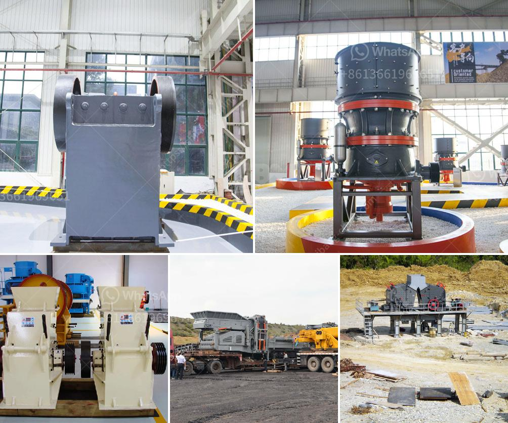

<h3>شاشة اهتزاز عالية التردد</h3>
تعتبر شاشة الاهتزاز عالية التردد من التكنولوجيا الحديثة والمبتكرة في عالم الأجهزة الإلكترونية. تستخدم هذه الشاشة في مختلف المجالات مثل الهواتف الذكية والأجهزة اللوحية والأجهزة اللوحية والأجهزة الطبية والصناعية. تقدم الشاشة صورًا عالية الدقة وذات جودة عالية تساهم في تحسين تجربة المستخدم.

تتميز شاشة اهتزاز عالية التردد بقدرتها على تكرار الإشارات الصوتية بسرعة كبيرة، وهذا يسمح بإنتاج صورة تتميز بدقة عالية ورموز متحركة سلسة. هذا يعني أن المشاهد ستحصل على تجربة واقعية تفوق توقعاتهم. تعتمد التقنية على تغيير الإشارة بأمان عالٍ مما يساهم في تخفيض معدل الامتداد والعودة ، مما يتيح الحصول على صور ثابتة وواضحة.

تتميز الشاشة بتراكب الألوان الرائع، حيث تتمتع بمدى ألوان واسع النطاق وألوان دقيقة وواضحة. هذا يعني أنه يمكن إظهار تفاصيل الصور بشكل أفضل، بما في ذلك المظهر المنعش للصور الثلاثية الأبعاد.

توفر الشاشة أيضًا زمن استجابة أسرع، مما يعني أن التغيير بين الصور يكون سريعًا وسلسًا بدون أي تأخير واضح، وهذا يساعد في تجنب التمزق والتلبد في الصور السريعة. وهذا يكون مهمًا خاصة في الألعاب والفيديوهات ذات الحركة السريعة، حيث يحسن تجربة المستخدم بشكل كبير.

يعتبر استهلاك الطاقة أحد التحديات التي تواجهها شاشات الاهتزاز عالية التردد. ولكن فرق البحث والتطوير قد حققت تقدمًا في هذا المجال، حيث تم تطوير شاشات تستهلك كمية أقل من الطاقة المطلوبة لتشغيلها، مما يساهم في توفير الطاقة بشكل كبير ويقلل من تأثيرها البيئي.

باختصار، شاشة الاهتزاز عالية التردد تعتبر تكنولوجيا حديثة ومبتكرة تقدم عرضًا عالي الجودة وواقعي للصور والفيديوهات. بفضل تقنياتها المتطورة وقدرتها على تجربة مستخدم فائقة، فإنها تلبي توقعات المشاهدين وتساهم في تحسين جودة العروض المرئية في الأجهزة الحديثة.
<h3>Contact us</h3><ul><li><strong>Whatsapp:&nbsp;<a href="https://wa.me/8613661969651">+8613661969651</a></strong></li><li><a href="https://swt.shibang-china.com/?git&amp;zhl&amp;شاشة اهتزاز عالية التردد"><strong>Online Service(chat now)</strong></a></li></ul><h3>Related</h3><ul><li><a href='خط إنتاج سحق الجرانيت.md'>خط إنتاج سحق الجرانيت</a></li><li><a href='مطحنة قضيب الطحن الجاف.md'>مطحنة قضيب الطحن الجاف</a></li><li><a href='آلة صنع الرمل VSI.md'>آلة صنع الرمل VSI.</a></li><li><a href='مطرقة صخرية.md'>مطرقة صخرية</a></li><li><a href='سعر كسارة الحجر في باكستان.md'>سعر كسارة الحجر في باكستان</a></li></ul>