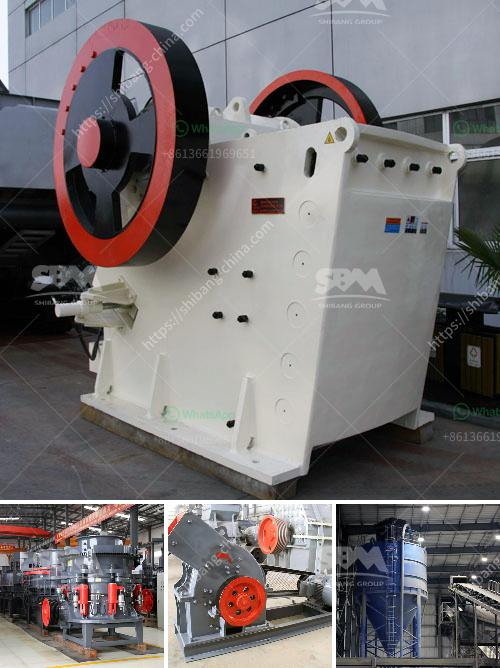

<h3>شاشة اهتزاز في إندونيسيا</h3>
تُعدّ شاشة الهزازة من التقنيات التي تستخدم على نطاق واسع في صناعة التعدين ومعالجة الألغام، وتعتبر إندونيسيا من بين الدول الرائدة في استخدام هذه التقنية. تُستخدَم شاشة الهزازة لفصل المواد الصلبة التي تحتوي على آثار سائلة أو هاوية، مما يؤدي إلى تحسين استخراج المعادن والمواد الصلبة من خاماتها.

تعتبر إندونيسيا من أكبر منتجي الفحم في العالم، حيث تشكل الفحم جزءًا كبيرًا من صناعة الطاقة في البلاد. وباستخدام شاشة الهزازة، يتم فصل المواد السائلة والهاوية من الفحم المستخرج، مما يوفر نتائج أعلى في عملية الطحن والمعالجة.

تتميز شاشة الهزازة بعدة مزايا، بما في ذلك قدرتها على فصل المواد بشكل فعال وسريع، حيث يمكنها فصل المواد بأحجام مختلفة حسب الاحتياجات والمتطلبات. كما يتم تحسين استخراج المعادن والمواد الصلبة بفضل تلك التقنية، وبالتالي تزيد من كفاءة عملية الطحن وتعزز الإنتاجية.

يتم تصنيع شاشة الهزازة بأحجام ومقاييس مختلفة، وتختلف المواصفات والمواد المستخدمة حسب الصناعة المستهدفة. تستخدم هذه الشاشات في مختلف الصناعات الأخرى بجانب صناعة التعدين، مثل صناعة البناء والطرق والكيماويات، حيث تساهم في تحسين نوعية المنتج النهائي وفصل الجسيمات المشوبة بالسوائل أو الشوائب.

وتعتبر شاشة الهزازة مصدر ربح مهم للشركات المصنعة في إندونيسيا، إذ تستخدم منتجاتهم على نطاق واسع في السوق المحلية والعالمية. وقد قامت بعض الشركات بتعزيز المشهد التنافسي عن طريق تحسين جودة منتجاتهم وتقديم حلول مختلفة لعملائهم، كما تهدف الشركات المحلية إلى توسيع نطاق الصادرات وزيادة حصتها في السوق العالمية.

في الختام، يُمكن القول إن شاشة الهزازة تعتبر وسيلة حديثة وفعالة لفصل المواد الصلبة عن السوائل والهواء، وتعزز من كفاءة العمليات الصناعية وتحسين الإنتاجية في إندونيسيا. ومع تطور التكنولوجيا وتحسين الأداء، يُمكن توقع أن تستمر هذه الصناعة في الازدهار وتوفير مزيدًا من الفرص الاقتصادية للبلاد.
<h3>Contact us</h3><ul><li><strong>Whatsapp:&nbsp;<a href="https://wa.me/8613661969651">+8613661969651</a></strong></li><li><a href="https://swt.shibang-china.com/?git&amp;zhl&amp;شاشة اهتزاز في إندونيسيا"><strong>Online Service(chat now)</strong></a></li></ul><h3>Related</h3><ul><li><a href='كيفية صنع مسحوق الطين الأحمر للغراز.md'>كيفية صنع مسحوق الطين الأحمر للغراز</a></li><li><a href='كسارات الحجر والرمل المحمولة على نطاق صغير.md'>كسارات الحجر والرمل المحمولة على نطاق صغير</a></li><li><a href='كسارة فك للبيع في الفيليبين.md'>كسارة فك للبيع في الفيليبين</a></li><li><a href='سعر آلة طاحونة الهامر.md'>سعر آلة طاحونة الهامر</a></li><li><a href='خط إنتاج الحجر الجيري.md'>خط إنتاج الحجر الجيري</a></li></ul>