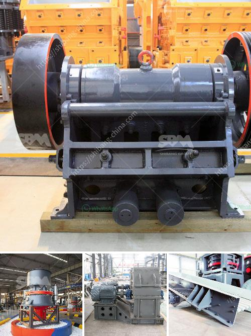

<h3>شاشة اهتزاز للشبكة 14 شاشة اهتزاز</h3>
تعتبر شاشة اهتزاز للشبكة 14 شاشة اهتزاز واحدة من الأدوات المستخدمة في صناعة التعدين وفي صناعات أخرى مثل البناء والكيمياء والصناعات الغذائية. تساعد هذه الشاشات في فصل المواد المتنوعة حسب حجمها، حيث تهتز الشاشة بشكل مستمر لفصل المواد الكبيرة عن المواد الصغيرة.

لا يمكن الإستغناء عن استخدام الشاشات الاهتزازية في مختلف صناعات التعدين، حيث تساعد في تصنيف المواد بحسب دقتها وحجمها. تعتمد الشاشة الاهتزازية على حركة اهتزازية رأسية لفصل الجسيمات، حيث يتم تغذية المواد على الشاشة في الجزء العلوي وتتحرك باتجاه الأسفل بين الشبكة المثبتة على الشاشة. تتميز هذه الشاشة بتردد اهتزازات محدد وسرعة تأثيرية عالية تؤدي إلى فصل المواد بشكل فعال.

تعتبر شاشة الاهتزاز ذات الشبكة 14 شاشة اهتزاز واحدة من الموديلات الشائعة المستخدمة في الصناعة. تتميز بقاعدة قوية مصنوعة من الفولاذ المقاوم للصدأ لتحمل الظروف القاسية وعملية التعدين التي قد تتطلب استخدامها في الهواء الطلق. تأتي هذه الشاشة بشكل عام في أحجام مختلفة حسب حجم الجسيمات المراد فصلها. يكون الشبكة المستخدمة عادة مصنوعة من سلك فولاذي ذو ثقوب بحجم محدد، حيث تسمح الثقوب الصغيرة بمرور الجسيمات الصغيرة وتمنع مرور الجسيمات الكبيرة.

تتميز شاشة الاهتزاز بكفاءة عالية في التصنيف والفصل، حيث يمكنها فصل المواد بنجاح وفقًا لحجمها بشكل سريع ودقيق. تعمل الاهتزازات العمودية في الشاشة على تنظيم تدفق المواد وفصلها بشكل فعال وسريع. يمكن ضبط سرعة وتردد الاهتزازات لتناسب احتياجات التصنيف وفصل المواد المختلفة.

بالإضافة إلى فعالية الشاشة الاهتزازية، تتمتع أيضًا بسهولة الصيانة والتشغيل. يمكن تنظيف الشاشة بسهولة وسرعة بفضل تصميمها المناسب. كما يمكن تعديل الشبكة المثبتة على الشاشة بسهولة لتناسب الاحتياجات الخاصة بعملية التصنيف والفصل المستخدمة.

باختصار، تعتبر شاشة الاهتزاز للشبكة 14 شاشة اهتزاز أداة أساسية في عمليات التصنيف والفصل في صناعة التعدين وصناعات أخرى. تتميز هذه الشاشات بكفاءة عالية في تصنيف المواد حسب حجمها وفصلها بشكل سريع ودقيق. كما تتميز بسهولة الصيانة والتشغيل، مما يجعلها اختيارًا مثاليًا للشركات التي تعمل في صناعة التعدين والصناعات الأخرى التي تحتاج إلى أداة موثوقة وفعالة في عمليات التصنيف والفصل.
<h3>Contact us</h3><ul><li><strong>Whatsapp:&nbsp;<a href="https://wa.me/8613661969651">+8613661969651</a></strong></li><li><a href="https://swt.shibang-china.com/?git&amp;zhl&amp;شاشة اهتزاز للشبكة 14 شاشة اهتزاز"><strong>Online Service(chat now)</strong></a></li></ul><h3>Related</h3><ul><li><a href='تحسين الجرافيت.md'>تحسين الجرافيت</a></li><li><a href='مطاحن الحجر الجيري المستخدمة في الفلبين.md'>مطاحن الحجر الجيري المستخدمة في الفلبين</a></li><li><a href='شركات آلات مصانع الحجر في سالم تاميل نادو.md'>شركات آلات مصانع الحجر في سالم تاميل نادو</a></li><li><a href='أرغب في شراء آلة كسارة البلاستيك.md'>أرغب في شراء آلة كسارة البلاستيك</a></li><li><a href='شركة تصنيع سير الناقل من الصين.md'>شركة تصنيع سير الناقل من الصين</a></li></ul>