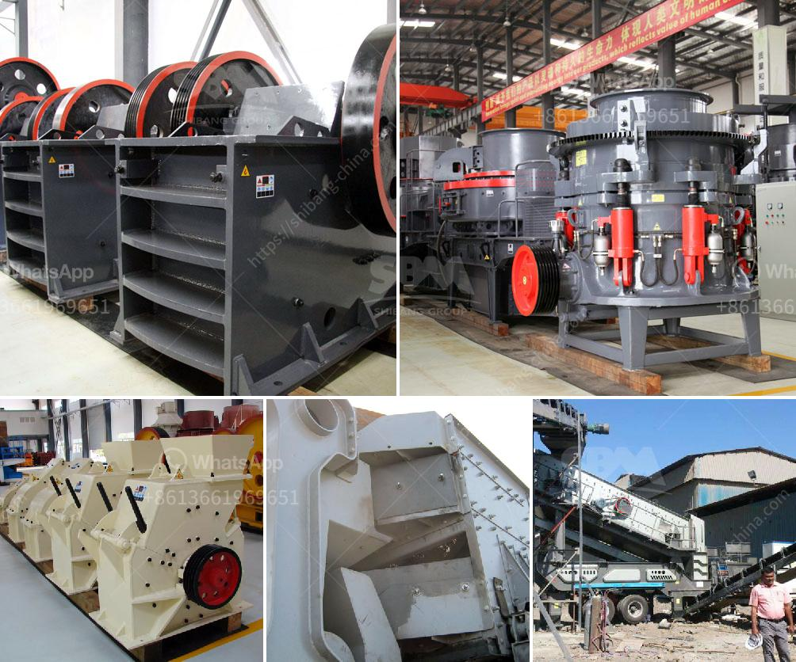

<h3>شاشة اهتزازية لرمل الكوارتز</h3>
شاشة الاهتزاز لرمل الكوارتز هي أداة تستخدم في عملية فصل الجسيمات المختلفة الموجودة في رمل الكوارتز. تعد الرمال الكوارتزية من أهم المواد الأساسية المستخدمة في صناعات متعددة مثل البناء، والزجاج، والسيراميك، والإلكترونيات، والنفط، والغاز. ولتحقيق جودة عالية في منتج رمل الكوارتز، تحتاج العملية إلى فصل الجسيمات الصلبة الموجودة داخله بدقة وفعالية.

تعمل شاشة الاهتزاز عن طريق استخدام قوى الاهتزاز لفصل الجسيمات المختلفة بحجمها. تتكون من سطح مسطح مثقب يتحرك بحركة تهتز بسرعة محددة وبزاوية ميل محددة. عند إدخال رمل الكوارتز على سطح الشاشة، فإن الجسيمات ذات الأحجام الصغيرة تمر من خلال الثقوب وتفصل عن الجسيمات الأكبر.

تتوفر شاشات الاهتزاز بمختلف الأحجام والتصاميم وفقًا لاحتياجات العملية. يتم اختيار حجم الثقوب بحيث تسمح للجسيمات ذات الحجم المطلوب بالمرور وتعمل على احتجاز الجسيمات الأكبر. تعمل الشاشة بكفاءة عالية وتوفر فصلاً دقيقًا بين الجسيمات المختلفة، مما يسمح بإنتاج رمل الكوارتز عالي الجودة.

يتميز استخدام شاشة الاهتزاز لفصل رمل الكوارتز بعدة مزايا. فتقليل حجم الجسيمات في المنتج النهائي يسهم في تحسين جودته. كما أن الاهتزاز الذي يتم تطبيقه يساعد في تسهيل مناولة رمل الكوارتز وتحسين سرعة عملية الإنتاج. كما أن شاشة الاهتزاز تعمل بكفاءة عالية وتتطلب صيانة بسيطة، مما يقلل من تكاليف الصيانة والإصلاح.

في الختام، يمكن القول إن شاشة الاهتزاز لرمل الكوارتز هي أداة ضرورية في عملية فصل الجسيمات المختلفة داخل رمل الكوارتز. تتميز بكفاءتها العالية وقدرتها على تحسين جودة منتج رمل الكوارتز النهائي. إن استخدام الشاشة يسهم في تحسين عملية الإنتاج وتقليل التكلفة. ومن المؤكد أن الشاشة الاهتزازية ستظل أداة أساسية في صناعة رمل الكوارتز في المستقبل.
<h3>Contact us</h3><ul><li><strong>Whatsapp:&nbsp;<a href="https://wa.me/8613661969651">+8613661969651</a></strong></li><li><a href="https://swt.shibang-china.com/?git&amp;zhl&amp;شاشة اهتزازية لرمل الكوارتز"><strong>Online Service(chat now)</strong></a></li></ul><h3>Related</h3><ul><li><a href='مصنعين كسارات في روسيا.md'>مصنعين كسارات في روسيا</a></li><li><a href='آلة المحجر للبيع.md'>آلة المحجر للبيع</a></li><li><a href='دراسة جدوى لمصنع سحق الكروم الفير.md'>دراسة جدوى لمصنع سحق الكروم الفير</a></li><li><a href='مقترح مشروع حول مصنع تكسير الحجر.md'>مقترح مشروع حول مصنع تكسير الحجر</a></li><li><a href='محطة سحق تينوفا.md'>محطة سحق تينوفا</a></li></ul>