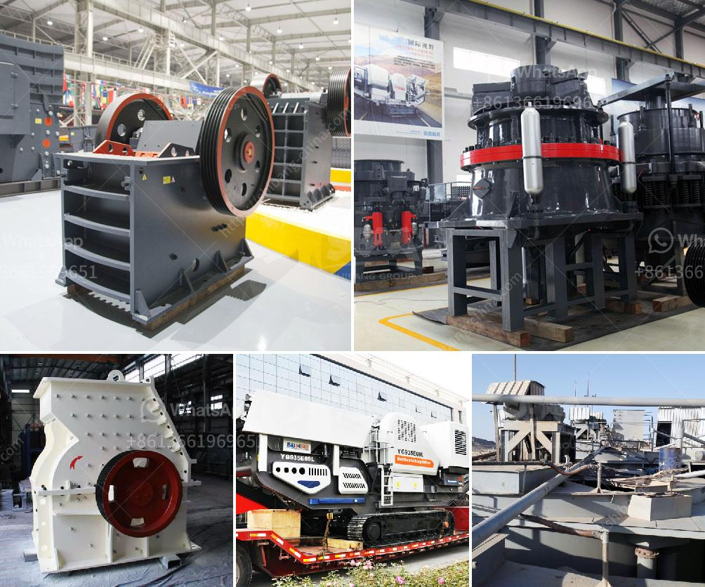

<h3>شاشة اهتزازية للبيع في الفلبين</h3>
تعتبر الشاشات الاهتزازية من التكنولوجيات المبتكرة التي تستخدم في مجموعة متنوعة من الصناعات. وفي الفلبين، يمكن العثور على العديد من الشركات التي تقدم شاشات اهتزازية للبيع بأسعار تتراوح بين 200-400 دولار. توفر هذه الشاشات تجربة فريدة للمستخدمين وتستخدم في العديد من التطبيقات، بما في ذلك الصناعات الغذائية والتعدين والبناء والصناعات الكيماوية والصناعات الصوتية والبصرية.

تعد الشاشات الاهتزازية من الخيارات الفعالة والاقتصادية لفصل المواد الصلبة من السوائل أو الفصل بين المنتجات المختلفة من مواد محببة من خلال تطبيق قوة اهتزازية. فالاهتزاز يساعد على تفريق المادة وتوزيعها بشكل متساوٍ على السطح، مما يؤدي إلى زيادة كفاءة الفصل. تعمل الشاشات الاهتزازية عن طريق توجيه تيار من الكهرباء إلى محركات الاهتزاز المثبتة في الجزء السفلي من الشاشة، مما يسبب اهتزازها وهز الجسيمات على السطح.

يمكن استخدام الشاشات الاهتزازية في صناعة الغذاء لفصل المكونات الصلبة والسائلة في عمليات مثل الفرز والتصفية والفرز الحجمي. يمكن استخدامها أيضًا لفحص المواد الغذائية وإزالة الشوائب والمواد الغريبة. بالإضافة إلى ذلك، يمكن استخدامها في صناعة التعدين لفصل المواد المعدنية والفرز وإزالة الشوائب والأوساخ. وتستخدم الشاشات الاهتزازية أيضًا في صناعة البناء لفرز الركام والرمل والحصى في عمليات البناء.

تتوافر الشاشات الاهتزازية المعروضة للبيع في الفلبين بأحجام وأشكال مختلفة، لتتناسب مع احتياجات كل صناعة وتطبيق محدد. توفر الشركات المصنعة للشاشات الاهتزازية مجموعة متنوعة من الموديلات التي تتراوح بين الشاشات الصغيرة المحمولة المستخدمة في الاختبارات الصغيرة، وحتى الشاشات الكبيرة المستخدمة في صناعات ذات طلبات أكبر.

تمتاز الشاشات الاهتزازية بالمرونة والمتانة، مما يضمن استخدامها لفترة طويلة وبأداء عالٍ. كما أنها سهلة الصيانة والتشغيل، مما يجعلها خيارًا شائعًا للشركات والصناعات المختلفة في الفلبين.

لذا، يمكن القول إن الشاشات الاهتزازية توفر للصناعات في الفلبين حلاً فعالًا ومبتكرًا للفصل والفرز والتصفية. بفضل مجموعة واسعة من الموديلات والأحجام المتاحة، يمكن للشركات الاختيار من بينها حسب احتياجاتها الخاصة. كما أن التكنولوجيا المتقدمة التي يتمتع بها هذا الجهاز تضمن كفاءة عالية في العملية وتوفير التكاليف وتقليل الهدر، مما يساعد على زيادة الإنتاجية وتعزيز رضا العملاء.
<h3>Contact us</h3><ul><li><strong>Whatsapp:&nbsp;<a href="https://wa.me/8613661969651">+8613661969651</a></strong></li><li><a href="https://swt.shibang-china.com/?git&amp;zhl&amp;شاشة اهتزازية للبيع في الفلبين"><strong>Online Service(chat now)</strong></a></li></ul><h3>Related</h3><ul><li><a href='سعر رخيص لآلة تصنيع حبيبات الفحم.md'>سعر رخيص لآلة تصنيع حبيبات الفحم</a></li><li><a href='خط إنتاج مسحوق الحجر الجيري في الهند.md'>خط إنتاج مسحوق الحجر الجيري في الهند</a></li><li><a href='تقرير مشروع وحدات كسارة الحجر.md'>تقرير مشروع وحدات كسارة الحجر</a></li><li><a href='ضبط حجم الفك كسارة الإغلاق.md'>ضبط حجم الفك كسارة الإغلاق</a></li><li><a href='سيور ناقلة معدنية في الألواح.md'>سيور ناقلة معدنية في الألواح</a></li></ul>