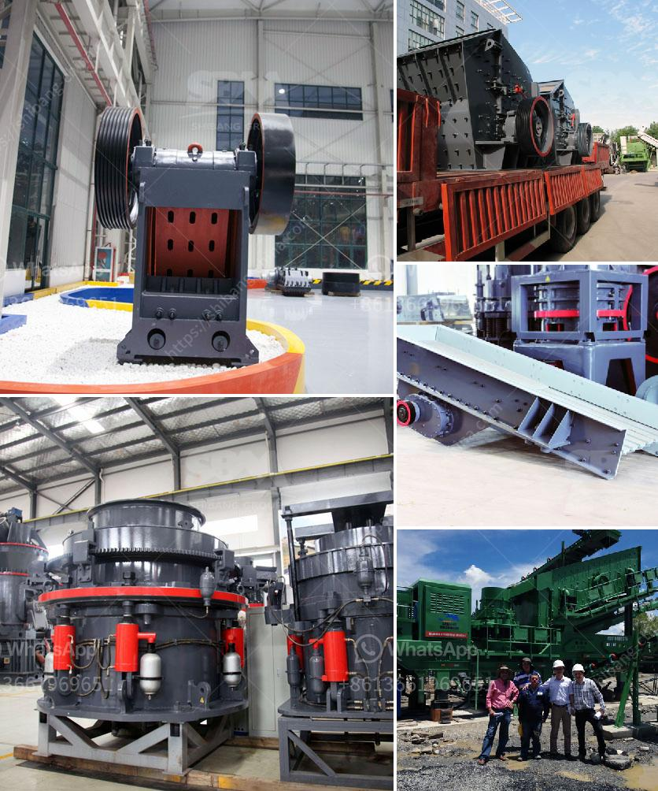

<h3>شاشة تصنيف اهتزازية</h3>
تعتبر شاشات التصنيف الاهتزازية، المعروفة أيضًا باسم شاشات الهز الخطي، تقنية حديثة وفعالة في عملية الفصل والتصنيف. تعتمد هذه التقنية على الاستفادة من قوة الهز لفصل المواد المختلفة بناءً على الحجم والوزن. تمثل هذه الشاشات تقنية مبتكرة تستخدم في عدة صناعات مثل التعدين، ومعالجة المواد، والتعبئة والتغليف، وصناعة الألوان، والمزيد.

تتكون الشاشة التصنيف الاهتزازية من سطح مسطح مثقب يحتوي على ثقوب تصل إلى أحجام مختلفة تعتمد على نوع المواد الخام المطلوب فصلها. المواد تأتي من خلال فوهة الإدخال وتوزع بالتساوي على سطح الشاشة. ثم، تتم تشغيل شاشة التصنيف الاهتزازية وتبدأ الهزات، مما يساعد في تصنيف المواد تلقائيًا على أساس حجمها ووزنها.

لماذا تستخدم الشاشات التصنيف الاهتزازية؟ تعتبر هذه التقنية فعالة جدًا في تحسين عمليات الفصل والتصنيف المختلفة. فهي تتيح فرز المواد تلقائيًا بناءً على حجمها، مما يزيد من الإنتاجية ويقلل من تكاليف العمل والوقت. كما أنها تزيد من نسبة جودة المنتجات النهائية وتقلل من احتمالية حدوث خلط أو تمزق للمواد.

تتميز الشاشات التصنيف الاهتزازية بالدقة والسرعة في عملية التصنيف. فهي تقوم بفصل المواد بدقة عالية وبطريقة سريعة وفعالة. بالإضافة إلى ذلك، فإنها تعتبر أداة قابلة للتخصيص، حيث يمكن ضبطها لتلبية متطلبات العملاء المحددة.

بفضل تطور التكنولوجيا، أصبحت الشاشات التصنيف الاهتزازية أكثر تطورًا وتميزًا بالتحكم الرقمي والتشغيل الآلي. يتم ربط هذه الشاشات بأنظمة الكمبيوتر وبرامج التحكم، مما يسمح بالتحكم الدقيق في عملية التصنيف ومراقبتها.

في النهاية، تعد الشاشات التصنيف الاهتزازية تقنية حديثة ومهمة في عمليات الفصل والتصنيف. فهي تتيح فرز المواد بطريقة فعالة ودقيقة، مما يساهم في زيادة الإنتاجية وتقليل التكاليف. بفضل تطور التكنولوجيا، أصبحت هذه الشاشات أكثر تقدمًا ومرونة، مما يجعلها حلاً مثاليًا للصناعات المختلفة التي تحتاج إلى عملية دقيقة وفعالة للفصل والتصنيف.
<h3>Contact us</h3><ul><li><strong>Whatsapp:&nbsp;<a href="https://wa.me/8613661969651">+8613661969651</a></strong></li><li><a href="https://swt.shibang-china.com/?git&amp;zhl&amp;شاشة تصنيف اهتزازية"><strong>Online Service(chat now)</strong></a></li></ul><h3>Related</h3><ul><li><a href='مطحنة الأسطوانة للسائل.md'>مطحنة الأسطوانة للسائل</a></li><li><a href='كسارات الفحم المتنقلة للإيجار.md'>كسارات الفحم المتنقلة للإيجار</a></li><li><a href='معدات مصنع الكسارة.md'>معدات مصنع الكسارة</a></li><li><a href='تكاليف مطاحن الكرة.md'>تكاليف مطاحن الكرة</a></li><li><a href='تحليل التكلفة للكسارات.md'>تحليل التكلفة للكسارات</a></li></ul>