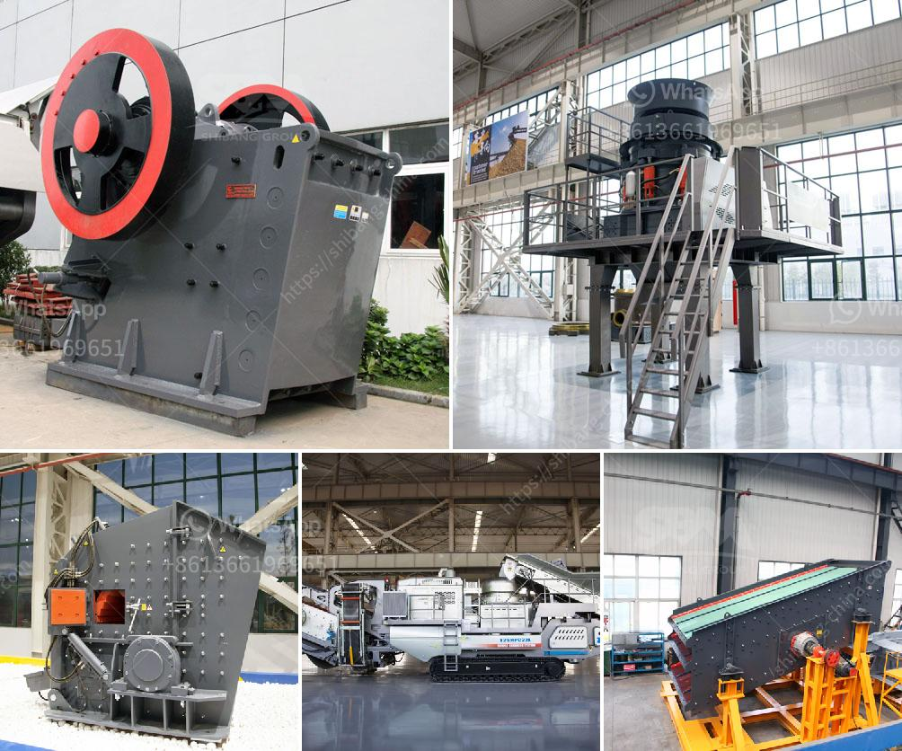

<h3>شاشة تهتز الفحم المصنعين في جنوب أفريقيا</h3>
تعتبر جنوب أفريقيا أحد أبرز المنتجين للفحم في العالم، حيث تتمتع بموارد ضخمة من الفحم تسهم في اقتصاد البلاد وتوفير فرص العمل للعديد من السكان. وتعتبر شاشة تهتز الفحم أحد الأجهزة الرئيسية المستخدمة في مناجم الفحم في جنوب أفريقيا لفصل الفحم عن المواد الأخرى.

تهدف شاشة تهتز الفحم إلى فصل قشور الفحم الصلبة والعوالق من خلال اهتزازها بشكل متكرر. تعمل هذه الشاشة عن طريق تثبيت شبكة معدنية على الجزء العلوي للجهاز، ويتم تغذية الفحم المكسر إلى الشاشة في الجزء العلوي. عندما يبدأ الجهاز في التشغيل، يتم تهتز الشاشة بسرعة محددة، مما يتسبب في فصل الفحم النقي عن الشوائب والمواد الأخرى.

تتوفر العديد من المصنعين لشاشات تهتز الفحم في جنوب أفريقيا، حيث تقوم هذه الشركات بتصنيع وتوريد المعدات اللازمة لصناعة الفحم. ومن بين هذه الشركات، يجب ذكر شركة "مصنعي شاشات الفحم الجنوبية"، وهي شركة محلية تعمل في هذا المجال منذ سنوات عديدة. تصنع الشركة شاشات تهتز الفحم عالية الجودة وفقًا للمعايير الصناعية العالمية، وتتميز بالموثوقية والكفاءة العالية.

تستخدم شاشات تهتز الفحم في جميع أنحاء مناجم الفحم في جنوب أفريقيا، وتسهم في زيادة إنتاجية هذا القطاع الحيوي. فبفضل تلك الشاشات، يتم فصل الفحم بشكل فعال وسريع، مما يوفر الوقت والجهد للعمال في المناجم ويزيد من الربحية لأصحاب الشركات.

بالإضافة إلى ذلك، فإن استخدام شاشات تهتز الفحم في جنوب أفريقيا يسهم في الحفاظ على البيئة، حيث يمكن تقليل إنتاج المواد الصلبة والعوالق التي تصاحب استخراج الفحم. وبالتالي، يقدم القطاع الفحمي في جنوب أفريقيا مساهمة إيجابية في تحقيق التنمية المستدامة.

في الختام، تعتبر شاشة تهتز الفحم من الأجهزة الحيوية في مناجم الفحم في جنوب أفريقيا، حيث تسهم في فصل الفحم عن المواد الأخرى بفعالية وكفاءة. ومن خلال توفير مصنعين محليين عالية الجودة، يتم تعزيز الإنتاجية والاستدامة في هذا القطاع الحيوي.
<h3>Contact us</h3><ul><li><strong>Whatsapp:&nbsp;<a href="https://wa.me/8613661969651">+8613661969651</a></strong></li><li><a href="https://swt.shibang-china.com/?git&amp;zhl&amp;شاشة تهتز الفحم المصنعين في جنوب أفريقيا"><strong>Online Service(chat now)</strong></a></li></ul><h3>Related</h3><ul><li><a href='كسارة في ليما.md'>كسارة في ليما</a></li><li><a href='رمل صناعي للبناء.md'>رمل صناعي للبناء</a></li><li><a href='مطاحن الكرة المتواصلة أو الانقطاعية.md'>مطاحن الكرة المتواصلة أو الانقطاعية</a></li><li><a href='كسارة مخروطية غير مستخدمة في إثيوبيا للبيع.md'>كسارة مخروطية غير مستخدمة في إثيوبيا للبيع</a></li><li><a href='خط إنتاج خاص لتعدين مسحوق الكوارتز.md'>خط إنتاج خاص لتعدين مسحوق الكوارتز</a></li></ul>