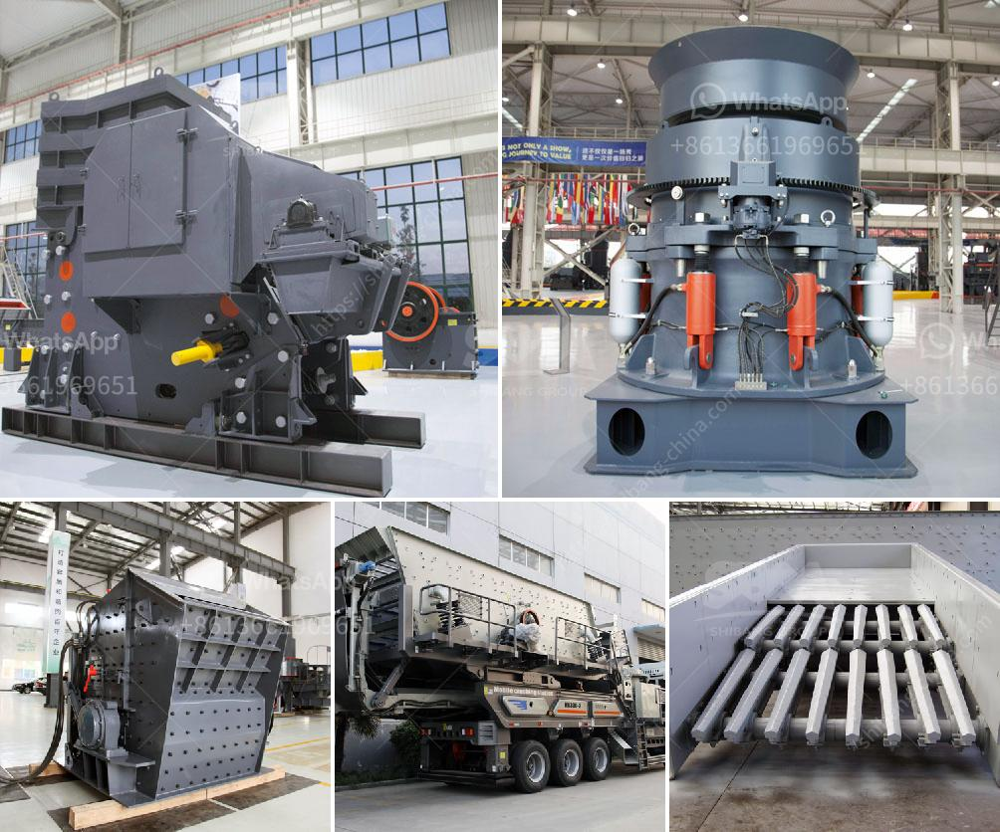

<h3>شاشة هزازة صينية</h3>
تعتبر الشاشات الهزازة الصينية من الأجهزة التكنولوجية الحديثة التي تختلف عن الشاشات التقليدية التي نعرفها. تقدم الشاشات الهزازة تجربة ممتعة ومريحة للمستخدم، حيث يتم تصميمها بطريقة تسمح للشاشة بالاهتزاز بشكل متكرر.

إن وظيفة الهزاز في الشاشة هو إعطاء تأثير واقعي للمحتوى المعروض على الشاشة، بغض النظر عن ماهية المحتوى، سواء كانت صورة تتحرك أو مشهد فيلم أو لعبة فيديو. يرتبط وجود الهزاز بحساسات صغيرة مثبتة في الخلفية أو الحواف الجانبية للشاشة، وعند تشغيل الجهاز، يقوم البرنامج بتحديد الأصوات والموجات الصوتية أو الأحداث في المحتوى المعروض، ثم يقوم بإرسال إشارة إلى الحساسات لتوليد الاهتزاز المناسب وفقًا للتجربة المطلوبة.

تعتبر الشاشات الهزازة مفيدة في مجموعة متنوعة من التطبيقات والألعاب. ففي حالة تشغيل مشهد فيلم أو لعبة فيديو مثيرة للإثارة، يمكن أن تساهم الشاشة الهزازة في زيادة الشعور بالتشويق والحماس وتحسين تجربة المستخدم. بالإضافة إلى ذلك، فإن الشاشات الهزازة قد تساهم في تحسين تجربة المشاهدة للأفلام الأكشن، حيث يتم نقل الحركات والموجات الصوتية بشكل واقعي إلى المشاهد.

يقدم الشاشات الهزازة أيضًا تجربة ممتعة في التجارب الافتراضية والواقع المعزز. على سبيل المثال، في حالة استخدام الشاشة الهزازة في ألعاب القيادة، يمكن للمستخدم أن يشعر بالتأرجح الطفيف للسيارة أثناء القيادة، الأمر الذي يعزز واقعية اللعبة ويوفر تجربة ألعاب محسّنة.

من الواضح أن الشاشات الهزازة الصينية تعد جديرة بالاهتمام بتكلفة تنافسية تتراوح ما بين 200 و 400 دولار. إن هذه الشاشات توفر تجربة ترفيهية ممتعة للمستخدمين عن طريق إضافة عنصر الاهتزاز إلى التطبيقات والألعاب الرقمية. يمكن للشاشات الهزازة الصينية أن تحدث ثورة في مجال الترفيه الرقمي وتقدم تجربة فريدة من نوعها للمستخدمين الذين يبحثون عن مزيد من التحسينات والتجارب المبتكرة في عالم التكنولوجيا.
<h3>Contact us</h3><ul><li><strong>Whatsapp:&nbsp;<a href="https://wa.me/8613661969651">+8613661969651</a></strong></li><li><a href="https://swt.shibang-china.com/?git&amp;zhl&amp;شاشة هزازة صينية"><strong>Online Service(chat now)</strong></a></li></ul><h3>Related</h3><ul><li><a href='مصانع الكسارات الصينية.md'>مصانع الكسارات الصينية</a></li><li><a href='آلة مسحوق التلك.md'>آلة مسحوق التلك</a></li><li><a href='سعر آلة صنع الرمل الاصطناعي.md'>سعر آلة صنع الرمل الاصطناعي</a></li><li><a href='كيفية إنشاء مصنع لتكسير الحجر.md'>كيفية إنشاء مصنع لتكسير الحجر</a></li><li><a href='مطحنة كرات صغيرة لهنان الصين.md'>مطحنة كرات صغيرة لهنان الصين</a></li></ul>