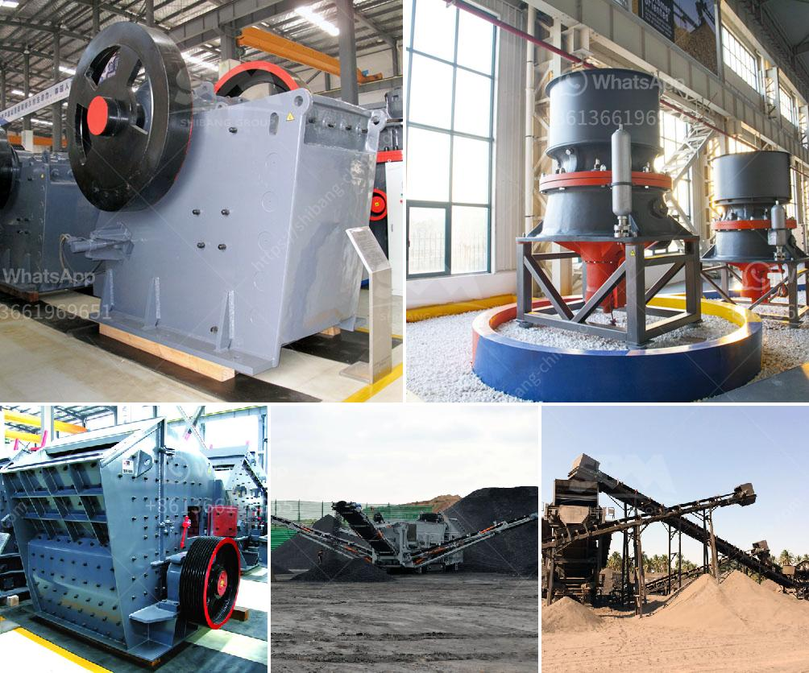

<h3>شراء آلة محجر من أوروبا</h3>
إن استثمار في قطاع التعدين يتطلب دومًا تجهيزات وآلات عالية الجودة لضمان تحقيق أقصى استفادة من المحجر. ومن بين الخيارات المتاحة لشراء هذه الآلات ، يُعتبر شراء آلة محجر من أوروبا من بين الخيارات الأكثر فائدة وجودة.

تمتاز آلات المحاجر الأوروبية بجودتها العالية والتكنولوجيا المتقدمة التي تضمن سهولة الاستخدام والأداء الفعال. تتمتع الشركات الأوروبية المصنعة بمستوى عالٍ من الاحترافية والتزامها بمعايير الجودة الصارمة. فالمنتجات المصنوعة في أوروبا غالبًا ما تمتلك تصاميم مبتكرة تساعد في تحسين إنتاجية المحجر، وبالتالي تعزيز الأرباح والمستدامة في المشروع.

من بين الفوائد الأخرى لشراء آلة محجر من أوروبا هو وجود خدمة ما بعد البيع الممتازة. تضمن الشركات الأوروبية توفير قطع الغيار الأصلية والصيانة الفنية المتخصصة. وهذا يعني أنه عندما يكون لديك آلة من أوروبا، فإنك تضمن الحفاظ على الأداء الأمثل للآلة لفترة أطول.

عند تحديد الميزانية لشراء آلة محجر من أوروبا، يجب أن يتم تحديد ما إذا كنت تبحث عن آلات مستعملة أم آلات جديدة. آلات المحاجر المستعملة قد تكون خيارًا ممتازًا للمشترين ذوي الميزانية المحدودة، حيث يمكن أن توفر فرصة للحصول على آلة ذات جودة عالية بتكلفة أقل. ومع ذلك، يجب أخذ العديد من العوامل في الاعتبار عند شراء آلة محجر مستعملة، مثل سنة الصنع وحالة الآلة وتاريخ الصيانة.

بالنسبة للمشترين الذين يمتلكون ميزانية مرتفعة، يمكنهم شراء آلة محجر جديدة ومخصصة من أوروبا. هذه الآلات تتمتع بأحدث التقنيات والتصاميم المبتكرة، وتوفر مزايا مثل زيادة الإنتاجية وتقليل تكاليف التشغيل. بالإضافة إلى ذلك، فإنه يمكن تخصيص الآلة حسب احتياجات المشروع الفردي، مما يزيد من كفاءة العمل والاستدامة.

في النهاية، فإن شراء آلة محجر من أوروبا يُعتبر خيارًا مثاليًا للمستثمرين الذين يتطلعون لتحقيق أقصى استفادة من عملية التعدين. سواء كانت الآلة جديدة أو مستعملة، فإن الجودة العالية والدعم التقني المتميز من الشركات الأوروبية تؤكد أنك ستحصل على آلة قوية وموثوقة تلبي احتياجاتك وتدعم نجاح مشروعك.
<h3>Contact us</h3><ul><li><strong>Whatsapp:&nbsp;<a href="https://wa.me/8613661969651">+8613661969651</a></strong></li><li><a href="https://swt.shibang-china.com/?git&amp;zhl&amp;شراء آلة محجر من أوروبا"><strong>Online Service(chat now)</strong></a></li></ul><h3>Related</h3><ul><li><a href='مورد سير ناقل في الصين.md'>مورد سير ناقل في الصين</a></li><li><a href='كسارة حجر لاستخراج الحجر.md'>كسارة حجر لاستخراج الحجر</a></li><li><a href='عملية تحويل الحجر الجيري إلى الإسمنت.md'>عملية تحويل الحجر الجيري إلى الإسمنت</a></li><li><a href='كسارة حجرية بسعة 100 طن في الساعة استهلاك الديزل.md'>كسارة حجرية بسعة 100 طن في الساعة استهلاك الديزل</a></li><li><a href='كيفية جعل مسحوق الحجر الجيري.md'>كيفية جعل مسحوق الحجر الجيري</a></li></ul>