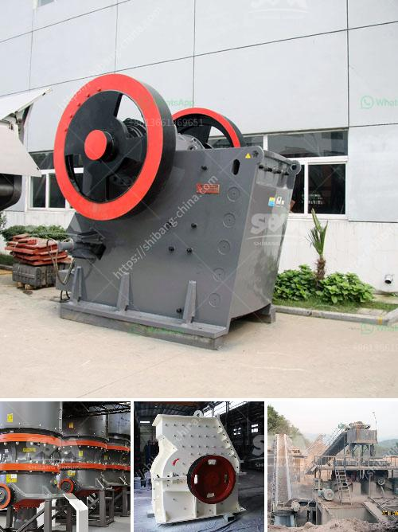

<h3>شراء كسارة الحجر sbm في الفلبين</h3>
تُعتبر صناعة البناء والإنشاء واحدة من أهم الصناعات الحيوية في الفلبين. ومن العوامل الرئيسية في عملية البناء هي استخدام الحصى والرمل والحجارة في إنشاء المباني والطرق. إذاً، الحصى والحجارة تلعب دورًا حيويًا في دعم وتطوير البنية التحتية في البلاد.

مع زيادة الإقبال على استخدام الحجر في قطاع البناء، يشعر العديد من رجال الأعمال والشركات بحاجة ماسة إلى كسارة حجر موثوقة وفعّالة. ومن بين الشركات المصنعة المعروفة حول العالم تأتي SBM كواحدة من أبرزها.

تتميز كسارة الحجر SBM بالعديد من المزايا التي تجعلها الخيار المثالي للعديد من الشركات في الفلبين. فمن المميزات الرئيسية للكسارة:

1. الجودة والموثوقية: تتميز كسارة الحجر SBM بتصميم عالي الجودة وقدرة تحمل عالية. تنتج الشركة أيضًا معدات ذات تكنولوجيا حديثة وموثوقة، وذلك لضمان المتانة والأداء العالي للكسارة.

2. الكفاءة والإنتاجية: تعمل كسارة الحجر SBM بكفاءة كبيرة مما ينتج في زيادة الإنتاجية وتقليل وقت الإنتاج. تتيح للشركات إنتاج كميات كبيرة من الحجارة والحصى في وقت قصير.

3. الصيانة السهلة: صيانة الكسارة SBM تعتبر بسيطة وغير مكلفة. كما أن قطع الغيار متوفرة بسهولة وبأسعار معقولة. هذا يساعد في تقليل تكلفة الصيانة وزيادة عمر الكسارة.

4. الأداء البيئي: تعتمد كسارة الحجر SBM على تقنيات حديثة تحسن كفاءة استخدام الطاقة وتقلل من انبعاثات الغازات الضارة. هذا يجعلها أكثر صديقة للبيئة وتلبي المعايير البيئية المحلية والدولية.

من الجدير بالذكر أن شراء كسارة الحجر SBM في الفلبين يتطلب دراسة وتحليل تفصيلي لاحتياجات الشركة وميزانيتها. يجب أن تطابق الكسارة المواصفات المطلوبة وأن تكون التكلفة متوافقة مع الميزانية المتاحة. لذلك، ينصح بالتعاون مع موردين موثوقين ومتخصصين لضمان اختيار الكسارة المثالية والاستفادة القصوى منها.

في النهاية، يعد شراء كسارة الحجر SBM في الفلبين قرارًا استراتيجيًا يمكن أن يحسن الكفاءة والإنتاجية لدى الشركات في قطاع البناء. من خلال اختيار الكسارة المناسبة ومتابعة الصيانة الدورية، يمكن للشركات تحقيق النجاح والنمو في هذه الصناعة الحيوية.
<h3>Contact us</h3><ul><li><strong>Whatsapp:&nbsp;<a href="https://wa.me/8613661969651">+8613661969651</a></strong></li><li><a href="https://swt.shibang-china.com/?git&amp;zhl&amp;شراء كسارة الحجر sbm في الفلبين"><strong>Online Service(chat now)</strong></a></li></ul><h3>Related</h3><ul><li><a href='عملية كولمان للطحن.md'>عملية كولمان للطحن</a></li><li><a href='مصانع طحن الأحجار في تايلاند.md'>مصانع طحن الأحجار في تايلاند</a></li><li><a href='قائمة الآلات المستخدمة في تعدين الفحم.md'>قائمة الآلات المستخدمة في تعدين الفحم</a></li><li><a href='أسعار مصنع كسارة الحجر.md'>أسعار مصنع كسارة الحجر</a></li><li><a href='تقرير تفصيلي حول مصنع مسحوق الكوارتز.md'>تقرير تفصيلي حول مصنع مسحوق الكوارتز</a></li></ul>