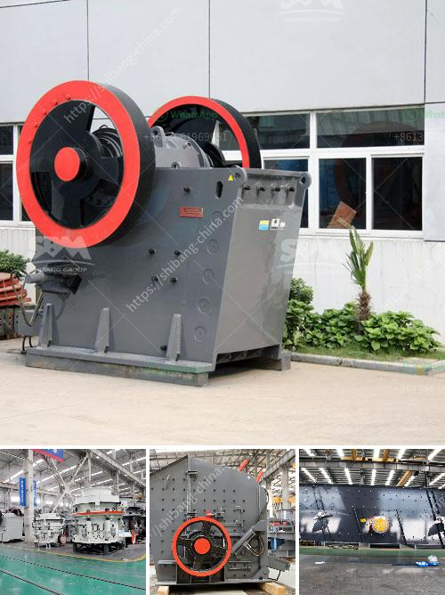

<h3>شراء كسارة الفك الأولية في نيجيريا</h3>
كسارة الفك الأولية هي واحدة من الآلات المستخدمة بشكل شائع في صناعة التعدين ومعالجة الصخور في نيجيريا وفي جميع أنحاء العالم. تعتبر كسارة الفك الأولية عبارة عن آلة تستخدم لتكسير الصخور الكبيرة وتحويلها إلى قطع صغيرة قابلة للتعامل. يتم استخدام هذه الكسارات بشكل رئيسي في عمليات التعدين والبناء وصناعة البناء وتجهيز المواد الخام.

هناك العديد من العوامل التي يجب مراعاتها عند شراء كسارة فكية أولية في نيجيريا. أولاً وقبل كل شيء ، يجب تحديد الاحتياجات والمتطلبات الخاصة بالمشروع المراد تنفيذه. يتعلق الأمر بنوع الصخور التي ستتم معالجتها وحجمها وكمياتها والمنطقة التي ستوضع فيها الكسارة.

بعد تحديد الاحتياجات، يجب البحث عن الشركات المصنعة الموثوقة والموزعين المحليين في نيجيريا الذين يقدمون كسارات الفك الأولية. يجب على المشتري أن يدرس المزيد عن سجل الشركة وسمعتها في السوق. يجب عليهم أيضاً البحث عن توصيات وآراء العملاء السابقين للتأكد من جودة المنتجات وخدمة العملاء.

بعد الحصول على قائمة بالشركات الأكثر ملاءمة، ينبغي للمشتري أن يقارن بين المنتجات المتاحة. يجب أن ينظر إلى المواصفات التقنية لكل كسارة وقدرتها على استيعاب الصخور وغرابة الشكل التي تريد معالجتها. كما يجب أيضاً النظر في القوة والمتانة وكفاءة الطاقة وصيانة المنتج.

من الضروري أن تكون الكسارة الفكية الأولية سهلة الاستخدام والصيانة. يجب أن يتوفر الدعم الفني من الشركة المصنعة أو الموزع النيجيري، حتى يتمكن المشتري من التعامل مع أي مشاكل تكتنف الكسارة المستخدمة في المستقبل.

وأخيرًا، يجب أن يتم تحديد الميزانية المتاحة لشراء كسارة الفك الأولية. يجب على المشتري أن يقارن بين الأسعار المختلفة وأن يختار الجودة والأداء الأمثل بناءً على الميزانية المحددة. إذا كانت الكسارة مكلفة للغاية، يجب البحث عن حلول تمويلية متاحة للمساعدة في الشراء.

باختصار، شراء كسارة الفك الأولية في نيجيريا يتطلب التخطيط والبحث المستفيض. يجب على المشتري معرفة احتياجات المشروع والتوصل إلى الشركات المصنعة الموثوقة وتقييم المنتجات المتاحة قبل اتخاذ قرار الشراء. ينبغي أيضاً عليهم دراسة الميزانية المتاحة وحاجتهم إلى تمويل إضافي إذا لزم الأمر. من خلال اتخاذ هذه الاحتياطات اللازمة ، يمكن للمشتري شراء كسارة فكية أولية ذات جودة عالية وأداء ممتاز لمشروعه في نيجيريا.
<h3>Contact us</h3><ul><li><strong>Whatsapp:&nbsp;<a href="https://wa.me/8613661969651">+8613661969651</a></strong></li><li><a href="https://swt.shibang-china.com/?git&amp;zhl&amp;شراء كسارة الفك الأولية في نيجيريا"><strong>Online Service(chat now)</strong></a></li></ul><h3>Related</h3><ul><li><a href='مطحنة كرات للبيع في الهند.md'>مطحنة كرات للبيع في الهند</a></li><li><a href='مطحنة طحن فائقة الدقة.md'>مطحنة طحن فائقة الدقة</a></li><li><a href='سحق الحجر الأسود تايلاند.md'>سحق الحجر الأسود تايلاند</a></li><li><a href='تصنيع محطم المحمولة في ألمانيا.md'>تصنيع محطم المحمولة في ألمانيا</a></li><li><a href='مشاريع المطاحن للسائل الزجاجي في الهند.md'>مشاريع المطاحن للسائل الزجاجي في الهند</a></li></ul>