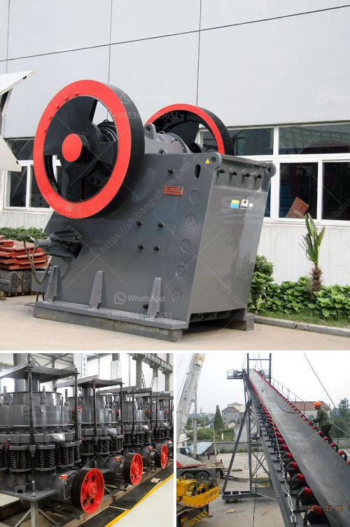

<h3>شراء كسارة حجر في الإمارات</h3>
تعتبر صناعة البناء والتشييد واحدة من أهم القطاعات الاقتصادية في دولة الإمارات العربية المتحدة. تشهد البلاد نموًا مستمرًا في القطاع العقاري والإنشائي بفضل العديد من المشاريع الضخمة التي تتضمن المباني السكنية والتجارية والمؤسسات الحكومية والمشاريع السياحية.

عند النظر في استثمار شراء كسارة حجر في الإمارات، يعتبر ذلك خطوة استراتيجية وذكية للأفراد أو الشركات المهتمة بقطاع البناء والتشييد. إن كسارات الحجر تستخدم لسحق الصخور وتحويلها إلى مواد بناء قابلة للإعادة الاستخدام مثل الحصى والركام. تلك المواد البنائية ضرورية للمشاريع الكبيرة والصغيرة على حد سواء.

يوجد العديد من الفوائد التي يمكن الحصول عليها عند شراء كسارة حجر في الإمارات. أهمها:

1. التحكم في جودة المواد: عند شراء كسارة حجر الخاصة بك ، يمكنك ضمان جودة المواد التي تستخدمها في مشاريعك. يمكنك التحكم في عملية السحق وفحص المواد بنفسك والتأكد من أنها تلبي المعايير المطلوبة.

2. خفض تكاليف الإنشاء: عند شراء كسارة حجر الخاصة بك ، يمكنك تقليل التكاليف الناتجة عن شراء المواد البنائية من مصادر خارجية. بدلاً من ذلك ، يمكنك استخدام الصخور المحطمة من خلال كسارتك الخاصة وتوفير المال في عملية الإنشاء.

3. زيادة الإنتاجية: من خلال تملكك لكسارة حجر الخاصة بك ، يمكنك زيادة إنتاجيتك وسرعة تنفيذ المشاريع. لن تكون مضطرًا للانتظار على المواد من موردين خارجيين ويمكنك تلبية احتياجات مشروعك عند الحاجة.

4. توفير الوقت: بدلاً من قضاء الوقت في البحث واختيار الموردين للمواد البنائية ، يمكنك الاستفادة من كسارتك الخاصة. ستتمكن من الحصول على المواد بسرعة وسهولة من موقع الكسارة ، وذلك بتوفير الوقت والجهد المبذولين في البحث عن الموردين الملائمين.

بعد اتخاذ قرار شراء كسارة حجر في الإمارات، ينبغي عليك أخذ بعض العوامل في الاعتبار. على سبيل المثال، يجب أن تقوم بتحديد حجم الكسارة المناسبة وقدرة إنتاجها وتكاليف الصيانة. باستشارة خبراء الصناعة والاستفادة من خبرتهم ومعرفتهم في هذا المجال ، ستتمكن من اتخاذ قرار شراء صحيح يلبي احتياجاتك.

في النهاية ، يجب عليك أن تدرك أن شراء كسارة حجر في الإمارات هو استثمار طويل الأمد يمكن أن يوفر لك العديد من المزايا ويدعم نمو وتطور أعمالك في قطاع البناء والتشييد. إذا تم اتخاذ القرار الصحيح وتوجيه الاهتمام والعناية اللازمين للكسارة، فسوف تعمل على تعزيز تنافسيتك في السوق وتحقيق النجاح المستدام.
<h3>Contact us</h3><ul><li><strong>Whatsapp:&nbsp;<a href="https://wa.me/8613661969651">+8613661969651</a></strong></li><li><a href="https://swt.shibang-china.com/?git&amp;zhl&amp;شراء كسارة حجر في الإمارات"><strong>Online Service(chat now)</strong></a></li></ul><h3>Related</h3><ul><li><a href='طاحونة السخام.md'>طاحونة السخام</a></li><li><a href='مورد مصنع تكسير الحجر في الفلبين.md'>مورد مصنع تكسير الحجر في الفلبين</a></li><li><a href='تصميم مطحنة الهامر.md'>تصميم مطحنة الهامر</a></li><li><a href='شاشة اهتزازية لرمل الكوارتز.md'>شاشة اهتزازية لرمل الكوارتز</a></li><li><a href='سحق الكلي ٢٠٠ طن في الساعة بمرحلتين.md'>سحق الكلي ٢٠٠ طن في الساعة بمرحلتين</a></li></ul>