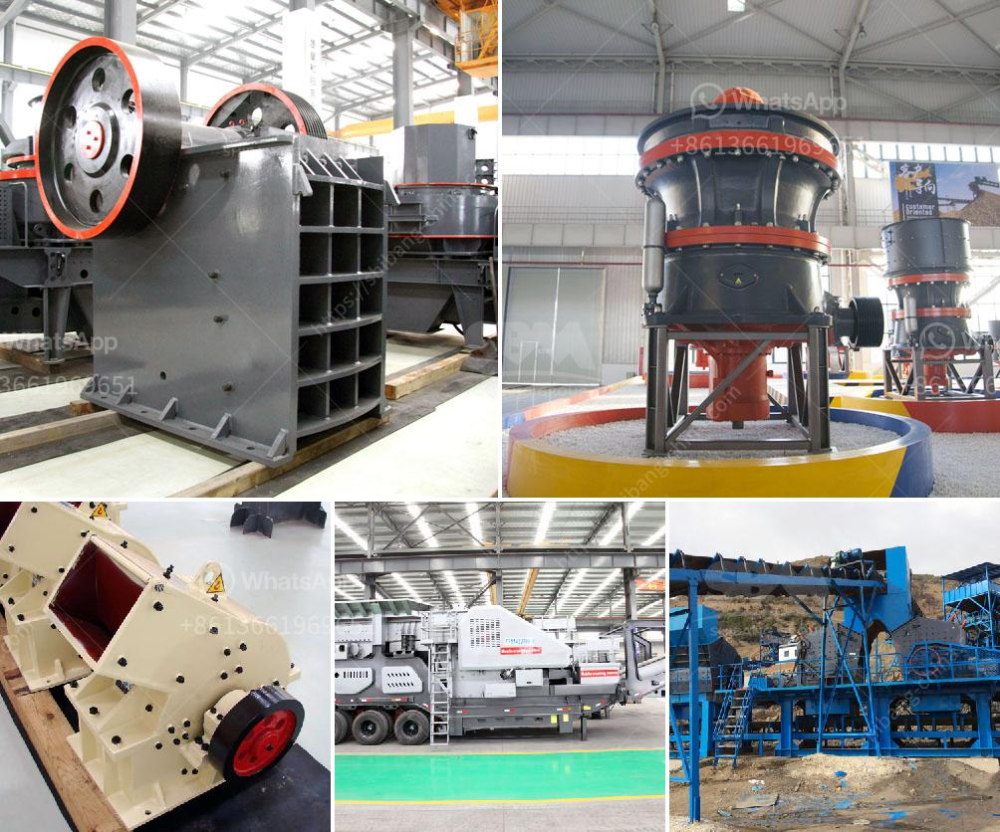

<h3>شراء محطة غسيل الفحم في ألمانيا</h3>
تعد محطات غسيل الفحم من العوامل الرئيسية في عملية تحويل الفحم الخام إلى فحم نظيف وعالي الجودة يمكن استخدامه في مجموعة متنوعة من الصناعات. ويعتبر استثمار في شراء محطة غسيل الفحم في ألمانيا خطوة استراتيجية مهمة لعدة أسباب.

أولاً، فإن شراء محطة غسيل الفحم يمكن أن يمثل فرصة استثمارية مربحة. فحم الفحم لا يزال من أكثر مصادر الطاقة توفرًا في العالم، ويستخدم بكثرة في مجموعة واسعة من الصناعات مثل صناعة الصلب، وتوليد الكهرباء، وصناعة الاسمنت. وبوجود محطة غسيل الفحم، يمكن للمستثمرين زيادة القيمة المضافة للفحم المستخرج من المناجم، وبالتالي زيادة الأرباح المستقبلية.

ثانياً، فإن شراء محطة غسيل الفحم يساهم في الحفاظ على البيئة وتعزيز الاستدامة. فحم الفحم النظيف يحتوي على نسبة أقل من المواد الضارة مثل الكبريت والنيتروجين، مما يقلل من الانبعاثات الضارة التي تؤثر سلبًا على الهواء والمياه والبيئة عمومًا. ولذا، فإن شراء محطة غسيل الفحم سيعزز استدامة صناعة الطاقة في ألمانيا، ويرفع من مستوى الوعي البيئي لدى المستهلكين.

ثالثاً، فإن شراء محطة غسيل الفحم في ألمانيا يعزز سيادة الدولة في مجال الطاقة. فإن الاعتماد على الفحم المحلي يقلل من الاعتماد على واردات الطاقة من الخارج، ويقلص نسبة الاعتماد على مصادر الطاقة الأخرى مثل النفط والغاز. بالتالي، تصبح الدولة قادرة على توفير الطاقة بأسعار معقولة وضمان استدامة الإمدادات والاعتمادية الطاقوية.

في الختام، فإن شراء محطة غسيل الفحم في ألمانيا هو استثمار استراتيجي يمكن أن يحقق عوائد مالية مربحة ويساهم في حماية البيئة وتحسين استدامة القطاع الطاقوي. لذا، فإن الشراء في هذه المحطة يعتبر قراراً حكيماً من الناحية الاقتصادية والبيئية والاستراتيجية.
<h3>Contact us</h3><ul><li><strong>Whatsapp:&nbsp;<a href="https://wa.me/8613661969651">+8613661969651</a></strong></li><li><a href="https://swt.shibang-china.com/?git&amp;zhl&amp;شراء محطة غسيل الفحم في ألمانيا"><strong>Online Service(chat now)</strong></a></li></ul><h3>Related</h3><ul><li><a href='تكلفة المطحنة من الكسارات.md'>تكلفة المطحنة من الكسارات</a></li><li><a href='مصنع معالجة الإسمنت.md'>مصنع معالجة الإسمنت</a></li><li><a href='كسارة للإيجار في نيو جيرسي.md'>كسارة للإيجار في نيو جيرسي</a></li><li><a href='مشكلة الناقل الفحم.md'>مشكلة الناقل الفحم</a></li><li><a href='مصنع كسارة الحجر والجرانيت.md'>مصنع كسارة الحجر والجرانيت</a></li></ul>