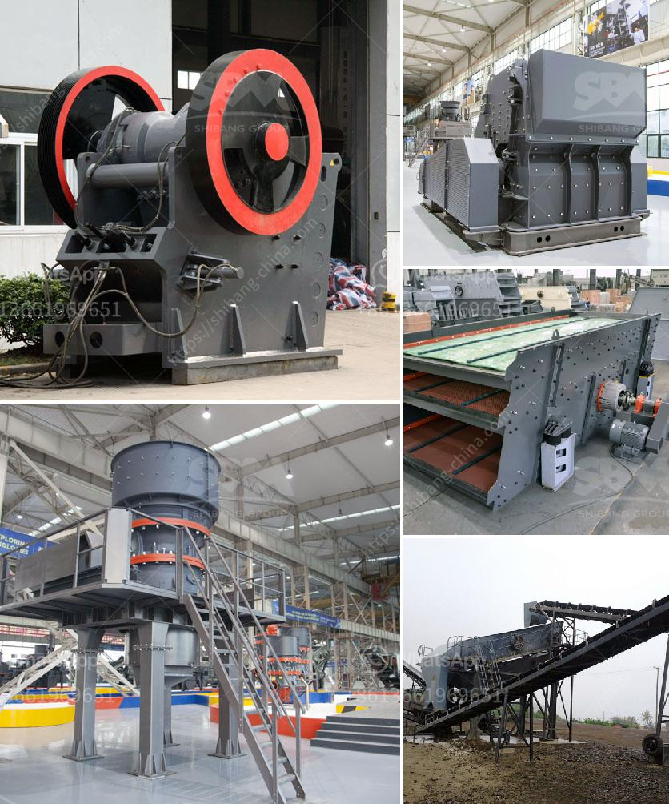

<h3>شراء مصنع غسيل الرمل في سريلانكا</h3>
تعتبر صناعة غسيل الرمل من الصناعات الأساسية التي تلعب دوراً هاماً في العديد من القطاعات مثل صناعة البناء والطرق وصناعة الزجاج. وعندما يتعلق الأمر بشراء مصنع لغسيل الرمل في سريلانكا، فإن هذا الاستثمار يمكن أن يكون خيارًا مواتيًا للعديد من الأسباب.

أولاً وقبل كل شيء، سريلانكا تعد واحدة من أجمل الوجهات السياحية في جنوب آسيا، حيث تجمع بين الطبيعة الخلابة والثقافة الغنية. وبفضل النمو المتسارع لقطاع السياحة في البلاد، فإن هناك طلب متزايد على المشاريع الإنشائية وبناء المنتجعات الفاخرة على الشواطئ وغيرها من المشاريع العقارية. وبالتالي، فإن الحاجة إلى الرمل المغسول يزداد يوماً بعد يوم.

ثانيًا، سريلانكا تشتهر بموقعها الجغرافي حيث تحتل موقعًا استراتيجيًا على مسار النقل البحري في المحيط الهندي. وبالتالي، فإنه يمكن استغلال هذا الموقع لاستيراد الرمل غير المعالج ومعالجته في المصنع المشترى لإنتاج رمل ذو جودة عالية. وباحتكار السوق المحلية، يمكن تحقيق أرباح هائلة.

هناك أيضًا العديد من المزايا التنافسية الأخرى التي يمكن أن تشكل دافعًا لشراء مصنع لغسيل الرمل في سريلانكا. فهناك توافر جيد للقوى العاملة الماهرة في البلاد، وأيضًا البنية التحتية المطورة والمرافق اللازمة لإقامة وتشغيل المصنع. كما يمكن العثور بسهولة على المواد الخام اللازمة لإنتاج الرمل، مثل الرمال النهرية أو الرمال البحرية.

وفي الختام، يجب أن نلاحظ أن شراء مصنع لغسيل الرمل في سريلانكا يتطلب تخطيطًا جيدًا ودراسة متأنية للسوق والعوامل الاقتصادية والقانونية المحلية. كما يجب على المستثمر البحث عن شركاء موثوق بهم والتأكد من توافر التمويل اللازم لشراء وتشغيل المصنع. ومع ذلك، إذا تمت معالجة هذه الجوانب الرئيسية، يمكن أن يكون شراء مصنع لغسيل الرمل في سريلانكا استثمارًا مجزيًا وناجحًا.
<h3>Contact us</h3><ul><li><strong>Whatsapp:&nbsp;<a href="https://wa.me/8613661969651">+8613661969651</a></strong></li><li><a href="https://swt.shibang-china.com/?git&amp;zhl&amp;شراء مصنع غسيل الرمل في سريلانكا"><strong>Online Service(chat now)</strong></a></li></ul><h3>Related</h3><ul><li><a href='معدات لإنتاج الحجر الطبيعي.md'>معدات لإنتاج الحجر الطبيعي</a></li><li><a href='تجهيز مسحوق الكوارتز السيليكا.md'>تجهيز مسحوق الكوارتز السيليكا</a></li><li><a href='مطحنة هامر للأسمنت.md'>مطحنة هامر للأسمنت</a></li><li><a href='معدات فحص الصخور.md'>معدات فحص الصخور</a></li><li><a href='آلة طحن صناعية في نيجيريا.md'>آلة طحن صناعية في نيجيريا</a></li></ul>