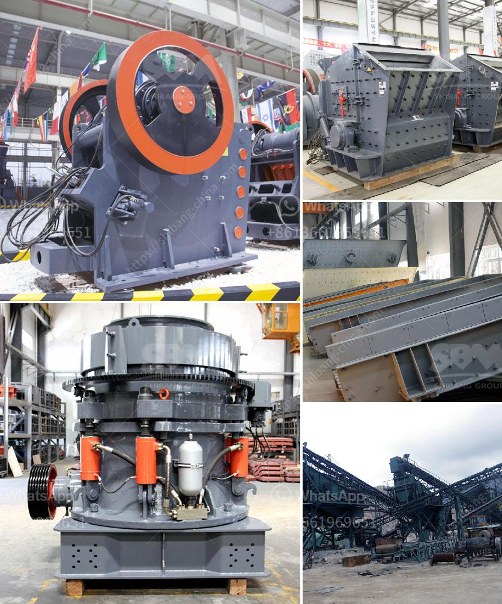

<h3>شراء مطحنة الكرة في بيرو</h3>
تعد مطاحن الكرة أدوات حاسمة في صناعة التعدين، حيث تستخدم لسحق المواد الخام وتحويلها إلى مسحوق ناعم يمكن استخدامه في العمليات الصناعية المختلفة. في بيرو، تعتبر صناعة التعدين من أهم القطاعات الاقتصادية، مما يجعل شراء مطحنة الكرة في هذا البلد خيارًا استثماريًا جيدًا بالنظر إلى الفرص الواعدة التي توفرها.

إحدى أسباب شراء مطحنة الكرة في بيرو هي غنى البلد بالموارد الطبيعية، وخاصة المعادن كالنحاس والذهب والفضة. يعد بيرو موردًا رئيسيًا لهذه المواد الثمينة، مما يشجع الشركات العالمية على الاستثمار في هذا القطاع. ويتطلب التعدين استخدام مطاحن الكرة لطحن الصخور الكبيرة وتحويلها إلى مسحوق ناعم يمكن استخدامه في إنتاج المعادن. لذلك، يمكن استدلالًا بسيطًا أن حاجة السوق لمطاحن الكرة ستكون مرتفعة في بيرو.

علاوة على ذلك، يشتهر بيرو بالاستثمار في قطاع التعدين وتكنولوجيا التعدين. تتوفر في البلاد العديد من الشركات المتخصصة في تصنيع مطاحن الكرة ذات الجودة العالية والتقنيات المتقدمة. تقدم هذه الشركات مطاحن الكرة المصممة خصيصًا للتعدين، مما يضمن أنها تلبي المتطلبات الصارمة لعمليات التعدين الحديثة. بالإضافة إلى ذلك، قد توفر بيرو تكلفة أقل لشراء مطحنة الكرة مقارنة ببعض البلدان الأخرى، مما يجعلها خيارًا مغريًا للشركات الباحثة عن استثمار طويل الأمد في صناعة التعدين.

أخيرًا، توجد فرص استثمارية متعددة في بيرو للتعدين، والتي يمكن أن تنجم عن شراء مطحنة الكرة. يمكن للشركات العاملة في هذا القطاع استغلال الطلب المتزايد على المعادن والتعدين في البلاد وزيادة إمكانية توليد أرباح عالية على المدى الطويل. يجب أن يدرك المستثمرون أن صناعة التعدين هي صناعة الفرص والمخاطر أيضًا، وعليهم أن يدرسوا السوق المحلية ويستعينوا بالخبراء المحليين لتقييم الفرص وحساب المخاطر.

بإجمالها، يجب أن ينظر شراء مطحنة الكرة في بيرو على أنه استثمار استراتيجي في صناعة التعدين. يمتلك البلد ثروة طبيعية هائلة وتوجد دعمت حكوميته للاستثمار في قطاع التعدين. لكن، ينبغي أن يتم دراسة الأسواق المحلية والعوامل الاقتصادية والسياسية الأخرى قبل اتخاذ قرار الاستثمار في شراء مطحنة الكرة في بيرو.
<h3>Contact us</h3><ul><li><strong>Whatsapp:&nbsp;<a href="https://wa.me/8613661969651">+8613661969651</a></strong></li><li><a href="https://swt.shibang-china.com/?git&amp;zhl&amp;شراء مطحنة الكرة في بيرو"><strong>Online Service(chat now)</strong></a></li></ul><h3>Related</h3><ul><li><a href='كسارة الصخور.md'>كسارة الصخور</a></li><li><a href='ضبط حجم الفك كسارة الإغلاق.md'>ضبط حجم الفك كسارة الإغلاق</a></li><li><a href='طبقة ألمنيوم عالية لمطحنة الكرة.md'>طبقة ألمنيوم عالية لمطحنة الكرة</a></li><li><a href='غسيل الرمال الصغيرة.md'>غسيل الرمال الصغيرة</a></li><li><a href='آلات إنتاج الرمل سحق الطحن والفرز.md'>آلات إنتاج الرمل سحق الطحن والفرز</a></li></ul>