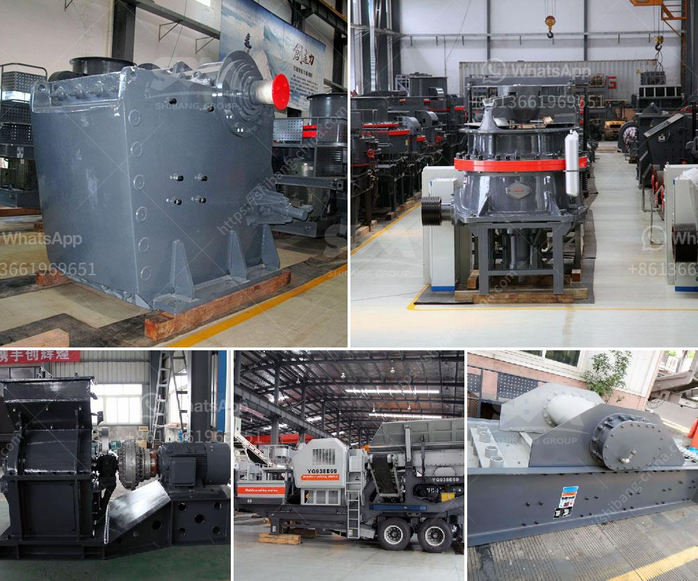

<h3>شراء وبيع حجر الكسارة في ماليزيا</h3>
تعد ماليزيا واحدة من أهم الدول المنتجة لحجر الكسارة في منطقة جنوب شرق آسيا. يعتبر حجر الكسارة المستخرج في ماليزيا منتجًا مهمًا للعديد من الصناعات مثل البناء والبنية التحتية.

تشتهر ماليزيا بالعديد من المواقع الجغرافية الغنية بمواد البناء، ومن هذه المواد حجر الكسارة. يتم استخراجه من المحاجر الجبلية ويتم تكسيره بواسطة ماكينات الكسارة إلى حجم مناسب قبل بيعه في السوق.

يتم توفير حجر الكسارة بمختلف الأحجام والمواصفات لتناسب مختلف احتياجات العملاء. يتم تقديمه في شكل مسحوق أو حبيبات أو قطع صغيرة حسب الطلب. يزود البائعون عادة بيانات تخص تصنيفات حجر الكسارة، مثل قدرة التحمل ومقاومة الضغط، لمساعدة المشترين في اتخاذ القرار المناسب.

يتم بيع حجر الكسارة في السوق الماليزية من خلال عدة قنوات، بما في ذلك الشركات المصنعة المحلية والوكلاء والموزعين. وتعتبر السوق المحلية هي السوق الرئيسية لشراء وبيع حجر الكسارة في ماليزيا، حيث يتم استخدامه بشكل كبير في مشاريع البناء والبنية التحتية المحلية.

علاوة على ذلك، تعتبر ماليزيا مصدرًا رئيسيًا لحجر الكسارة للعديد من الدول المجاورة. يتم تصديرها إلى سنغافورة وإندونيسيا وتايلاند وفيتنام والفلبين وغيرها من الدول في المنطقة. يتم تنقلها عن طريق الشاحنات أو القوارب أو السكك الحديدية إلى وجهاتها المقصودة.

وفي نهاية المطاف، يتأثر سعر حجر الكسارة في ماليزيا بعدة عوامل، مثل العرض والطلب وتكلفة الإنتاج والنقل. بشكل عام، يتراوح سعر حجر الكسارة في ماليزيا بين 200 و400 رنجت ماليزي للطن الواحد، ولكن قد يختلف هذا السعر تبعًا للحجم والجودة والموقع الجغرافي.

باختصار، يعد شراء وبيع حجر الكسارة في ماليزيا من الأنشطة الاقتصادية المهمة، حيث يستخدم في العديد من مشاريع البناء والبنية التحتية. يتم توفيره في مختلف الأحجام والمواصفات، ويتم بيعه في السوق المحلية وتصدره إلى عدة دول في المنطقة. يتأثر سعره بعوامل مثل العرض والطلب وتكلفة الإنتاج.
<h3>Contact us</h3><ul><li><strong>Whatsapp:&nbsp;<a href="https://wa.me/8613661969651">+8613661969651</a></strong></li><li><a href="https://swt.shibang-china.com/?git&amp;zhl&amp;شراء وبيع حجر الكسارة في ماليزيا"><strong>Online Service(chat now)</strong></a></li></ul><h3>Related</h3><ul><li><a href='جول بيلي كسارة حجر مستعملة.md'>جول بيلي كسارة حجر مستعملة</a></li><li><a href='مصنع غسيل الفحم للبيع في جنوب أفريقيا.md'>مصنع غسيل الفحم للبيع في جنوب أفريقيا</a></li><li><a href='مورد آلة صنع الرمل.md'>مورد آلة صنع الرمل</a></li><li><a href='مصنع تكسير الجرانيت 200 طن في الساعة للبيع.md'>مصنع تكسير الجرانيت 200 طن في الساعة للبيع</a></li><li><a href='مصنعون لكسارات في أوروبا.md'>مصنعون لكسارات في أوروبا</a></li></ul>