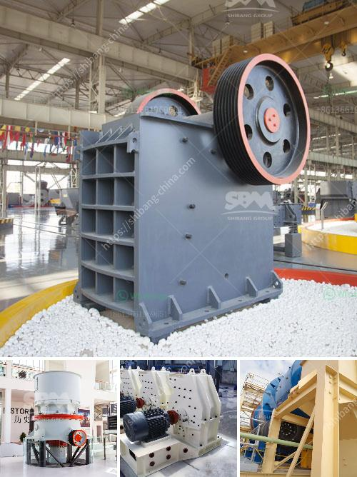

<h3>شركات آلات مصنع الأسمنت في كويمباتور</h3>
تعتبر آلات مصنع الأسمنت من أهم الصناعات في جميع أنحاء العالم، إذ تستخدم في إنتاج الأسمنت اللازم لبناء المباني والجسور والطرق والمنشآت الأخرى. ومن بين المدن المرموقة في مجال صناعة آلات مصنع الأسمنت تقع مدينة كويمباتور في ولاية تاميل نادو الهندية.

تعتبر كويمباتور مركزاً رئيسياً للصناعة في جنوب الهند، حيث تتعاون العديد من الشركات والمصانع لتوريد آلات مصنع الأسمنت عالية الجودة. تعمل الشركات المحلية والعالمية على تطوير تقنيات حديثة ومبتكرة للإنتاج، مما يعزز قدرة المصانع على تحقيق أعلى معايير الجودة والأداء.

تقدم هذه الشركات مجموعة واسعة من الآلات والمعدات التي تستخدم في مصانع الأسمنت. تشمل هذه الآلات الكسارات والطواحين والفرازات والمخلب والكسارات الاهتزازية وغيرها من المعدات التي تعمل على تحويل المواد الأولية إلى مجموعات من الحبيبات الدقيقة تسمى الكلنكر. ويتم بعد ذلك تجفيف وطحن هذه الكلنكرات وإضافة المواد الكيميائية اللازمة للحصول على المزيد من التفاصيل

وتتميز هذه الآلات بأنها قابلة للتكيف وفقاً لاحتياجات المصانع المختلفة. فعلى سبيل المثال، يمكن أن تتضمن الآلة المستخدمة في عمليات الطحن تقنيات التبريد المبتكرة لضمان استقرار درجة حرارة المواد المطحونة، مما يعزز الكفاءة العامة للمصنع.

وتتمتع شركات آلات مصنع الأسمنت في كويمباتور بسمعة طيبة فيما يتعلق بالجودة والخدمة. فهي تستفيد من خبرة مهندسين محترفين وفرق فنية مدربة لتلبية احتياجات ومتطلبات العملاء. كما تعتمد هذه الشركات على استخدام تكنولوجيا حديثة ومتطورة لتحسين أداء الآلات وزيادة الإنتاجية، مما يساهم في استمرارية العمليات وتقليل التكاليف.

باختصار، تعتبر شركات آلات مصنع الأسمنت في كويمباتور أنظمة حديثة ومتقدمة لتلبية احتياجات الصناعة المحلية والعالمية. تعزز هذه الشركات قدرة المصانع على تحقيق الجودة والكفاءة في الإنتاج، مما يساعدها في تحقيق المزيد من النجاح والاستدامة في سوق الأسمنت.
<h3>Contact us</h3><ul><li><strong>Whatsapp:&nbsp;<a href="https://wa.me/8613661969651">+8613661969651</a></strong></li><li><a href="https://swt.shibang-china.com/?git&amp;zhl&amp;شركات آلات مصنع الأسمنت في كويمباتور"><strong>Online Service(chat now)</strong></a></li></ul><h3>Related</h3><ul><li><a href='شاشة اهتزاز الحصى.md'>شاشة اهتزاز الحصى</a></li><li><a href='سعر النحاس.md'>سعر النحاس</a></li><li><a href='سعر معدات الطحن 250 طن.md'>سعر معدات الطحن 250 طن</a></li><li><a href='كسارة الفك 150 250 للبيع.md'>كسارة الفك 150 250 للبيع</a></li><li><a href='مصنعو آلات تكسير الحجر.md'>مصنعو آلات تكسير الحجر</a></li></ul>