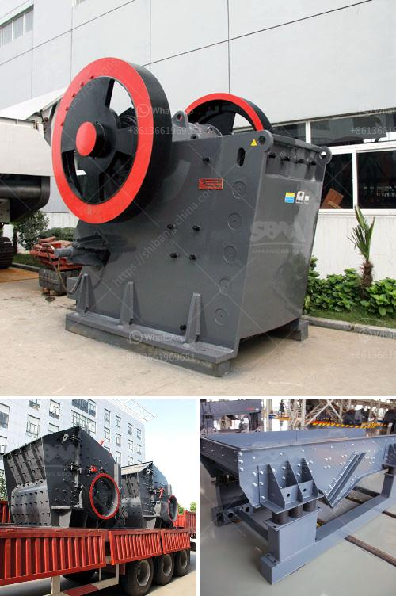

<h3>شركات المحاجر في بوكواس وأماسامان</h3>
شركات المحاجر في بوكواس وأماسامان: توفير الموارد الحيوية لقطاع الإنشاءات

تعتبر شركات المحاجر في بوكواس وأماسامان من اللاعبين الرئيسيين في صناعة الإنشاءات، حيث تقدم موارد حيوية لقطاع البناء والتشييد. وتنعكس أهمية هذه الشركات في تلبية احتياجات السوق المحلية والعالمية للمواد الخام للبناء والأعمال الإنشائية المختلفة.

تتميز المنطقة بوكواس وأماسامان بتواجد مصادر غنية للحجارة والرمال والحصى، وهي المكونات الأساسية في البناء. تتعاون شركات المحاجر في هذه المنطقة مع المهندسين المعماريين والمقاولين لتوفير المواد اللازمة لمشاريع البناء الضخمة وحتى المشاريع البسيطة التي قد تحتاج إلى هذه الموارد.

تعد شركات المحاجر في بوكواس وأماسامان عاملًا مهمًا في استدامة القطاع العقاري وتنمية البنية التحتية في المنطقة، مما يسهم في تعزيز الاقتصاد المحلي وتوفير فرص عمل جديدة. كما تساهم هذه الشركات في تلبية الاحتياجات الأساسية للمشاريع الحكومية والخاصة، من الطرق والجسور والمباني التجارية والسكنية.

ومن الجوانب الإيجابية لشركات المحاجر أيضًا، أنها تساهم في تخفيف الضغط على البيئة، فبدلاً من استغلال الموارد الطبيعية في مناطق أخرى بعيدة، يتم استغلال الموارد المتوفرة محليًا. وتُعد استخدام التكنولوجيا الحديثة والطرق العلمية في استخراج وإنتاج هذه الموارد جزءًا من التزام شركات المحاجر بالحفاظ على البيئة المحيطة بها.

ومع ذلك، يجب أن نأخذ في الاعتبار أيضًا أن استخراج هذه الموارد الحيوية يجب أن يتم بطريقة مستدامة، لضمان استمرار وتلبية احتياجات الأجيال القادمة. يجب أن تلتزم الشركات بمعايير تنموية صارمة للحفاظ على نوعية الموارد والاهتمام بجودة الأراضي المستصلحة بعد استخراج الموارد.

في الختام، تلعب شركات المحاجر في بوكواس وأماسامان دورًا حيويًا في قطاع البناء والتشييد. إنها تسهم في توفير الموارد الحيوية المطلوبة لمشاريع البناء المختلفة، وتسهم في تنمية البنية التحتية وتوفير فرص العمل. ومن الأهمية البالغة أن يتم استغلال هذه الموارد بطريقة مستدامة ومسؤولة، للحفاظ على البيئة وضمان استمرارية القطاع العقاري المزدهر في المنطقة.
<h3>Contact us</h3><ul><li><strong>Whatsapp:&nbsp;<a href="https://wa.me/8613661969651">+8613661969651</a></strong></li><li><a href="https://swt.shibang-china.com/?git&amp;zhl&amp;شركات المحاجر في بوكواس وأماسامان"><strong>Online Service(chat now)</strong></a></li></ul><h3>Related</h3><ul><li><a href='كسارة صغيرة للبيع في المحجر.md'>كسارة صغيرة للبيع في المحجر</a></li><li><a href='مصنعون لمسحوق الطين.md'>مصنعون لمسحوق الطين</a></li><li><a href='نماذج كسارات الحجر في ماليزيا.md'>نماذج كسارات الحجر في ماليزيا</a></li><li><a href='مطاحن تحضير الدولوميت.md'>مطاحن تحضير الدولوميت</a></li><li><a href='كسارة الرخام وآلات الطحن.md'>كسارة الرخام وآلات الطحن</a></li></ul>