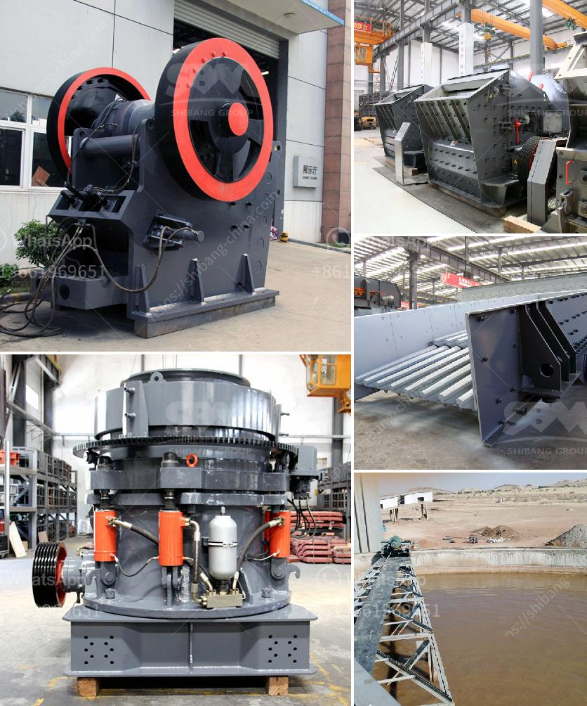

<h3>شركات بيع معدات التعدين في جنوب أفريقيا</h3>
تعتبر جنوب أفريقيا واحدة من أكبر البلدان المنتجة للمعادن في العالم، وتعتبر صناعة التعدين جزءًا مهمًا من الاقتصاد الجنوب أفريقي. هذه الصناعة تحتاج إلى معدات تعدين عالية الجودة وفعالة لاستخراج وتجهيز الموارد المعدنية الموجودة في البلاد. لهذا السبب، توجد العديد من الشركات التي تعمل في مجال بيع معدات التعدين في جنوب أفريقيا.

تقدم شركات بيع معدات التعدين في جنوب أفريقيا مجموعة واسعة من المنتجات والخدمات التي تلبي متطلبات صناعة التعدين المختلفة. يتم توريد معدات التعدين من قبل هذه الشركات لاستخراج المعادن الثقيلة مثل الذهب والألماس والبلاتين واليورانيوم والفحم والحجر الجيري.

تشمل المعدات التي يتم توفيرها من قبل هذه الشركات الحفارات الكبيرة والمخارط والعربات وآلات الغسيل وآلات الطحن وأحواض الفصل وأنظمة نقل المواد. كما توفر بعض هذه الشركات أيضًا خدمات ما بعد البيع ودعم فني للعملاء.

واحدة من الشركات الرائدة في مجال بيع معدات التعدين في جنوب أفريقيا هي شركة Caterpillar. تقوم شركة Caterpillar بتوفير مجموعة متنوعة من المعدات من الحفارات إلى المركبات والكسارات، وتشتهر بجودة منتجاتها وكفاءتها في أداء المهام المطلوبة.

تعمل أيضًا شركة Sandvik على توفير معدات التعدين عالية الجودة والابتكارية. تعتبر Sandvik واحدة من الشركات الرائدة في مجال تصنيع معدات التعدين وتقنيات التكسير والغربلة وتعمل على تلبية احتياجات صناعة التعدين في جنوب أفريقيا.

أيضًا شركة Joy Global، التي أصبحت جزءًا من شركة Komatsu، توفر معدات تعدين ذات تكنولوجيا عالية وتعتبر قوية في مجال استخراج المعادن.

يجب أن يتم اختيار المعدات الصحيحة وفقًا لاحتياجات وظروف عمل كل شركة تعدين. لذلك، يجب على الشركات المهتمة بشراء معدات التعدين الاستعانة بالشركات المختصة وتقييم احتياجاتها المحددة قبل اتخاذ قرار الشراء.

قد تختلف أسعار معدات التعدين حسب النموذج والحجم والكفاءة. ينصح بأن يتم اتخاذ قرار الشراء بعد تقييم مختلف الموردين والمنتجات المتاحة في السوق، بالإضافة إلى التأكد من خدمة الصيانة ودعم ما بعد البيع المقدمة من قبل الشركات المصنعة.
<h3>Contact us</h3><ul><li><strong>Whatsapp:&nbsp;<a href="https://wa.me/8613661969651">+8613661969651</a></strong></li><li><a href="https://swt.shibang-china.com/?git&amp;zhl&amp;شركات بيع معدات التعدين في جنوب أفريقيا"><strong>Online Service(chat now)</strong></a></li></ul><h3>Related</h3><ul><li><a href='آلة مطحنة الكرة في الصين.md'>آلة مطحنة الكرة في الصين</a></li><li><a href='كسارات محمولة مستعملة للبيع في جنوب أفريقيا.md'>كسارات محمولة مستعملة للبيع في جنوب أفريقيا</a></li><li><a href='أسعار آلات تكسير الحجر في زيمبابوي.md'>أسعار آلات تكسير الحجر في زيمبابوي</a></li><li><a href='كسارة فكية بمقدار 100 طن في الساعة.md'>كسارة فكية بمقدار 100 طن في الساعة</a></li><li><a href='معدات غسيل الذهب في غانا.md'>معدات غسيل الذهب في غانا</a></li></ul>