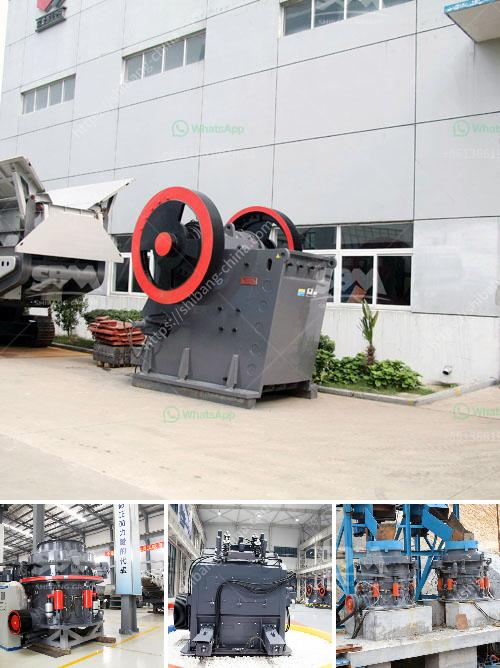

<h3>شركات تصنيع أحزمة الناقل في بنغلاديش</h3>
بنغلاديش هي واحدة من البلدان التي تتمتع بصناعة تصنيع قوية في مجال أحزمة الناقل. تعتبر شركات تصنيع أحزمة الناقل في بنغلاديش مصدرًا رئيسيًا للتصدير وتوفر فرص عمل للكثير من السكان. في هذه المقالة ، سنلقي نظرة على هذه الصناعة المتزايدة وأهميتها.

تعتبر أحزمة الناقل من أهم المكونات في صناعة النقل واللوجستيات ، حيث تستخدم لنقل المواد والسلع عبر المصانع والمرافق الصناعية. تعد بنغلاديش مصدرًا رئيسيًا لأحزمة الناقل القماشية التي تستخدم على نطاق واسع في العديد من الصناعات حول العالم.

تتميز شركات تصنيع أحزمة الناقل في بنغلاديش بعدة جوانب. أولاً وقبل كل شيء ، تتمتع هذه الشركات ببنية تحتية متقدمة وقدرة إنتاج عالية. تستخدم معظم الشركات أحدث التكنولوجيا والمعدات لضمان جودة منتجاتها وتلبية احتياجات العملاء بكفاءة عالية.

ثانيًا ، دور العمالة الماهرة لا يمكن تجاهله. تشتهر بنغلاديش بعمالتها ذات الكفاءة العالية والمهارات اليدوية الفريدة. تعمل الشركات الكبرى في هذا القطاع على توظيف العمال الماهرين وتوفير التدريب المستمر لهم لتطوير قدراتهم ومهاراتهم.

بالإضافة إلى ذلك ، تهتم شركات تصنيع أحزمة الناقل في بنغلاديش بحماية البيئة. تعتبر الاستدامة والمسؤولية الاجتماعية أحد الأولويات الرئيسية لهذه الصناعة. تعمل الشركات على تحسين عملياتها لتقليل التأثيرات البيئية السلبية وتشجع على استخدام المواد القابلة للتحلل والصديقة للبيئة.

في الختام ، تعد صناعة تصنيع أحزمة الناقل في بنغلاديش من الصناعات الصاعدة والمزدهرة. توفر فرص عمل للكثير من السكان وتساهم في تعزيز اقتصاد البلاد. تمتلك هذه الشركات القدرة على تلبية الطلب المتزايد على أحزمة الناقل وتلبية متطلبات العملاء في الأسواق الدولية. وبفضل الجهود المستمرة للتحسين والابتكار ، ستظل شركات تصنيع أحزمة الناقل في بنغلاديش في المقدمة في هذه الصناعة.
<h3>Contact us</h3><ul><li><strong>Whatsapp:&nbsp;<a href="https://wa.me/8613661969651">+8613661969651</a></strong></li><li><a href="https://swt.shibang-china.com/?git&amp;zhl&amp;شركات تصنيع أحزمة الناقل في بنغلاديش"><strong>Online Service(chat now)</strong></a></li></ul><h3>Related</h3><ul><li><a href='آخر مطحنة هامر.md'>آخر مطحنة هامر</a></li><li><a href='نوع من مطحنة الكرة.md'>نوع من مطحنة الكرة</a></li><li><a href='آلات الطحن لتكلفة مطحنة الدال.md'>آلات الطحن لتكلفة مطحنة الدال</a></li><li><a href='آلة كسارة الطين في راجكوت.md'>آلة كسارة الطين في راجكوت</a></li><li><a href='خطة عمل محجر الحجر.md'>خطة عمل محجر الحجر</a></li></ul>