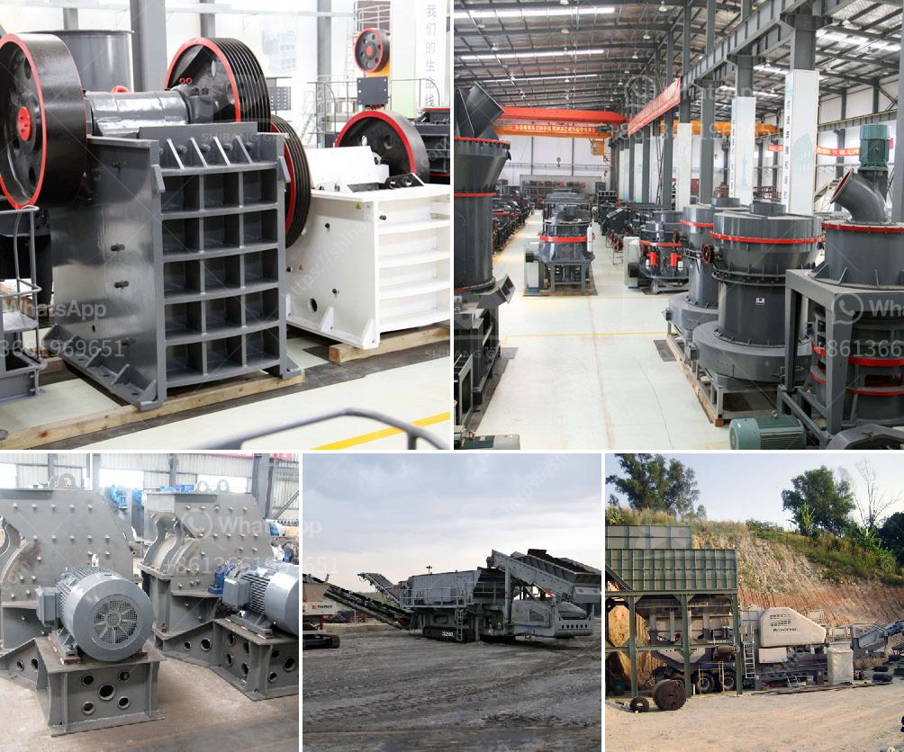

<h3>شركات تصنيع أحزمة الناقل في كولكاتا</h3>
تعد أحزمة الناقل أداة أساسية في عمليات الصناعة والنقل في جميع أنحاء العالم. إنها تستخدم لنقل المواد والبضائع بكفاءة وبشكل مستمر على مسافات طويلة. وتلعب أحزمة الناقل دورًا حيويًا في تحسين إنتاجية الشركات وتوفير الوقت والجهد في عمليات النقل.

كولكاتا هي واحدة من المدن الرئيسية في الهند التي تعتبر محورًا رئيسيًا للصناعة والتجارة في البلاد. يوجد في المدينة العديد من الشركات المتخصصة في تصنيع أحزمة الناقل. هذه الشركات تقدم مجموعة واسعة من الأحزمة المختلفة المصممة لتلبية احتياجات العملاء المختلفة.

إنتاج الأحزمة يتم باستخدام تكنولوجيا حديثة ومعدات عالية الجودة. تستخدم الشركات الأقمشة المتينة مثل المطاط والنايلون والبوليستر في تصنيع الأحزمة. كما تعتمد على التصميم الجيد والمتانة لتوفير منتجات عالية الجودة للعملاء.

تقدم الشركات في كولكاتا العديد من الخدمات المتعلقة بأحزمة الناقل، بما في ذلك التصميم والهندسة والتركيب والصيانة. تعمل هذه الشركات مع عملاء من مختلف الصناعات مثل الأعلاف والأسمدة والمواد الغذائية والصناعات الثقيلة وغيرها. تلتزم هذه الشركات بتلبية احتياجات العملاء وتقديم أفضل الحلول الممكنة لتحسين عملياتهم.

بالإضافة إلى ذلك، تتبع الشركات في كولكاتا معايير صارمة للجودة والأداء. فهي تضمن تصنيع منتجات عالية الجودة تلبي المعايير الوطنية والدولية. وبالتالي، تكون أحزمة الناقل المصنعة في كولكاتا قادرة على تحمل الظروف القاسية والتحميل الثقيل.

في الختام، تُعتبر شركات تصنيع أحزمة الناقل في كولكاتا من أفضل الشركات على المستوى العالمي في هذه الصناعة. إنها تعمل باستخدام التكنولوجيا الحديثة والمواد ذات الجودة العالية لتوفير أحزمة ناقلة قوية ومتينة. تلتزم هذه الشركات بتقديم أفضل الخدمات والحلول المناسبة لاحتياجات العملاء.
<h3>Contact us</h3><ul><li><strong>Whatsapp:&nbsp;<a href="https://wa.me/8613661969651">+8613661969651</a></strong></li><li><a href="https://swt.shibang-china.com/?git&amp;zhl&amp;شركات تصنيع أحزمة الناقل في كولكاتا"><strong>Online Service(chat now)</strong></a></li></ul><h3>Related</h3><ul><li><a href='مصنعون لمطحنة الهامر في بيرو.md'>مصنعون لمطحنة الهامر في بيرو</a></li><li><a href='خط إنتاج مسحوق الجبس بمقياس صغير.md'>خط إنتاج مسحوق الجبس بمقياس صغير</a></li><li><a href='كسارات الكرة في كينيا.md'>كسارات الكرة في كينيا</a></li><li><a href='أسعار معدات التكسير والفحص جنوب أفريقيا.md'>أسعار معدات التكسير والفحص جنوب أفريقيا</a></li><li><a href='سعر كسارة الحصى.md'>سعر كسارة الحصى</a></li></ul>