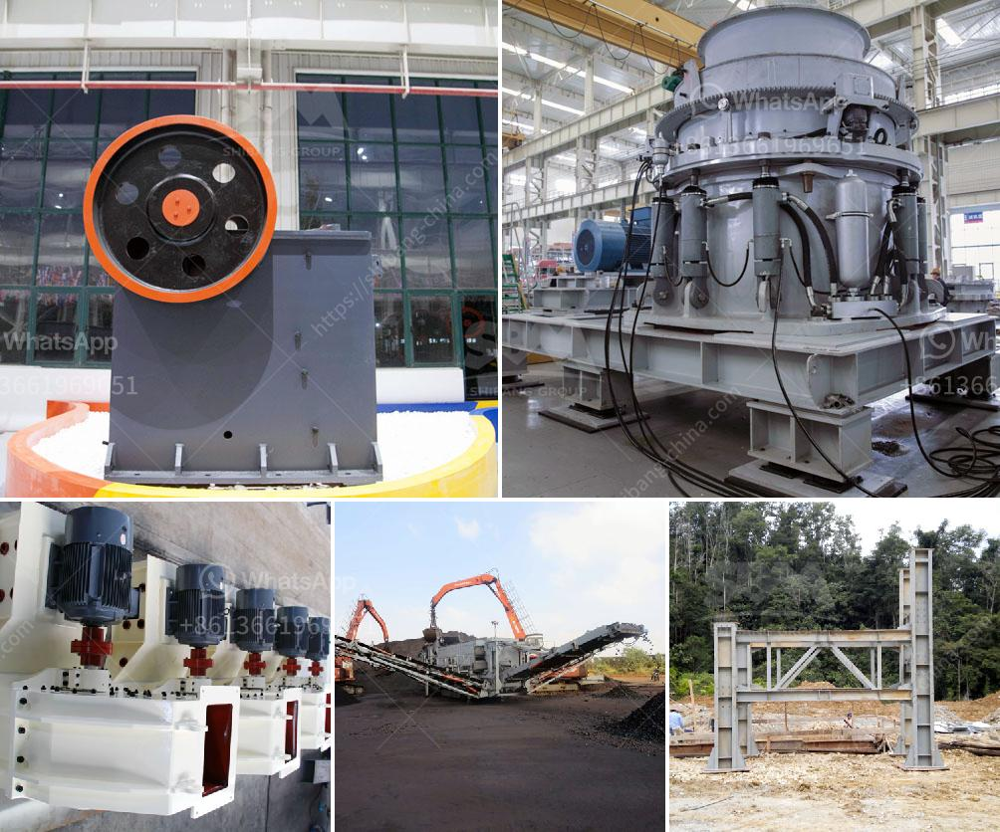

<h3>شركات تصنيع الكسارات في ماليزيا</h3>
تعد ماليزيا واحدة من الدول الرائدة في صناعة تصنيع الكسارات. تعزز الحكومة الماليزية هذا القطاع الصناعي وتقدم العديد من الدعم والتسهيلات للشركات المحلية والأجنبية لتشجيعها على الاستثمار في هذا القطاع.

تتميز شركات تصنيع الكسارات في ماليزيا بتوفير مجموعة واسعة من المعدات ذات الجودة العالية والتكنولوجيا المتقدمة. تعتبر هذه الشركات متخصصة في تصميم وتصنيع الكسارات للاستخدام في صناعات مختلفة مثل صناعة البناء والتعدين ومصانع الأسمنت.

تعمل الشركات الماليزية في تطوير تقنيات جديدة لتحسين أداء الكسارات وتقليل تأثيرها البيئي. تسعى هذه الشركات إلى توفير حلول مبتكرة ومستدامة لصناعة التكسير، بحيث يتم تحسين الكفاءة وتقليل استهلاك الطاقة وانبعاثات الغازات الضارة.

بالإضافة إلى ذلك، فإن شركات تصنيع الكسارات في ماليزيا تهتم بتوفير خدمات ما قبل وبعد البيع الممتازة. تعمل هذه الشركات على تزويد العملاء بالتدريب والدعم الفني لضمان استخدام آمن للمعدات. كما تقدم الشركات ضمانات جيدة للمنتجات المصنعة لضمان جودتها وأدائها المستدام.

تهدف الشركات الماليزية إلى التوسع في الأسواق العالمية وتصدير منتجاتها إلى العديد من الدول. تعمل هذه الشركات على تطوير شراكات استراتيجية مع شركات أخرى في القطاع لتعزيز التبادل التجاري وتعزيز فرص النمو والتطور.

بالاعتماد على الخبرة والتكنولوجيا المتقدمة، تتمتع شركات تصنيع الكسارات في ماليزيا بسمعة جيدة عالميا. وتعد هذه الشركات مصدرًا رئيسيًا للكسارات والمعدات ذات الصلة في العديد من الدول. تتطلع هذه الشركات للمزيد من النجاح والتوسع في السوق العالمية في المستقبل.

باختصار، تلعب شركات تصنيع الكسارات في ماليزيا دورًا هامًا في دعم صناعة التكسير المحلية والعالمية. تتميز هذه الشركات بتوفير معدات عالية الجودة، وتطوير تقنيات جديدة، وتقديم خدمات ما قبل وبعد البيع الممتازة. تنظر هذه الشركات إلى المستقبل بتفاؤل وتطلع إلى الاستمرار في تحسين أدائها وتوسيع حصتها في السوق العالمية.
<h3>Contact us</h3><ul><li><strong>Whatsapp:&nbsp;<a href="https://wa.me/8613661969651">+8613661969651</a></strong></li><li><a href="https://swt.shibang-china.com/?git&amp;zhl&amp;شركات تصنيع الكسارات في ماليزيا"><strong>Online Service(chat now)</strong></a></li></ul><h3>Related</h3><ul><li><a href='آلة قطع الحجر المستخدمة من اليابان.md'>آلة قطع الحجر المستخدمة من اليابان</a></li><li><a href='الجيوكيمياء التطبيقية لمعالجة اللميكا.md'>الجيوكيمياء التطبيقية لمعالجة اللميكا</a></li><li><a href='سعر مصنع التكسير والفرز في جنوب أفريقيا.md'>سعر مصنع التكسير والفرز في جنوب أفريقيا</a></li><li><a href='كسارات الحجر في جوتنغ.md'>كسارات الحجر في جوتنغ</a></li><li><a href='مطرقة الذهب المستخدمة للبيع في زيمبابوي.md'>مطرقة الذهب المستخدمة للبيع في زيمبابوي</a></li></ul>