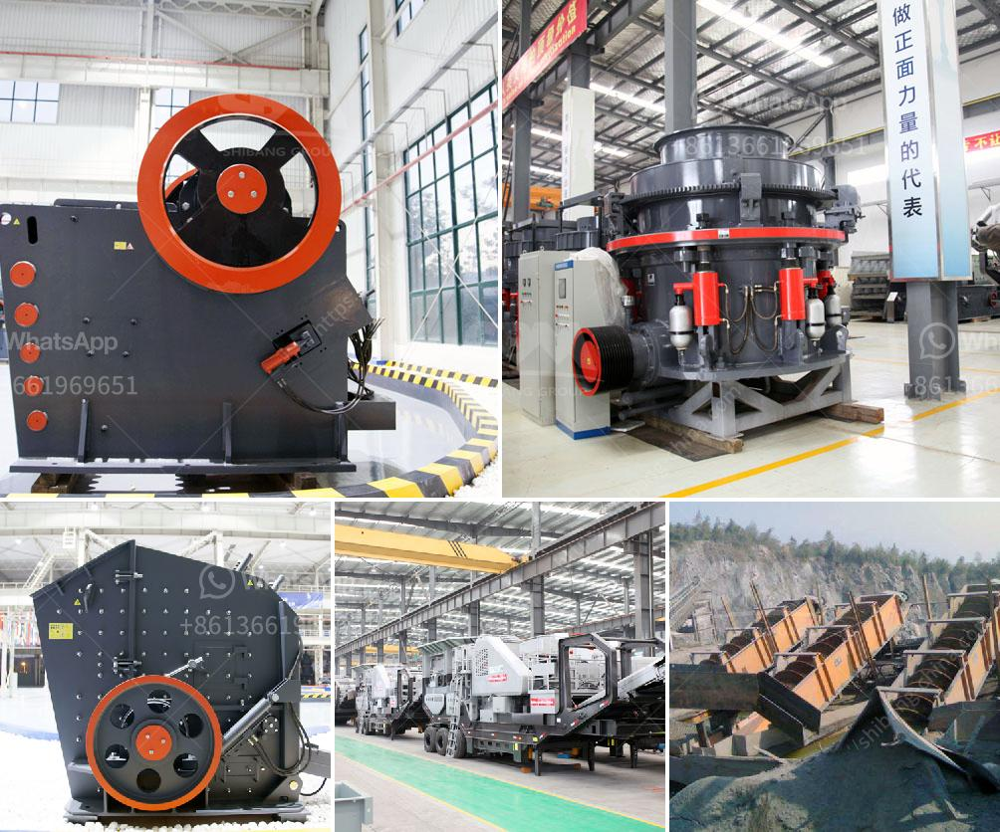

<h3>شركات تصنيع كسارات الفحم ppt</h3>
تشير كسارات الفحم إلى الآلات المستخدمة في عملية سحق الفحم لتحويله إلى قطع صغيرة قابلة للاستخدام في العديد من التطبيقات الصناعية المختلفة. وتتنوع هذه الكسارات من حيث الحجم والتصميم وقدرتها على معالجة الفحم. تعتبر شركات تصنيع كسارات الفحم مهمة جدًا في صناعة التعدين والبناء والطاقة والصناعات الثقيلة بشكل عام.

توفر شركات تصنيع كسارات الفحم مجموعة واسعة من الآلات والمعدات المبتكرة لتلبية احتياجات العملاء المختلفة. تصمم كسارات الفحم المتقدمة لديها القدرة على معالجة الفحم بكفاءة عالية وتقليل حجمه إلى قطع صغيرة. توفر هذه الشركات أيضًا خدمات الصيانة والدعم الفني المستمر لضمان تشغيل مستدام للكسارات وتجنب أي توقف في الإنتاج.

يعتبر قطاع تصنيع كسارات الفحم من القطاعات الحيوية التي تلعب دورًا هامًا في تحسين الكفاءة وزيادة الإنتاجية في صناعة الفحم. تساعد هذه الآلات في تجهيز الفحم للاستخدام في مجموعة متنوعة من الصناعات مثل توليد الطاقة الكهربائية والأسمدة الزراعية وصناعة الصلب والتعدين والبناء.

تعد شركات تصنيع كسارات الفحم رائدة في استخدام التكنولوجيا المتقدمة لتحسين أداء الكسارات وتقليل استهلاك الطاقة وزيادة الكفاءة العامة. تستخدم هذه الشركات أنظمة التحكم الآلي والمراقبة لتعزيز عمليات الإنتاج وتحسين الأداء العام. كما تهتم شركات تصنيع كسارات الفحم بتطوير تقنيات التنظيف والحفاظ على البيئة للحد من التأثيرات الضارة لصناعة الفحم على البيئة.

باختصار، تلعب شركات تصنيع كسارات الفحم دورًا حاسمًا في صناعة الفحم. تقدم هذه الشركات تقنيات متطورة ومعدات مبتكرة لتحسين كفاءة استخدام الفحم وزيادة الإنتاجية. كما يوفر تركيزها على التطوير المستمر والحفاظ على البيئة فرصًا جديدة للتحسين والتطوير في الصناعة.
<h3>Contact us</h3><ul><li><strong>Whatsapp:&nbsp;<a href="https://wa.me/8613661969651">+8613661969651</a></strong></li><li><a href="https://swt.shibang-china.com/?git&amp;zhl&amp;شركات تصنيع كسارات الفحم ppt"><strong>Online Service(chat now)</strong></a></li></ul><h3>Related</h3><ul><li><a href='مكاتب CAD لمعدات التعدين.md'>مكاتب CAD لمعدات التعدين</a></li><li><a href='موزعو معدات تكسير extec.md'>موزعو معدات تكسير extec</a></li><li><a href='مصنع كسارة الصخور بسعة 150 طن.md'>مصنع كسارة الصخور بسعة 150 طن</a></li><li><a href='مشترين وبائعين لآلات مطحنة ريموند.md'>مشترين وبائعين لآلات مطحنة ريموند</a></li><li><a href='بيع كسارة الفك في كينيا.md'>بيع كسارة الفك في كينيا</a></li></ul>