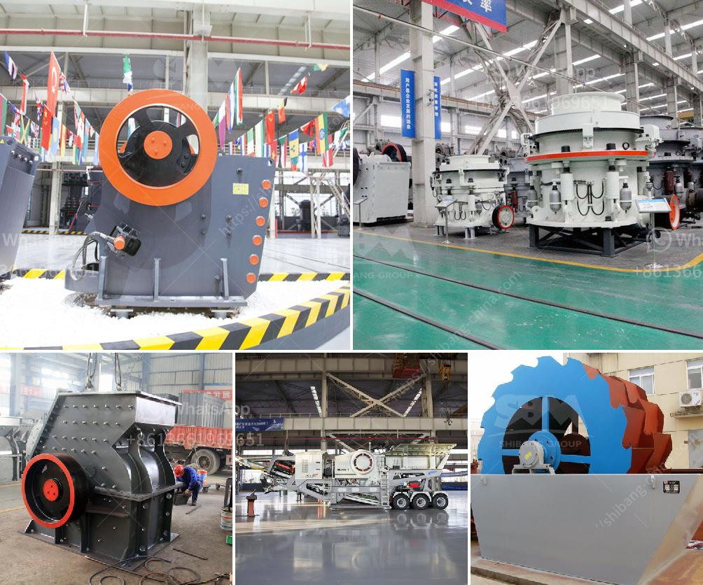

<h3>شركات تصنيع مصانع المحاجر في المملكة المتحدة</h3>
تلعب مصانع المحاجر دورًا حاسمًا في صناعة التعدين والبناء في المملكة المتحدة. فهذه المصانع تعمل على تصميم وتصنيع وتوريد معدات تستخدم في استخراج وتجهيز المواد الخام من المحجر. تتوافر في المملكة المتحدة العديد من الشركات المتخصصة في تصنيع مصانع المحاجر، والتي تقدم حلولًا مبتكرة وفعالة لمتطلبات الصناعة.

تعد شركة "X Quarry Plants" واحدة من رواد صناعة تصنيع المحاجر في المملكة المتحدة. تقوم الشركة بتصميم وتصنيع معدات المحجر المختلفة، مثل الكسارات والغرابيل والناقلات ومعدات تجهيز المواد الخام. تتميز مصانع "X Quarry Plants" بجودة عالية وأداء موثوق به، إضافة إلى توفر قطع الغيار والدعم الفني المستمر.

من ناحية أخرى، تمتلك شركة "Y Quarry Technology" خبرة واسعة في مجال تصميم وتصنيع مصانع المحاجر في المملكة المتحدة. تعد هذه الشركة رائدة في توفير حلول مخصصة لعملائها، حيث يتم تطوير المصانع وفقًا لاحتياجاتهم الخاصة. تشمل منتجات "Y Quarry Technology" الكسارات المختلفة والمجاميع والآلات الأخرى التي تعمل على زيادة الإنتاجية وتحسين كفاءة استخراج المواد الخام.

واحدة من الشركات الرائدة في مجال تصنيع مصانع المحاجر في المملكة المتحدة هي "Z Quarry Machinery". تقدم الشركة مجموعة شاملة من المعدات المتطورة والمبتكرة لتلبية متطلبات عمليات المحاجر المختلفة. توفر "Z Quarry Machinery" حلاً متكاملاً بدءًا من تصميم المصنع وحتى التشغيل، مع توجيه العملاء ومساعدتهم في اختيار الأفضل من بين المعدات المتاحة.

بإجمالي قدرة تصنيعية عالية وجودة متفوقة، تسعى هذه الشركات إلى تلبية احتياجات صناعة تعدين المحاجر في المملكة المتحدة. تعتبر المصانع التي تنتجها هذه الشركات موثوقة وفعالة، وتلعب دورًا هامًا في دعم التنمية الاقتصادية والبنية التحتية في المملكة المتحدة.

باختصار، تتميز شركات تصنيع مصانع المحاجر في المملكة المتحدة بتقديم حلول مبتكرة وموثوقة لتلبية احتياجات صناعة التعدين والبناء المحلية. تعزز هذه الشركات القدرات الصناعية للبلاد وتدعم تحقيق التنمية الاقتصادية في المملكة المتحدة.
<h3>Contact us</h3><ul><li><strong>Whatsapp:&nbsp;<a href="https://wa.me/8613661969651">+8613661969651</a></strong></li><li><a href="https://swt.shibang-china.com/?git&amp;zhl&amp;شركات تصنيع مصانع المحاجر في المملكة المتحدة"><strong>Online Service(chat now)</strong></a></li></ul><h3>Related</h3><ul><li><a href='اليابان لمصنع تكسير متنقل.md'>اليابان لمصنع تكسير متنقل</a></li><li><a href='تكلفة مصنع الإسمنت الصغير بسعة 2000 طن يوميًا.md'>تكلفة مصنع الإسمنت الصغير بسعة 2000 طن يوميًا</a></li><li><a href='مطحنة صناعية.md'>مطحنة صناعية</a></li><li><a href='كسارات متنقلة للتأجير في جوهانسبرغ.md'>كسارات متنقلة للتأجير في جوهانسبرغ</a></li><li><a href='مورد معدات فصل الوسط الكثيف.md'>مورد معدات فصل الوسط الكثيف</a></li></ul>