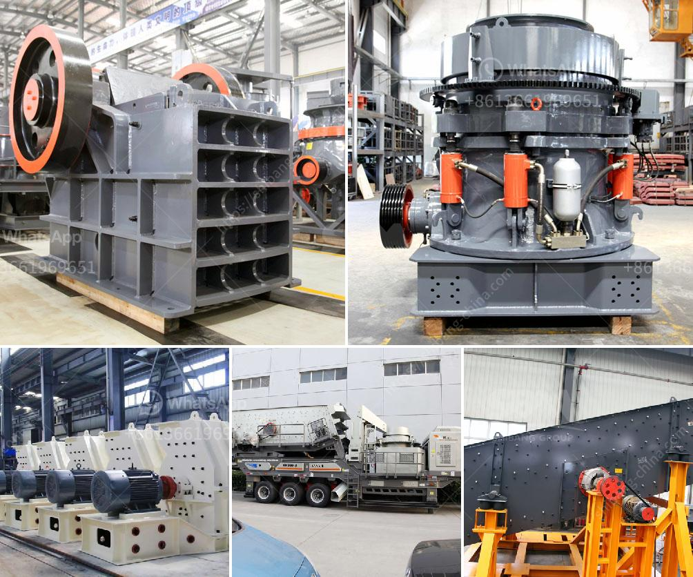

<h3>شركات تكسير الحجر في بيرو</h3>
تعتبر صناعة تكسير الحجر أحد القطاعات الحيوية في بيرو، حيث تعمل العديد من الشركات في هذا المجال، وتساهم في توفير فرص عمل وتشجيع النمو الاقتصادي.

تعد شركات تكسير الحجر في بيرو مهمة جداً، لأنها تلعب دورًا هامًا في صناعة مواد البناء والبنية التحتية والإنشاءات. تعمل هذه الشركات على تكسير الصخور والحجارة إلى أحجام مختلفة، حسب الاحتياجات والمواصفات المطلوبة للمشاريع المختلفة.

تتميز بيرو بوفرة الموارد الطبيعية للأحجار والصخور المختلفة، مما يجعلها تجذب استثمارات عديدة في هذا القطاع. تعد الجرانيت والرخام والبازلت والحجر الجيري من أبرز الموارد المستغلة في صناعة التكسير. وتحظى هذه الشركات بشهرة جيدة في السوق المحلي والعالمي بفضل جودة المنتجات التي تنتجها.

تقوم الشركات بتطبيق معايير وتقنيات عالية الجودة في عملية التكسير، لضمان حصول الزبائن على منتج نهائي ممتاز. يتم استخدام آلات ومعدات حديثة ومتقدمة في عملية التكسير، بما في ذلك الكسارات والمطاحن والغرابيل، مما يسهم في زيادة الكفاءة والإنتاجية.

تستخدم هذه الشركات تقنيات مبتكرة في أعمالها، مما يتيح لها إعادة تدوير المواد وتحويلها إلى منتجات مستدامة. وبفضل التقنيات المتطورة، فإن عملية التكسير تصبح أكثر فعالية من حيث الاستهلاك وتوفير الموارد الطبيعية.

بالإضافة إلى تأثيرها الاقتصادي، تسهم شركات تكسير الحجر في بيرو أيضًا في حماية البيئة. فعملية التكسير الحديثة تقلل من إنبعاثات الغازات الضارة والغبار، مما يحسن جودة الهواء المحيط ويحمي صحة السكان المحليين.

من الجدير بالذكر أن هناك بعض التحديات التي تواجه شركات تكسير الحجر في بيرو، بما في ذلك تنظيم الصناعة، وتوفير التدريب المهني للعاملين، وتحسين البنية التحتية للنقل المؤسسي واللوجستي.

باختصار، تعتبر شركات تكسير الحجر في بيرو قطاعًا حيويًا في الاقتصاد المحلي، حيث توفر فرص عمل وتعمل على تلبية الطلب على مواد البناء والإسهام في تطوير البنية التحتية. كما تحاول هذه الشركات تحقيق الاستدامة البيئية من خلال تطبيق التقنيات الحديثة وتقليل الآثار البيئية السلبية.
<h3>Contact us</h3><ul><li><strong>Whatsapp:&nbsp;<a href="https://wa.me/8613661969651">+8613661969651</a></strong></li><li><a href="https://swt.shibang-china.com/?git&amp;zhl&amp;شركات تكسير الحجر في بيرو"><strong>Online Service(chat now)</strong></a></li></ul><h3>Related</h3><ul><li><a href='مطاحن صناعية للفحم.md'>مطاحن صناعية للفحم</a></li><li><a href='شركة تصنيع معدات التعدين في الصين.md'>شركة تصنيع معدات التعدين في الصين</a></li><li><a href='حساب تصميم مطحنة الكرة.md'>حساب تصميم مطحنة الكرة</a></li><li><a href='مطحنة طحن الكرةستخدم لطحن الكرات.md'>مطحنة طحن الكرةستخدم لطحن الكرات</a></li><li><a href='كسارات VSI بسعة 25 طن في الساعة.md'>كسارات VSI بسعة 25 طن في الساعة</a></li></ul>