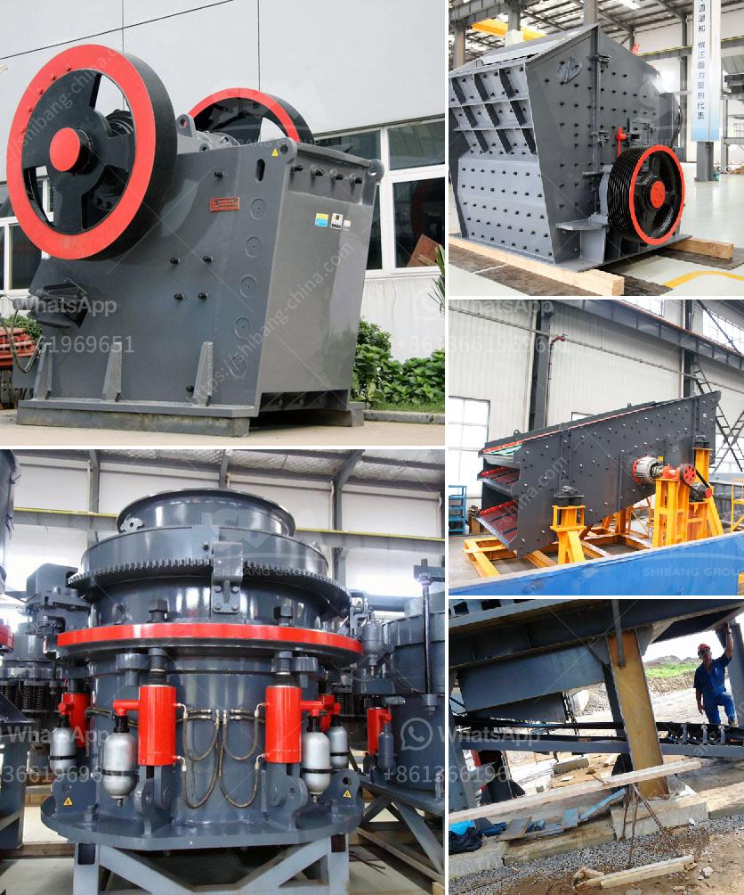

<h3>شركات سيور النقل في المكسيك</h3>
تعتبر سيور النقل من الوسائل الحديثة التي تساعد على تسهيل عملية نقل البضائع والمواد في جميع أنحاء المكسيك. فهي تعتبر طريقة فعالة وآمنة لنقل المواد من مكان إلى آخر بكفاءة وسرعة.

في المكسيك، هناك العديد من الشركات التي تقدم خدمات نقل البضائع عبر سيور النقل. تختلف هذه الشركات في حجمها وقدرتها على تلبية احتياجات العملاء. وتشمل بعض هذه الشركات الكبيرة والمشهورة شركة DHL وشركة FedEx، إضافة إلى الشركات الصغيرة والمتوسطة التي تخدم مناطق محددة.

تقدم الشركات التي تعمل في مجال سيور النقل خدمات متنوعة للعملاء. وتشمل هذه الخدمات النقل الوطني والدولي، بالإضافة إلى خدمات الشحن السريع والشحن البحري. تستخدم هذه الشركات تكنولوجيا حديثة في عملياتها، بما في ذلك استخدام الروبوتات والأتمتة لضمان تسليم البضائع بسرعة ودقة.

تعتبر شركات سيور النقل في المكسيك جزءًا مهمًا من سلسلة التوريد وتعمل على توفير خدمات نقل موثوقة وأمنة. تقوم هذه الشركات بتوفير التغليف المناسب للبضائع وتوفير خدمات التخزين إذا لزم الأمر. وتضمن هذه الشركات أيضًا تسليم البضائع في الوقت المحدد وضمان سلامتها أثناء النقل.

بفضل الأداء الممتاز والخدمات المتكاملة التي توفرها شركات سيور النقل في المكسيك، أصبحت هذه الشركات شريكا مهما للشركات العاملة في مجالات التجارة والصناعة. تعتبر الشركات المحلية والعالمية عملاء لهذه الشركات حيث تعتمد عليها لنقل البضائع وضمان وصولها إلى وجهتها المقصودة بسرعة وسلامة.

باختصار، شركات سيور النقل في المكسيك تلعب دورًا حيويًا في تطور الاقتصاد المكسيكي وتعمل على توفير خدمات نقل موثوقة وفعالة للشركات والمستهلكين على حد سواء. تساهم هذه الشركات في تحسين سلاسة سلسلة التوريد وتحقيق الكفاءة في عمليات النقل والتوزيع.
<h3>Contact us</h3><ul><li><strong>Whatsapp:&nbsp;<a href="https://wa.me/8613661969651">+8613661969651</a></strong></li><li><a href="https://swt.shibang-china.com/?git&amp;zhl&amp;شركات سيور النقل في المكسيك"><strong>Online Service(chat now)</strong></a></li></ul><h3>Related</h3><ul><li><a href='آلة غربلة الرمل للبيع في الفلبين.md'>آلة غربلة الرمل للبيع في الفلبين</a></li><li><a href='آلة فحص الرمل في ماليزيا.md'>آلة فحص الرمل في ماليزيا</a></li><li><a href='كيفية إنشاء شركة محجر.md'>كيفية إنشاء شركة محجر</a></li><li><a href='صيانة محطة توليد الفحم بصيغة PDF.md'>صيانة محطة توليد الفحم بصيغة PDF</a></li><li><a href='مطحنة الطحن بالميكرون.md'>مطحنة الطحن بالميكرون</a></li></ul>