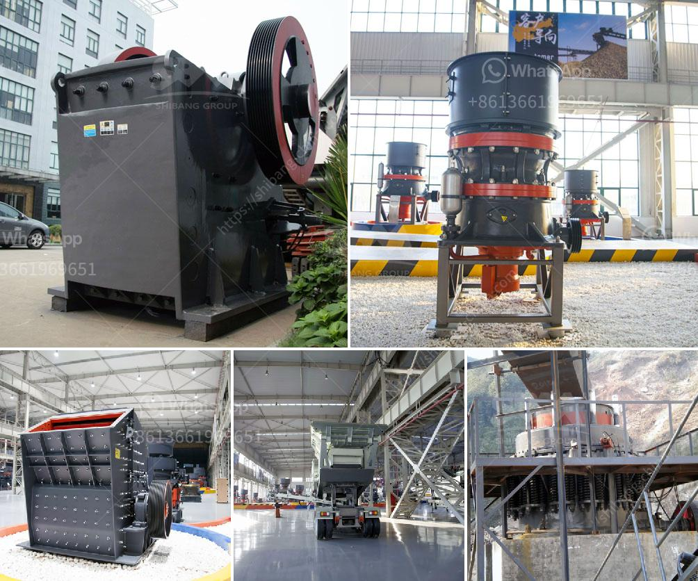

<h3>شركات مصنعي مطاحن الأسطوانات في الهند</h3>
تعد الهند واحدة من أكبر الدول المنتجة للغلال والحبوب في العالم. ومنذ فترة طويلة، استخدم الهنود مطاحن الأسطوانات لطحن حبوب الحبوب المختلفة والتي تستخدم في إعداد مجموعة واسعة من الأطعمة مثل الطحين والعجين والأرز المطحون والشعيرية وغيرها. ومن خلال هذا الطلب المتزايد على مطاحن الأسطوانات، نشأت العديد من شركات تصنيع مطاحن الأسطوانات في الهند.

أحد الأسماء الرائدة في صناعة مطاحن الأسطوانات في الهند هي شركة Bühler Group. تأسست في عام 1860 في مدينة أوفندن في سويسرا، وازدهرت الشركة على مر السنين وأصبحت اليوم رائدة عالميًا في مجال معدات تجهيز الحبوب والمطاحن. تعتبر Bühler Group مصنعًا عالميًا وتمتلك مصانع في العديد من الدول، بما في ذلك الهند.

شركة Bühler Group تعمل في مجال تصنيع مطاحن الأسطوانات عالية الجودة ومتطورة. تتميز منتجاتها بالكفاءة والدقة والمتانة. تعتمد المطاحن على تقنيات متقدمة مثل التحكم الآلي والتكنولوجيا الحديثة لتلبية متطلبات العملاء فيما يتعلق بالجودة والكفاءة.

إضافة إلى Bühler Group، هناك العديد من الشركات الأخرى في الهند التي تصنع مطاحن الأسطوانات. على سبيل المثال، شركة Fowler Westrup هي شركة رائدة في تصنيع معدات معالجة الحبوب والمطاحن في الهند. تقدم الشركة مجموعة واسعة من المنتجات التي تتضمن مطاحن الأسطوانات بالإضافة إلى معدات تنظيف الحبوب وتجهيزها.

باستخدام مطاحن الأسطوانات المصنوعة في الهند، يمكن للمزارعين والمصانع والأفراد طحن الحبوب بطريقة سهلة وفعالة. تعتبر المطاحن عبارة عن آلات مدمجة مصممة لطحن الحبوب بفعالية وبدقة عالية، مما ينتج في نهاية المطاف في إنتاج منتجات غذائية عالية الجودة.

باختصار، شركات مصنعي مطاحن الأسطوانات في الهند تقدم منتجات عالية الجودة وتستخدم تقنيات متقدمة لتلبية احتياجات العملاء. هذه الشركات تساهم في تعزيز صناعة الأغذية في الهند وتوفير منتجات قيمة للمستهلكين.
<h3>Contact us</h3><ul><li><strong>Whatsapp:&nbsp;<a href="https://wa.me/8613661969651">+8613661969651</a></strong></li><li><a href="https://swt.shibang-china.com/?git&amp;zhl&amp;شركات مصنعي مطاحن الأسطوانات في الهند"><strong>Online Service(chat now)</strong></a></li></ul><h3>Related</h3><ul><li><a href='ركض محطم للبيع في صباح.md'>ركض محطم للبيع في صباح</a></li><li><a href='سعر كسارة متنقلة خام الكروم الرئيسية.md'>سعر كسارة متنقلة خام الكروم الرئيسية</a></li><li><a href='مصنع تكسير الحجر في نيجيريا.md'>مصنع تكسير الحجر في نيجيريا</a></li><li><a href='مصنع تكسير الخرسانة في تركيا.md'>مصنع تكسير الخرسانة في تركيا</a></li><li><a href='غسالة مواد خام جرايستون مستعملة.md'>غسالة مواد خام جرايستون مستعملة</a></li></ul>