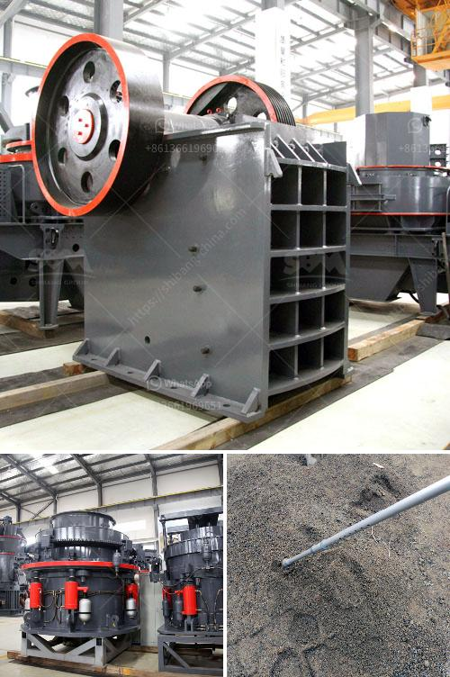

<h3>شركة الإسمنت في بروتيا جلين</h3>
شركة الإسمنت في بروتيا جلين: مساهمة في تطوير البنية التحتية

تعتبر شركة الإسمنت في بروتيا جلين واحدة من الشركات الرائدة في مجال الإنتاج والتوريد لصناعة الإسمنت. تأسست الشركة في عام 1981، ومنذ ذلك الحين، توسعت وتطورت لتصبح صانعة رئيسية في صناعة البناء.

تمتلك شركة الإسمنت في بروتيا جلين مصانع متقدمة ومجهزة بأحدث التقنيات، مما يضمن جودة المنتجات وتوفيرها بكميات كبيرة لمختلف المشاريع الإنشائية. تنتج الشركة أنواعًا مختلفة من الإسمنت، بما في ذلك الإسمنت العادي والإسمنت المقاوم للماء والإسمنت المقاوم للحرارة والإسمنت المتأخر في الحصول على القوة.

تعتبر شركة الإسمنت في بروتيا جلين مساهمًا هامًا في تطوير البنية التحتية للبلاد. فمن خلال توفير منتجاتها ذات الجودة العالية، يمكن للشركة أن تلبي احتياجات ومتطلبات العديد من القطاعات، بما في ذلك القطاع السكني والتجاري والصناعي والبنية التحتية.

تتبع شركة الإسمنت في بروتيا جلين معايير صارمة في عملياتها الإنتاجية، وتضمن جميع المنتجات التي تم تصنيعها مطابقة للمواصفات الفنية والمعايير الصناعية المحلية والعالمية. تستخدم الشركة مواد خام عالية الجودة في عملية إنتاجها، مما يؤدي إلى تصنيع إسمنت قوي ومتين يمكن استخدامه في مشاريع البنية التحتية ذات المتطلبات الصعبة.

تولي شركة الإسمنت في بروتيا جلين اهتمامًا كبيرًا لسلامة الموظفين والبيئة. تعمل الشركة على تطبيق معايير السلامة والصحة المهنية، وتوفير بيئة عمل آمنة للعاملين بها. كما تعمل الشركة على تحقيق أعلى مستويات الاستدامة البيئية من خلال استخدام التقنيات الحديثة وتحسين معالجة النفايات والمحافظة على الموارد الطبيعية.

بفضل التزام شركة الإسمنت في بروتيا جلين بتوفير منتجات ذات جودة عالية ودعمها لتطوير البنية التحتية في البلاد، فإنها تعتبر شريكًا قويًا وذو مسؤولية اجتماعية. إن المساهمة الكبيرة للشركة في تنمية الاقتصاد المحلي وتوفير فرص العمل للمجتمع المحلي تؤكد على دورها الفعال في تحقيق التنمية المستدامة.

باختصار، فإن شركة الإسمنت في بروتيا جلين تعمل باستمرار على تحقيق الابتكار والتطوير في صناعة الإسمنت وتوفير منتجات عالية الجودة التي تلبي احتياجات القطاعات المختلفة. بفضل مبادراتها في مجال الاستدامة، فإنها تساهم في تطوير البنية التحتية وتحسين جودة الحياة في المنطقة.
<h3>Contact us</h3><ul><li><strong>Whatsapp:&nbsp;<a href="https://wa.me/8613661969651">+8613661969651</a></strong></li><li><a href="https://swt.shibang-china.com/?git&amp;zhl&amp;شركة الإسمنت في بروتيا جلين"><strong>Online Service(chat now)</strong></a></li></ul><h3>Related</h3><ul><li><a href='شركة تصنيع آلة طحن الكرة في أوروبا.md'>شركة تصنيع آلة طحن الكرة في أوروبا</a></li><li><a href='شركة تصنيع معدات الجبس.md'>شركة تصنيع معدات الجبس</a></li><li><a href='تكلفة وحدة طحن الأسمنت tpd كسارة.md'>تكلفة وحدة طحن الأسمنت tpd كسارة</a></li><li><a href='كراشر لخدمة الخادم.md'>كراشر لخدمة الخادم</a></li><li><a href='كوماتسو بي آر كسارة للبيع.md'>كوماتسو بي آر كسارة للبيع</a></li></ul>