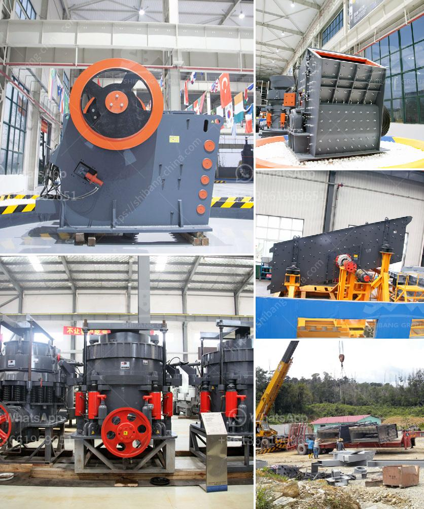

<h3>شركة تصنيع آلات الكسارة في زامبيا</h3>
تعتبر صناعة تصنيع آلات الكسارة في زامبيا قطاعًا حيويًا في الاقتصاد المحلي. تلعب هذه الآلات دورًا هامًا في عمليات التعدين والبناء والتشييد، حيث تُستخدم لكسر وطحن المواد الخام مثل الصخور والحجارة والخرسانة، بحيث يتم تحويلها إلى مواد أصغر الحجم يمكن استخدامها في العديد من التطبيقات المختلفة.

إحدى الشركات الرائدة في تصنيع آلات الكسارة في زامبيا هي شركة "زامبيا للتصنيع". تأسست الشركة في العام 2005 وهي تعمل بجد لتلبية احتياجات قطاعي التعدين والبناء في البلاد. تتمتع الشركة بسمعة ممتازة في صناعة تصنيع الآلات وتقديم حلول مبتكرة وذات جودة عالية لعملائها.

تقوم شركة زامبيا للتصنيع بتصنيع مجموعة متنوعة من الآلات، بما في ذلك كسارات الفك، وكسارات الصدم، وكسارات المخروط، ومطاحن الكرة، وغيرها الكثير. تتميز منتجات الشركة بجودتها العالية وأدائها الموثوق، مما يجعلها خيارًا مفضلًا للعديد من الشركات والمشاريع الكبيرة في زامبيا.

تعمل شركة زامبيا للتصنيع لضمان تقديم منتجات تلبي احتياجات عملائها بشكل مثالي. فهي تستثمر بشكل مستمر في البحث والتطوير لتحسين تصاميمها وتكنولوجيا الإنتاج. كما تولي الشركة اهتمامًا كبيرًا لخدمة العملاء، حيث توفر خدمات ما بعد البيع الممتازة التي تضمن استدامة أداء الآلات على المدى الطويل.

تسهم شركة زامبيا للتصنيع في دفع عجلة التنمية الاقتصادية في زامبيا، حيث تساهم في توفير فرص عمل للمجتمع المحلي وتدريب الموظفين المحليين على تقنيات التصنيع المتقدمة. كما تلتزم الشركة بالمسؤولية الاجتماعية، حيث تدعم المشروعات البيئية والاجتماعية المستدامة في المنطقة.

باختصار، تعد شركة زامبيا للتصنيع واحدة من اللاعبين الرئيسيين في صناعة تصنيع آلات الكسارة في زامبيا. تتمتع الشركة بخبرة واسعة وتقنيات متقدمة لتلبية احتياجات العملاء في قطاعي التعدين والبناء، مع التزامها الثابت بالجودة والابتكار والاستدامة المجتمعية والبيئية.
<h3>Contact us</h3><ul><li><strong>Whatsapp:&nbsp;<a href="https://wa.me/8613661969651">+8613661969651</a></strong></li><li><a href="https://swt.shibang-china.com/?git&amp;zhl&amp;شركة تصنيع آلات الكسارة في زامبيا"><strong>Online Service(chat now)</strong></a></li></ul><h3>Related</h3><ul><li><a href='آلة تعدين النحاس.md'>آلة تعدين النحاس</a></li><li><a href='صورة مطحنة رولر ريموند الموديل 30.md'>صورة مطحنة رولر ريموند الموديل 30</a></li><li><a href='عملية تلبيس خام المنغنيز.md'>عملية تلبيس خام المنغنيز</a></li><li><a href='كسارة صخور صغيرة.md'>كسارة صخور صغيرة</a></li><li><a href='أسعار مطاحن المطرقة في الرأس الشرقي.md'>أسعار مطاحن المطرقة في الرأس الشرقي</a></li></ul>