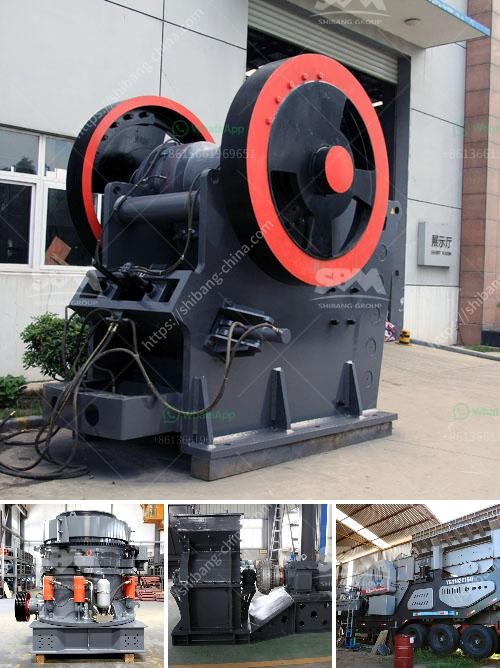

<h3>شركة تصنيع آلات رمل السيليكا في الهند</h3>
تعد الهند واحدة من أكبر الدول المنتجة للسيليكا في العالم، حيث تمتلك موارد طبيعية غنية من الرمال السيليكا. وفي السنوات الأخيرة، شهدت الهند زيادة ملحوظة في الطلب على معدات صناعة السيليكا، مما أدى إلى ظهور العديد من الشركات التي تصنع آلات رمل السيليكا.

تعتبر شركة "اسم الشركة" واحدة من أبرز الشركات المصنعة للآلات المستخدمة في إنتاج رمل السيليكا. تتمتع هذه الشركة بسمعة قوية وخبرة ممتدة لعدة سنوات في صناعة المعدات الصناعية.

تتميز آلات تصنيع رمل السيليكا التي تقدمها الشركة بالدقة والكفاءة. وتستخدم هذه الآلات التكنولوجيا الحديثة والأساليب المتقدمة لضمان تحقيق أعلى جودة للمنتج النهائي. وبفضل التصاميم المبتكرة والتقنيات العالية، تعمل هذه الآلات بكفاءة عالية وتتميز بأداء مستدام واستهلاك منخفض للطاقة.

يتم تصنيع آلات تجهيز رمل السيليكا بواسطة الشركة باستخدام مواد عالية الجودة ومكونات متينة. تتضمن هذه الآلات عمليات مثل تنقية المياه وفصل الشوائب وتجفيف الرمل وتعويمه وغسله ومعالجته بالكيماويات اللازمة للحصول على رمل السيليكا المطلوب.

توفر الشركة أيضًا خدمات ما بعد البيع الممتازة والدعم الفني لعملائها. وتقدم استشارات فنية وتدريب وصيانة منتظمة للآلات التي تطورها. وبفضل الشبكة الواسعة من الوكلاء والموزعين في مختلف أنحاء الهند، يمكن للشركة توفير الخدمة الفورية للعملاء وتلبية احتياجاتهم بفاعلية.

تلتزم شركة تصنيع آلات رمل السيليكا في الهند بالتنمية المستدامة والحفاظ على البيئة. فهي تلتزم بمعايير الجودة العالمية وتتبع أفضل الممارسات البيئية في عملياتها. وتسعى الشركة باستمرار لتحسين أدائها وتطوير منتجاتها للتكيف مع التطورات الصناعية واحتياجات العملاء المتغيرة.

باختصار، فإن شركة تصنيع آلات رمل السيليكا في الهند توفر منتجات عالية الجودة وتقدم خدمات استثنائية لعملائها. وتساهم في تعزيز صناعة السيليكا في الهند وتعزيز الاقتصاد المحلي. فهي تعد مثالًا للشركات الرائدة في مجال تصنيع المعدات الصناعية في الهند.
<h3>Contact us</h3><ul><li><strong>Whatsapp:&nbsp;<a href="https://wa.me/8613661969651">+8613661969651</a></strong></li><li><a href="https://swt.shibang-china.com/?git&amp;zhl&amp;شركة تصنيع آلات رمل السيليكا في الهند"><strong>Online Service(chat now)</strong></a></li></ul><h3>Related</h3><ul><li><a href='بيع كسارة تصنيع.md'>بيع كسارة تصنيع</a></li><li><a href='كسارة محمولة تريمان.md'>كسارة محمولة تريمان</a></li><li><a href='كسارات الفك مسحوق كربيد التنجستن.md'>كسارات الفك مسحوق كربيد التنجستن</a></li><li><a href='شركات تكسير الحجر في بيرو.md'>شركات تكسير الحجر في بيرو</a></li><li><a href='معدات غسيل الباريت.md'>معدات غسيل الباريت</a></li></ul>