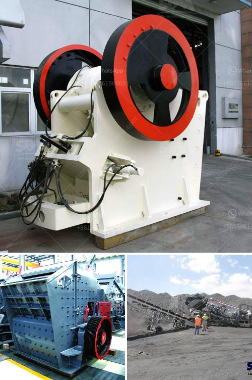

<h3>شركة تصنيع آلة كسارة الحجر</h3>
تُعد آلة كسارة الحجر من الآلات الأساسية في صناعة التعدين والبناء. وتتميز هذه الآلة بقدرتها على تحويل الصخور الضخمة إلى قطع أصغر من الأحجام المطلوبة، مما يجعلها مناسبة للاستخدام في العديد من المجالات مثل بناء الطرق والبنية التحتية والإنشاءات العامة.

تختلف آلات كسارة الحجر في الأحجام والأنواع المختلفة وفقًا للاستخدام المطلوب. قد تكون الآلات المتوسطة الحجم مناسبة للشركات الصغيرة والمتوسطة وتحتوي على محرك كهربائي قوي يقوم بتشغيل الكسارة وتكسير الصخور بكفاءة عالية. بينما تكون الآلات الأكبر حجمًا متخصصة في مشاريع البناء الكبيرة وتتطلب تركيبات أقوى لتحمل الضغوط العالية التي تتعرض لها.

تعتبر شركات تصنيع آلة كسارة الحجر أحد أعمدة الصناعة المعدنية والبنائية. فقد تطورت هذه الشركات لتلبية احتياجات السوق المتزايدة والتحديات التكنولوجية، وتقدم حلولًا متنوعة للعملاء. تقوم هذه الشركات بتصميم وتطوير آلات كسارة الحجر الحديثة التي تتميز بالكفاءة والأمان والاستدامة.

تعتمد عملية تصنيع آلة كسارة الحجر على خطوات عديدة. تبدأ العملية بتصميم الآلة واختبارها وتحليل توافق المواد المستخدمة. ثم تبدأ عملية التصنيع الفعلية والتجميع والاختبار النهائي. وفي كل خطوة من هذه العمليات يتم التحقق من جودة المنتج والالتزام بمعايير السلامة.

بالإضافة إلى ذلك، تضع شركات تصنيع آلة كسارة الحجر الاهتمام بتحسين الأداء وخفض استهلاك الطاقة والحفاظ على البيئة. فقد تم تطوير تقنيات جديدة لتحسين كفاءة الآلات والتحكم في انبعاثات الغبار والضوضاء الناتجة عن عملية التكسير.

باختصار، تلعب آلة كسارة الحجر دورًا حيويًا في صناعة التعدين والبناء. وتتطور شركات تصنيع هذه الآلات باستمرار لتلبية احتياجات السوق وتحسين الأداء والكفاءة. تعتبر آلات كسارة الحجر حلاً مهمًا لتحقيق الاستدامة في البناء والتعدين وتحسين كفاءة وجودة الأعمال.
<h3>Contact us</h3><ul><li><strong>Whatsapp:&nbsp;<a href="https://wa.me/8613661969651">+8613661969651</a></strong></li><li><a href="https://swt.shibang-china.com/?git&amp;zhl&amp;شركة تصنيع آلة كسارة الحجر"><strong>Online Service(chat now)</strong></a></li></ul><h3>Related</h3><ul><li><a href='كسارة محمولة للشراء.md'>كسارة محمولة للشراء</a></li><li><a href='كسارة محمولة كليمان.md'>كسارة محمولة كليمان.</a></li><li><a href='تكسير الحجر المصنوع في ألمانيا.md'>تكسير الحجر المصنوع في ألمانيا</a></li><li><a href='آلة سحق نقاء الشورا.md'>آلة سحق نقاء الشورا</a></li><li><a href='مصنع تكسير الجرانيت 200 طن في الساعة للبيع.md'>مصنع تكسير الجرانيت 200 طن في الساعة للبيع</a></li></ul>