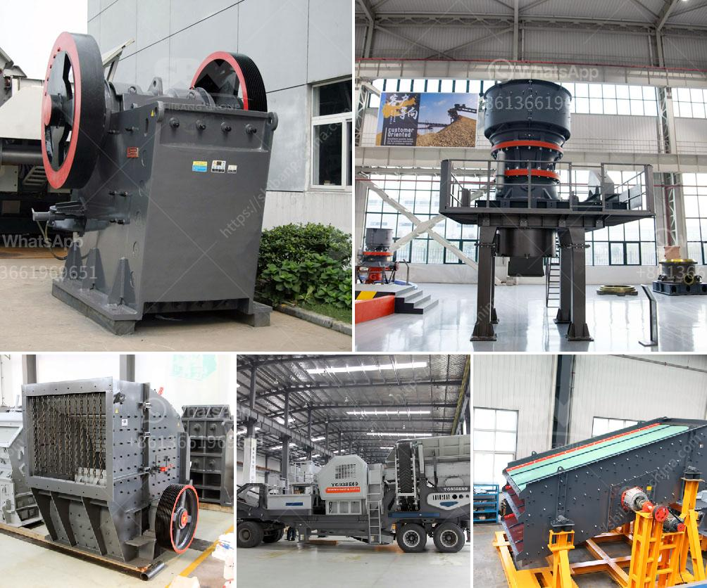

<h3>شركة تصنيع سير الناقل من الصين</h3>
تعد صناعة السيور الناقلة من الصين واحدة من الصناعات التي شهدت تطوراً ملحوظاً في السنوات الأخيرة. تعد هذه الصناعة أساسية في العديد من القطاعات مثل الصناعة التعدينية والغذائية والتصنيع والنقل. وتقدم الشركات الصينية مجموعة واسعة من الأنواع والأحجام من السيور الناقلة لتلبية احتياجات العملاء في جميع أنحاء العالم.

تتمتع الشركات الصينية المصنعة للسيور الناقلة بسمعة عالمية تكون مدعومة بالجودة والكفاءة والتكنولوجيا المتقدمة. تستخدم هذه الشركات مواد عالية الجودة في تصنيع السيور الناقلة، مثل مطاط الألتيمر والنايلون والبوليستر، لضمان المتانة والمتانة العالية، حيث تقاوم هذه المواد التآكل والتآكل الميكانيكي.

توفر الشركات الصينية مجموعة متنوعة من السيور الناقلة المختلفة، مثل السيور الناقلة العادية والسيور الناقلة المطاطية والسيور الناقلة المعدنية والسيور الناقلة المعززة بألياف النايلون والسيور الناقلة المضفرة. وتتوفر أيضاً خيارات مختلفة فيما يتعلق بنوع الحزام وعرضه وطوله وسرعة التشغيل، مما يسمح للعملاء بتحديد الخيار المناسب لاحتياجاتهم الفردية.

بفضل التكنولوجيا المتقدمة المستخدمة في صناعة السيور الناقلة، فإن الشركات الصينية قادرة على تلبية متطلبات العملاء المتغيرة بسهولة. تعتمد هذه الشركات على فرق هندسية متخصصة ومجهزة بأحدث المعدات والأدوات اللازمة لتصنيع واختبار السيور الناقلة بدقة عالية. وبفضل التفتيش الدقيق وعمليات التحكم في الجودة المشددة، تتمتع السيور الناقلة المصنعة في الصين بجودة عالية وأداء موثوق به.

إضافةً إلى ذلك، يتم توفير خدمة ما بعد البيع الممتازة من قبل الشركات الصينية، حيث يتم تسليم السيور الناقلة في الوقت المحدد وتوفير الدعم الفني اللازم للعملاء. يهدف هذا الدعم الفني إلى ضمان تشغيل سلس وفعال للسيور الناقلة وتقديم الحلول المناسبة لأي مشاكل تنشأ خلال فترة الاستخدام.

باختصار، تعتبر شركات تصنيع السيور الناقلة من الصين خيارًا موثوقًا ومثاليًا للعملاء في جميع أنحاء العالم. فهي توفر جودة عالية، وتنوع في الأحجام والأنواع، وتكنولوجيا متقدمة، ودعم فني ممتاز. بفضل هذه الصفات، تستمر الشركات الصينية في تحقيق نجاح مستمر ورضا العملاء في مجال تصنيع السيور الناقلة.
<h3>Contact us</h3><ul><li><strong>Whatsapp:&nbsp;<a href="https://wa.me/8613661969651">+8613661969651</a></strong></li><li><a href="https://swt.shibang-china.com/?git&amp;zhl&amp;شركة تصنيع سير الناقل من الصين"><strong>Online Service(chat now)</strong></a></li></ul><h3>Related</h3><ul><li><a href='آلة طحن الحجر الصخري في فوجيان.md'>آلة طحن الحجر الصخري في فوجيان</a></li><li><a href='خطة عمل تعدين الجرانيت.md'>خطة عمل تعدين الجرانيت</a></li><li><a href='مطرقة الذهب المستخدمة للبيع في زيمبابوي.md'>مطرقة الذهب المستخدمة للبيع في زيمبابوي</a></li><li><a href='آلة طحن الحجر الجيري المصنع.md'>آلة طحن الحجر الجيري المصنع</a></li><li><a href='تقرير الجدوى لاستفادة من خام النحاس.md'>تقرير الجدوى لاستفادة من خام النحاس</a></li></ul>