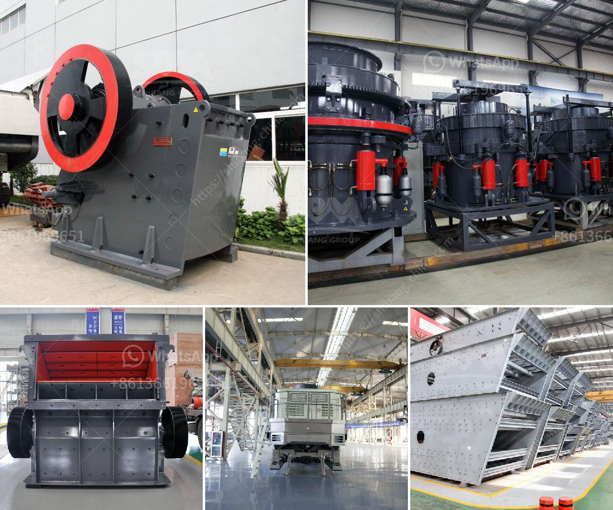

<h3>شركة تصنيع كسارات صغيرة في الصين</h3>
تعتبر الصين واحدة من أكبر الدول المصنعة في العالم، حيث تتخصص في تصنيع مجموعة متنوعة من المنتجات بأحجام وأشكال مختلفة. ومن بين هذه المنتجات التي تتميز بها الصين هي كسارات الحجارة الصغيرة.

تعتبر شركات تصنيع الكسارات الصغيرة في الصين من أبرز المصنعين في العالم، حيث تصمم وتصنع هذه الكسارات وفقًا لمتطلبات العملاء واحتياجاتهم المحددة.

توفر هذه الكسارات الصغيرة حلاً فعالًا لعملية كسر الصخور الصلبة والحجارة إلى قطع أصغر وأكثر قابلية للنقل والاستخدام. تستخدم هذه الكسارات على نطاق واسع في صناعات مختلفة مثل البناء والتعدين والهندسة المدنية.

تتميز شركات تصنيع الكسارات الصغيرة في الصين بتوفير أجهزة عالية الجودة وعالية الأداء، حيث يتم استخدام تقنيات متقدمة لتطوير وتصنيع هذه الكسارات. تعتمد تقنيات التصنيع على استخدام المعادن القوية والمتينة، مما يقلل من تكاليف الصيانة ويزيد من عمر الخدمة لهذه الكسارات.

من بين المزايا الأخرى للكسارات الصغيرة المصنعة في الصين هو نظام التحكم الذكي الذي يتحكم في العملية بطريقة فعالة ودقيقة. يسمح هذا النظام بمراقبة وتحكم كامل في عملية التكسير، بما في ذلك سرعة الكسارة وتدفق المواد وحجم الحصى المنتج.

بالإضافة إلى ذلك، تتميز الشركات المصنعة في الصين بتوفير خدمة ما بعد البيع الممتازة، حيث يتم تقديم الدعم الفني والصيانة لعملائها. تضمن هذه الخدمة أن العميل يحصل على الدعم اللازم بعد شراء الكسارة، ويتم إصلاح وصيانة الأجزاء اللازمة للحفاظ على أداء الكسارة بأفضل حالة.

على الرغم من التحديات التي تواجهها هذه الشركات المصنعة في الصين مثل المنافسة الشرسة والتكاليف المرتفعة، إلا أنها تواصل التطور والابتكار لتلبية احتياجات السوق وطلب العملاء المتزايد.

بشكل عام، تعتبر شركات تصنيع الكسارات الصغيرة في الصين قوية وموثوقة وتوفر منتجات عالية الجودة. لذا، فإنها هي الخيار الأمثل للعملاء الذين يرغبون في الحصول على كسارة صغيرة فعالة وفعالة التكلفة لتلبية احتياجاتهم في مجال البناء والتعدين وغيرها من الصناعات.
<h3>Contact us</h3><ul><li><strong>Whatsapp:&nbsp;<a href="https://wa.me/8613661969651">+8613661969651</a></strong></li><li><a href="https://swt.shibang-china.com/?git&amp;zhl&amp;شركة تصنيع كسارات صغيرة في الصين"><strong>Online Service(chat now)</strong></a></li></ul><h3>Related</h3><ul><li><a href='كسارة أولية مستخدمة في جنوب أفريقيا.md'>كسارة أولية مستخدمة في جنوب أفريقيا</a></li><li><a href='رمل صناعي للبناء.md'>رمل صناعي للبناء</a></li><li><a href='مصنع محطم الدولوميت في ماليزيا.md'>مصنع محطم الدولوميت في ماليزيا</a></li><li><a href='طاحونة رايموند للفحم.md'>طاحونة رايموند للفحم</a></li><li><a href='آلة معالجة الجبس بسعة طن واحد.md'>آلة معالجة الجبس بسعة طن واحد</a></li></ul>