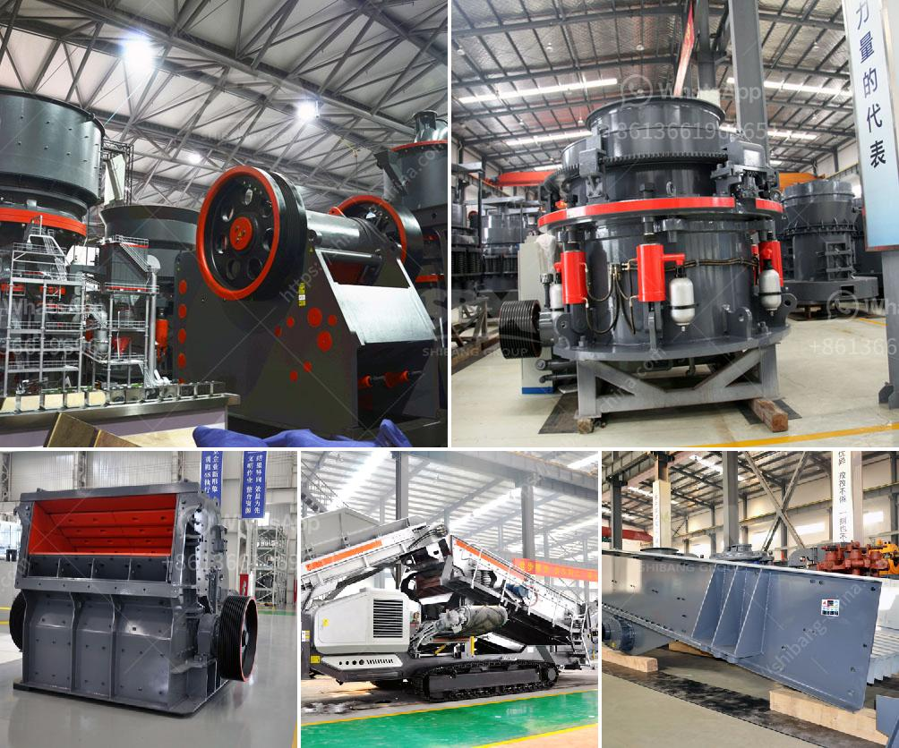

<h3>شركة تصنيع كسارة الحصى</h3>
تعد كسارة الحصى من المعدات الأساسية في صناعة البناء والإنشاءات، وتستخدم لتكسير الصخور والحصى الكبير للحصول على حجم مناسب للاستخدام في البناء. وتعد شركة تصنيع كسارة الحصى من أهم الشركات في هذا القطاع.

تعمل شركة تصنيع كسارة الحصى على تصميم وتطوير مجموعة متنوعة من الكسارات التي تلبي احتياجات العملاء المختلفة. تتوفر هذه الكسارات بأحجام وسعات مختلفة، بدءًا من الكسارات الصغيرة المحمولة وحتى الكسارات الكبيرة الموجودة في المواقع الكبيرة. كما تستخدم الشركة أحدث التقنيات والمواد لضمان جودة المنتجات وأداءها الممتاز.

تتمتع شركة تصنيع كسارة الحصى بفريق من المهندسين ذوي الخبرة في مجال تصميم وتطوير الكسارات. يعمل هؤلاء المهندسون على تحليل احتياجات العملاء وتصميم كسارة مخصصة تلبي هذه الاحتياجات بأفضل طريقة ممكنة. كما يضم فريق الدعم الفني المتاح على مدار الساعة خبراء فنيين مدربين تدريبًا جيدًا لتوفير الدعم الفني والصيانة للعملاء.

تقدم شركة تصنيع كسارة الحصى جميع الخدمات الملحقة للكسارات، بما في ذلك التركيب والتجميع والصيانة. كما تتعاون الشركة مع موردي المواد الخام والشركات اللوجستية لتأمين المواد اللازمة لصناعة الكسارة وتوصيلها بسرعة وفعالية.

تؤمن شركة تصنيع كسارة الحصى بأهمية الحفاظ على البيئة، ولذلك تعمل على تصميم كسارات صديقة للبيئة وذات كفاءة عالية في استخدام الطاقة. تقوم الشركة أيضًا بتقديم الاستشارات البيئية والتوجيه للعملاء لضمان استخدام أفضل الممارسات البيئية في عمليات كسر الحصى.

باختصار، تعد شركة تصنيع كسارة الحصى الشركة المثالية لتلبية احتياجات صناعة البناء والإنشاءات. تقدم الشركة منتجات عالية الجودة وخدمة متميزة، كما تحرص على حماية البيئة وتقديم أفضل الحلول التقنية لعملائها. تمثل شركة تصنيع كسارة الحصى الخيار الأمثل للعملاء الذين يبحثون عن معدات كسر الحصى عالية الأداء والفعالية.
<h3>Contact us</h3><ul><li><strong>Whatsapp:&nbsp;<a href="https://wa.me/8613661969651">+8613661969651</a></strong></li><li><a href="https://swt.shibang-china.com/?git&amp;zhl&amp;شركة تصنيع كسارة الحصى"><strong>Online Service(chat now)</strong></a></li></ul><h3>Related</h3><ul><li><a href='مطحنة كرات عمودية في كينيا.md'>مطحنة كرات عمودية في كينيا</a></li><li><a href='آلات إنتاج مسحوق كربونات الكالسيوم.md'>آلات إنتاج مسحوق كربونات الكالسيوم</a></li><li><a href='تكلفة مصنع الكسارة.md'>تكلفة مصنع الكسارة</a></li><li><a href='مصنع سحق محمول بدائرة مغلقة.md'>مصنع سحق محمول بدائرة مغلقة</a></li><li><a href='عملية كربونات الكالسيوم المترسبة.md'>عملية كربونات الكالسيوم المترسبة</a></li></ul>