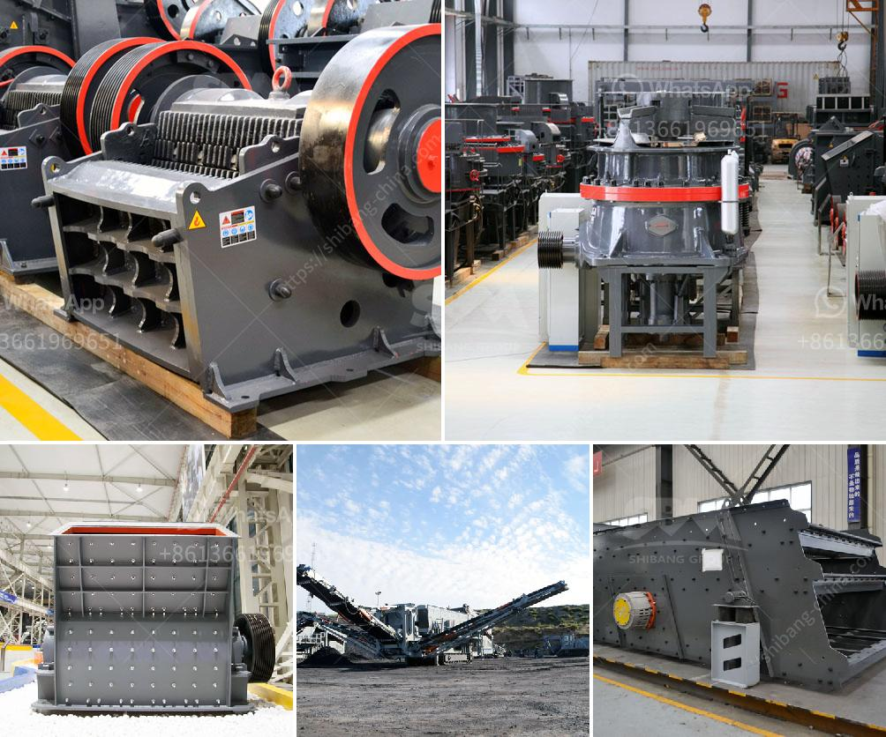

<h3>شركة تصنيع كسارة الفك الدورانية في الهند</h3>
تصنع كسارات الفك الدورانية في الهند من قبل شركة تصنيع رائدة تهدف إلى توفير معدات التكسير عالية الجودة والكفاءة. تعتبر شركة تصنيع الكسارات الفك الدورانية من الشركات الرائدة في صناعة التعدين والبناء في الهند وتمتلك سمعة ممتازة في توفير منتجات عالية الجودة وبأسعار تنافسية.

يتم استخدام كسارات الفك الدورانية بشكل شائع في صناعات التعدين والبناء لسحق الأحجار الكبيرة إلى قطع صغيرة من الحجم المطلوب. تعتبر الكسارات الفك الدورانية فعالة في سحق مجموعة متنوعة من المواد مثل الحجر الجيري والجرانيت والبازلت والرخام والخامات المعدنية الأخرى.

تتميز كسارات الفك الدورانية بتصميم فريد يتيح لها الدوران حول محورها. هذا التصميم يسمح بزيادة قدرة الكسارة وتحسين كفاءتها. تمتاز هذه الكسارات أيضًا بتكاليف صيانة منخفضة وتعمل بكفاءة عالية في الظروف القاسية.

تستخدم الكسارات الفك الدورانية في العديد من التطبيقات مثل سحق الصخور الكبيرة في صناعة التعدين وسحق الأحجار الصلبة في صناعة البناء. كما يتم استخدامها في صناعة الأسمنت وصناعة الكيماويات والطاقة وغيرها من الصناعات التحويلية.

تلتزم شركة تصنيع الكسارات الفك الدورانية في الهند بتقديم أعلى مستوى من الجودة والموثوقية. تستخدم الشركة أحدث التقنيات والمواد عالية الجودة في عملية التصنيع لضمان عمر طويل وأداء ممتاز للكسارات.

وبفضل توجيهها نحو الابتكار والتطوير المستدام، تعمل الشركة على تطوير وتحسين كسارات الفك الدورانية بشكل مستمر. بالإضافة إلى ذلك، يتم توفير دعم فني وخدمة ما بعد البيع ممتازة لضمان رضا العملاء وتلبية احتياجاتهم.

باختصار، تعتبر شركة تصنيع كسارات الفك الدورانية في الهند رائدة في صناعتها وتوفر منتجات عالية الجودة وكفاءة عالية. إن استخدام هذه الكسارات في صناعة التعدين والبناء يساهم في زيادة الإنتاجية وتحسين كفاءة العمليات. لذا، فإن اختيار شركة تصنيع الكسارات الفك الدورانية في الهند يعد خيارًا ممتازًا.
<h3>Contact us</h3><ul><li><strong>Whatsapp:&nbsp;<a href="https://wa.me/8613661969651">+8613661969651</a></strong></li><li><a href="https://swt.shibang-china.com/?git&amp;zhl&amp;شركة تصنيع كسارة الفك الدورانية في الهند"><strong>Online Service(chat now)</strong></a></li></ul><h3>Related</h3><ul><li><a href='سحق النفايات الخرسانية والحديد.md'>سحق النفايات الخرسانية والحديد</a></li><li><a href='آلات صنع البودرة.md'>آلات صنع البودرة</a></li><li><a href='تكلفة كسارة السيليكا.md'>تكلفة كسارة السيليكا</a></li><li><a href='معدات غسيل الذهب.md'>معدات غسيل الذهب</a></li><li><a href='مصنع معالجة للبيع في جنوب أفريقيا.md'>مصنع معالجة للبيع في جنوب أفريقيا</a></li></ul>