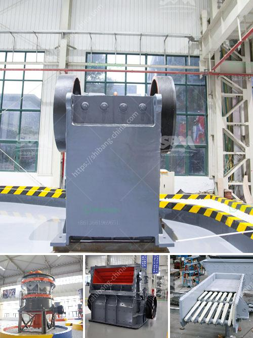

<h3>شركة تصنيع كسارة في جوجارات</h3>
تعتبر صناعة التعدين ومحاجر الحجارة من أهم القطاعات الصناعية في الهند، حيث تشتهر ولاية جوجارات بكونها من أكبر ولايات الهند في إنتاج الحجارة والجرانيت. وفي هذا السياق، تبرز شركة تصنيع كسارة كواحدة من الشركات الرائدة في صناعة المعدات الثقيلة لتكسير الحجارة في ولاية جوجارات.

تأسست الشركة قبل عدة عقود، وعلى مر السنين استطاعت بناء تاريخ حافل في تصنيع وتوريد الكسارات عالية الجودة. تتمتع الشركة بخبرة واسعة في تصميم وتصنيع أنواع مختلفة من الكسارات، بدءًا من الكسارات الفكية وصولاً إلى الكسارات التصادمية والمخروطية.

تتمتع الشركة بمصنع حديث مجهز بأحدث التقنيات والمعدات، ما يتيح ضمان جودة المنتجات وتلبية احتياجات العملاء المتنوعة. توظف الشركة مهندسين وخبراء ذوي خبرة عالية في هذا المجال، مما يضمن تصنيع منتجات عالية الأداء وفعالة من حيث التكلفة.

تعتبر الكسارات المنتجة من قبل الشركة مثالية لتكسير الحجارة ذات الصلابة المختلفة، سواء كانت صخور صلبة أو ناعمة. كما تتوفر الكسارات بمختلف السعات والأحجام، ما يجعلها مناسبة للاستخدام في مشاريع البناء الكبيرة والصغيرة على حدٍ سواء.

بالإضافة إلى ذلك، تقوم الشركة بتصنيع معدات إضافية مثل الشاشات والناقلات الهوائية والمستمرة، التي تساعد في تحسين كفاءة العمل وتوفير الوقت والجهد. كما تحرص الشركة على خدمة ما بعد البيع المتميزة، حيث توفر قطع الغيار الأصلية وتعمل على توفير الدعم الفني والصيانة المنتظمة لعملائها.

تراعي الشركة الجوانب البيئية في عمليات التصنيع، حيث تعتمد على أحدث التقنيات الخضراء وتلتزم بتقليل التأثير البيئي لعمليات الإنتاج. وبفضل جودة منتجاتها واهتمامها بالجوانب البيئية، استطاعت الشركة كسب رضى وثقة العديد من العملاء والشركات في الهند وخارجها.

بالاعتماد على تقنيات حديثة وجودة منتجاتها، توفر شركة تصنيع كسارة في جوجارات حلولًا مثالية للعملاء الباحثين عن معدات تكسير عالية الأداء وموثوقة. ومن خلال استمرارها في الابتكار وتحسين جودة منتجاتها، تعتبر الشركة خيارًا مثاليًا لاحتياجات الصناعة التعدينية ومحاجر الحجارة في ولاية جوجارات وخارجها.
<h3>Contact us</h3><ul><li><strong>Whatsapp:&nbsp;<a href="https://wa.me/8613661969651">+8613661969651</a></strong></li><li><a href="https://swt.shibang-china.com/?git&amp;zhl&amp;شركة تصنيع كسارة في جوجارات"><strong>Online Service(chat now)</strong></a></li></ul><h3>Related</h3><ul><li><a href='شركة مطحنة الكرة في تاميل نادو.md'>شركة مطحنة الكرة في تاميل نادو</a></li><li><a href='موزع كسارة مخروط في إندونيسيا.md'>موزع كسارة مخروط في إندونيسيا</a></li><li><a href='تكلفة الكسارة المحمولة.md'>تكلفة الكسارة المحمولة</a></li><li><a href='مصانع معالجة الخام الصينية.md'>مصانع معالجة الخام الصينية</a></li><li><a href='حجر الحجر الجيري المسحوق بحجم 34 بوصة.md'>حجر الحجر الجيري المسحوق بحجم 3/4 بوصة</a></li></ul>