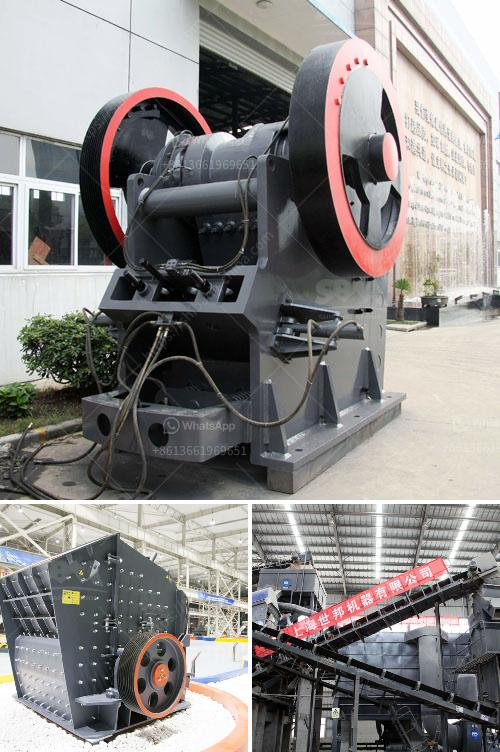

<h3>شركة تصنيع مطاحن المطرقة في ماليزيا</h3>
تعتبر صناعة مطاحن المطرقة من الصناعات الحديثة والمتقدمة في سوق الصناعة في ماليزيا. تلعب هذه المطاحن دورًا حيويًا في تحويل وطحن المواد الخام مثل الأعلاف والحبوب والمواد الكيميائية إلى مساحيق ناعمة. وتستخدم في صناعات مختلفة مثل صناعة الغذاء والدواء والتخلص من النفايات وغيرها.

شركة تصنيع مطاحن المطرقة في ماليزيا تعتبر واحدة من الشركات الرائدة في هذا القطاع. تستخدم الشركة أحدث التقنيات والمعدات لتصميم وتصنيع مطاحن المطرقة عالية الجودة وفعالة من حيث التكلفة. تضمن الشركة تلبية احتياجات العملاء وفقًا لمتطلباتهم الفردية بناءً على استشاراتهم.

تستخدم مطاحن المطرقة في عملية الطحن باستخدام قوة الكمبيوتر والمحركات لحمل وطحن المواد الخام. يتم توجيه المادة الخام إلى مطحنة المطرقة حيث ترتفع عندما تتعرض لهذه القوة وتتناثر في الهواء. ثم يتم سحقها بواسطة المطارق المثبتة على المحور الدوار. تتميز مطاحن المطرقة بفعاليتها في تحويل المواد الخام إلى مساحيق ناعمة في وقت قصير وبنتائج دقيقة.

تشتهر شركة تصنيع المطاحن الماليزية بمنتجاتها ذات الجودة العالية والموثوقية. يتم تصنيع المطاحن بمواد قوية ومتينة مثل الحديد المقاوم للصدأ والفولاذ المطلي بالكروم للتأكد من صمودها أمام الظروف القاسية والاستخدام المستمر. توفر الشركة خدمة ما بعد البيع والصيانة المتميزة لضمان عملية سلسة ومستمرة وتحقيق رضا العملاء.

بفضل استخدام التكنولوجيا والابتكار، أصبحت مطاحن المطرقة في ماليزيا بديلًا فعالًا وقويًا عن العمليات التقليدية للطحن. تعمل بكفاءة عالية وتوفر وقتًا وجهدًا للمصنعين في ماليزيا والمناطق المجاورة. وبفضل التركيز المستمر على الجودة والابتكار، تواصل الشركة تطوير وتحسين منتجاتها وخدماتها لتلبية احتياجات العملاء المتنوعة في جميع أنحاء العالم.

باختصار، تعد شركة تصنيع مطاحن المطرقة في ماليزيا رائدة في هذا القطاع وتعكس روح الابتكار والتطور في صناعة الصناعات التحويلية في ماليزيا. تلبي هذه المطاحن احتياجات العملاء بفعالية وجودة عالية، وتستخدم أحدث التقنيات والمواد لتحسين أداء العملية وتلبية توقعات السوق المتغيرة.
<h3>Contact us</h3><ul><li><strong>Whatsapp:&nbsp;<a href="https://wa.me/8613661969651">+8613661969651</a></strong></li><li><a href="https://swt.shibang-china.com/?git&amp;zhl&amp;شركة تصنيع مطاحن المطرقة في ماليزيا"><strong>Online Service(chat now)</strong></a></li></ul><h3>Related</h3><ul><li><a href='تكلفة مشروع طحن التلك.md'>تكلفة مشروع طحن التلك</a></li><li><a href='مطحنة الأسطوانة للطحن.md'>مطحنة الأسطوانة للطحن</a></li><li><a href='سعر كسارة الحجر سعة طن في الساعة.md'>سعر كسارة الحجر سعة طن في الساعة</a></li><li><a href='تجهيز خام الحديد بي دي إف.md'>تجهيز خام الحديد بي دي إف</a></li><li><a href='آلات صنع الألواح الجبسية من تركيا.md'>آلات صنع الألواح الجبسية من تركيا</a></li></ul>