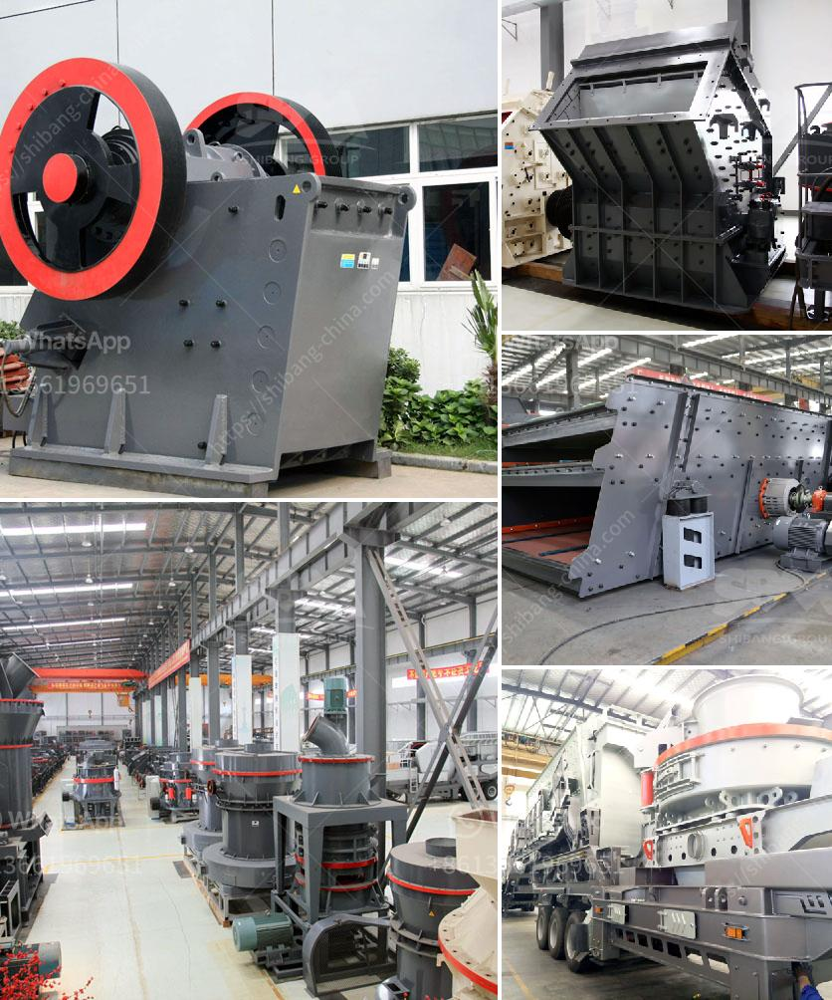

<h3>شركة تصنيع مطحنة الفحم في الصين</h3>
تعتبر الصين واحدة من أكبر المنتجين والمستهلكين للفحم في العالم. وتلعب صناعة توليد الطاقة من الفحم في الصين دورًا حاسمًا في تلبية احتياجات الطاقة المحلية والوطنية. ولتحقيق ذلك، تعمل العديد من الشركات في الصين على تصنيع مطاحن الفحم التي تعد جزءًا هامًا في عملية التحويل والاستخدام الفعال للفحم.

إحدى الشركات الرائدة في تصنيع مطاحن الفحم في الصين هي شركة "تشانغشا شيبانغ ماشينري كوربوريشن"، والتي تأسست في عام 1997. تهدف هذه الشركة إلى توفير أفضل الحلول التقنية والمعدات لصناعة التعدين وتوليد الكهرباء من الفحم. توفر شركة "تشانغشا شيبانغ" مجموعة واسعة من مطاحن الفحم، بما في ذلك مطاحن الفحم الرأسية ومطاحن الفحم الأفقية ومطاحن الفحم الكروية.

تعتبر مطاحن الفحم التي تقدّمها الشركة مزايا فنية واقتصادية عديدة. فهي تعتمد على تقنيات متقدمة تضمن كفاءة عالية في طحن الفحم وتجهيزه، مما يساهم في زيادة إنتاجية الفحم وتوفير الطاقة. تتميز مطاحن الفحم الرأسية الخاصة بالشركة بمساحة صغيرة وتصميم مدمج، مما يسهل عملية التركيب والصيانة. أما مطاحن الفحم الأفقية ومطاحن الفحم الكروية، فتتميز بقدرتها على معالجة كميات كبيرة من الفحم في فترة زمنية قصيرة.

تولي شركة "تشانغشا شيبانغ" اهتمامًا كبيرًا بالجودة والابتكار، وتعمل على تحفيز التطوير التكنولوجي ورفع مستوى الأداء. لذلك، تستثمر الشركة بشكل مستمر في البحث والتطوير، وتعقد شراكات مع الجامعات والمعاهد البحثية المحلية والدولية. وبفضل هذا الجهد المستمر، حصلت شركة "تشانغشا شيبانغ" على العديد من البراءات والشهادات في مجال تصنيع مطاحن الفحم.

علاوة على ذلك، تتمتع شركة "تشانغشا شيبانغ" بسمعة طيبة في قطاع تصنيع مطاحن الفحم، حيث توفر منتجات عالية الجودة وخدمة ممتازة لعملائها. وتعتبر الشركة شريكًا موثوقًا به في صناعة توليد الكهرباء من الفحم، حيث تعمل على توريد المعدات وإقامة خطوط إنتاج فعالة لعملائها.

بهذا الشكل، تلعب شركة تصنيع مطاحن الفحم في الصين دورًا مهمًا في تعزيز صناعة الفحم ودعم تلبية الاحتياجات المتزايدة للطاقة في الصين. ومن خلال تطوير تقنيات متقدمة ومنتجات عالية الجودة، ستستمر هذه الشركات في تعزيز قدرتها التنافسية وتحقيق التنمية المستدامة في هذا القطاع المهم.
<h3>Contact us</h3><ul><li><strong>Whatsapp:&nbsp;<a href="https://wa.me/8613661969651">+8613661969651</a></strong></li><li><a href="https://swt.shibang-china.com/?git&amp;zhl&amp;شركة تصنيع مطحنة الفحم في الصين"><strong>Online Service(chat now)</strong></a></li></ul><h3>Related</h3><ul><li><a href='مطحنة الكرة لمسحوق الكوارتز في تاميل نادو.md'>مطحنة الكرة لمسحوق الكوارتز في تاميل نادو</a></li><li><a href='أسعار كسارة الفك.md'>أسعار كسارة الفك</a></li><li><a href='مصنع معالجة الصخور.md'>مصنع معالجة الصخور</a></li><li><a href='آلة سحق الحجر المحمولة في أمريكا.md'>آلة سحق الحجر المحمولة في أمريكا</a></li><li><a href='مصنع كسارة الحجر الأبيض في الفلبين.md'>مصنع كسارة الحجر الأبيض في الفلبين</a></li></ul>