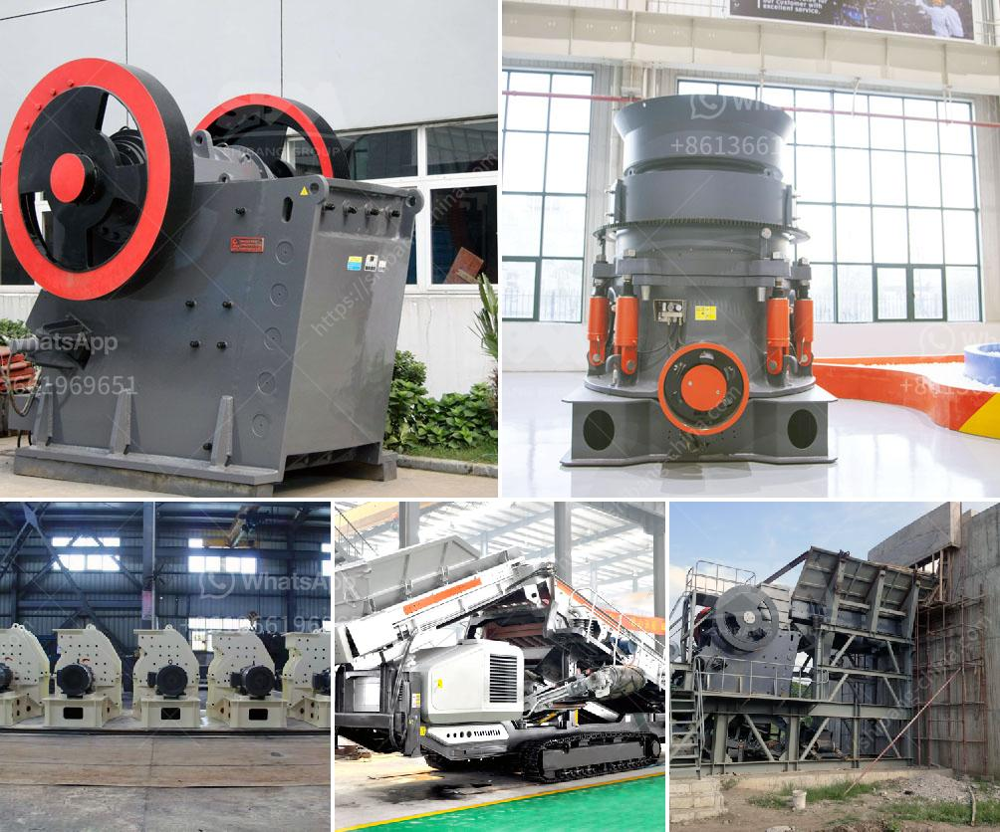

<h3>شركة تصنيع معدات التعدين في الصين</h3>
تُعد الصين واحدة من أكبر الدول المصنعة لمعدات التعدين في العالم. تتمتع الشركات الصينية المتخصصة في هذا القطاع بسمعة عالمية بفضل جودة منتجاتها وتكنولوجيتها المتقدمة.

إحدى الشركات البارزة في صناعة معدات التعدين في الصين هي "شركة Zhong Yun Group"، وهي شركة رائدة في تطوير وتصنيع معدات التعدين والبناء والخدمات ذات الصلة. تأسست الشركة في عام 1987 وتتمتع بتاريخ عريق في هذا المجال.

تقدم شركة Zhong Yun Group مجموعة واسعة من المنتجات المتخصصة في معدات التعدين، بما في ذلك الكسارات والطواحين وآلات فصل المعادن ومعدات النقل وغيرها الكثير. تتميز منتجات الشركة بتصميمها الفريد والمبتكر وأداءها الاستثنائي. تتمتع شركة Zhong Yun Group أيضًا بقدرة قوية على البحث والتطوير، حيث تضطلع بجهود مستمرة لتحسين منتجاتها وتطوير تقنيات جديدة في المجال.

تلتزم الشركة أيضًا بمعايير الجودة العالية والالتزام بالمواصفات الدولية لصناعة معدات التعدين. تخضع جميع المنتجات لعمليات فحص صارمة في مراحل الإنتاج، بدءًا من تحليل المواد الخام وانتهاءً بالاختبارات النهائية قبل التسليم. تسعى الشركة لتقديم منتجات عالية الجودة تلبي احتياجات العملاء بشكل مثالي.

من الجدير بالذكر أن صناعة معدات التعدين في الصين تعتمد أيضًا على الاستدامة البيئية. تسعى الشركات الصينية إلى تطوير واستخدام تقنيات ومواد صديقة للبيئة للحفاظ على البيئة المحيطة وتقليل التأثيرات السلبية لعمليات التعدين.

بالإضافة إلى ذلك، تعمل الشركات الصينية المصنعة لمعدات التعدين على تقديم خدمات ممتازة لعملائها، بما في ذلك توفير قطع الغيار والصيانة والدعم الفني المستمر. يتم تدريب فرق الدعم الفني على أعلى مستوى للتأكد من حصول العملاء على أفضل الخدمات.

في الختام، تعتبر شركات تصنيع معدات التعدين في الصين من أبرز اللاعبين في هذا السوق العالمي. تتميز بتقديمها لمنتجات عالية الجودة وبتكنولوجيا متقدمة وبالالتزام بالاستدامة البيئية. تُعد شركة Zhong Yun Group مثالًا لذلك، حيث تلبي احتياجات العملاء بشكل متميز وتقدم خدمات عالية الجودة.
<h3>Contact us</h3><ul><li><strong>Whatsapp:&nbsp;<a href="https://wa.me/8613661969651">+8613661969651</a></strong></li><li><a href="https://swt.shibang-china.com/?git&amp;zhl&amp;شركة تصنيع معدات التعدين في الصين"><strong>Online Service(chat now)</strong></a></li></ul><h3>Related</h3><ul><li><a href='آلة حزمة مطحنة الكرة.md'>آلة حزمة مطحنة الكرة</a></li><li><a href='مصنع سحق في ماليزيا.md'>مصنع سحق في ماليزيا</a></li><li><a href='أسعار وحدات طحن الكلنكر.md'>أسعار وحدات طحن الكلنكر</a></li><li><a href='سعر كسارة الفك في نيجيريا.md'>سعر كسارة الفك في نيجيريا</a></li><li><a href='مصانع معدات مصانع رمال الفراك.md'>مصانع معدات مصانع رمال الفراك</a></li></ul>